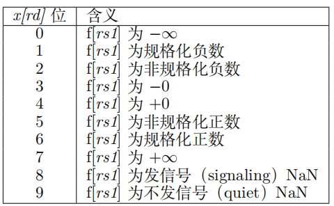

# RISC-V RVV第13 讲之RVV浮点算术指令

这一章讲述RVV 向量浮点算术命令。

### 1 向量浮点异常标志

参与向量浮点运算的活跃元素如果产生异常，将会在`fflag`寄存器中设置相关标志位

**注意：**向量浮点运算会共用标量浮点运算的一些浮点状态寄存器。如浮点异常标志寄存器`fflags`, 浮点舍入模式寄存器`frm`

### 2 单宽度向量浮点加减法指令

提供向量浮点加减法指令。

~~~shell
 # Floating-point add
 vfadd.vv vd, vs2, vs1, vm # Vector-vector
 vfadd.vf vd, vs2, rs1, vm # vector-scalar
 # Floating-point subtract
 vfsub.vv vd, vs2, vs1, vm  # Vector-vector
 vfsub.vf vd, vs2, rs1, vm  # Vector-scalar vd[i] = vs2[i] - f[rs1]
 vfrsub.vf vd, vs2, rs1, vm # Scalar-vector vd[i] = f[rs1] - vs2[i]
~~~

举例：

~~~c
// 浮点加法
typedef float float32_t;

#define DATALEN 16
int main(void)
{
  const float32_t vec1[DATALEN] = { 1.0, 2.0, 3.0, 4.0, 5.0, 6.0, 7.0, 8.0, 9.0, 10.0, 11.0, 12.0, 13.0, 14.0, 15.0, 16.0 };
  const float32_t vec2[DATALEN] = { 1.0, 1.0, 1.0, 1.0, 1.0, 1.0, 1.0, 1.0, 1.0, 1.0, 1.0, 1.0, 1.0, 1.0, 1.0, 1.0 };

  float32_t res[DATALEN] = {0.0};

  const float32_t *pSrcA = vec1;
  const float32_t *pSrcB = vec2;
  float32_t *pDes = res;

  size_t avl = DATALEN;
  size_t vl;
  vfloat32m4_t op1, op2, rd;

  for (; (vl = __riscv_vsetvl_e32m4(avl)) > 0; avl -= vl) {
    // load数据
    op1 = __riscv_vle32_v_f32m4(pSrcA, vl);
    op2 = __riscv_vle32_v_f32m4(pSrcB, vl);
    pSrcA += vl;
    pSrcB += vl;

    // 向量浮点加法
    rd = __riscv_vfadd_vv_f32m4(op1, op2, vl);

    // store数据
    __riscv_vse32_v_f32m4 (pDes, rd, vl);
    pDes += vl;
  }

  // 数据打印
  for (int i = 0; i < DATALEN; i++) {
    printf("%f, ", res[i]);
  }
  printf("\r\n");

  return 0;
}
~~~

打印如下：

~~~log
res[16] = {2.000000, 3.000000, 4.000000, 5.000000, 6.000000, 7.000000, 8.000000, 9.000000, 10.000000, 11.000000, 12.000000, 13.000000, 14.000000, 15.000000, 16.000000, 17.000000,}
~~~

浮点数反减的例子如下：

~~~c
// 浮点数反减

typedef float float32_t;

#define DATALEN 16
int main(void)
{
  const float32_t vec1[DATALEN] = { 1.0, 2.0, 3.0, 4.0, 5.0, 6.0, 7.0, 8.0, 9.0, 10.0, 11.0, 12.0, 13.0, 14.0, 15.0, 16.0 };

  float32_t res[DATALEN] = {0.0};

  const float32_t *pSrcA = vec1;
  float32_t *pDes = res;

  size_t avl = DATALEN;
  size_t vl;
  vfloat32m4_t op1, rd;
  float32_t op2 = 0.0; // 被减数

  for (; (vl = __riscv_vsetvl_e32m4(avl)) > 0; avl -= vl) {
    // load数据
    op1 = __riscv_vle32_v_f32m4(pSrcA, vl);
    pSrcA += vl;

    // 向量减法
    rd = __riscv_vfrsub_vf_f32m4(op1, op2, vl);

    // store数据
    __riscv_vse32_v_f32m4 (pDes, rd, vl);
    pDes += vl;
  }

  // 数据打印
  for (int i = 0; i < DATALEN; i++) {
    printf("%f, ", res[i]);
  }
  printf("\r\n");
  return 0;
}
~~~

打印日志如下：

~~~log
res[16] = {-1.000000, -2.000000, -3.000000, -4.000000, -5.000000, -6.000000, -7.000000, -8.000000, -9.000000, -10.000000, -11.000000, -12.000000, -13.000000, -14.000000, -15.000000, -16.000000}
~~~

### 3 扩宽向量浮点加减指令

~~~shell
# Widening FP add/subtract, 2*SEW = SEW +/- SEW
vfwadd.vv vd, vs2, vs1, vm # vector-vector
vfwadd.vf vd, vs2, rs1, vm # vector-scalar
vfwsub.vv vd, vs2, vs1, vm # vector-vector
vfwsub.vf vd, vs2, rs1, vm # vector-scalar
# Widening FP add/subtract, 2*SEW = 2*SEW +/- SEW
vfwadd.wv vd, vs2, vs1, vm # vector-vector
vfwadd.wf vd, vs2, rs1, vm # vector-scalar
vfwsub.wv vd, vs2, vs1, vm # vector-vector
vfwsub.wf vd, vs2, rs1, vm # vector-scalar
~~~

举例如下：

~~~~c
typedef float float32_t;
typedef _Float16 float16_t;

#define DATALEN 16
int main(void)
{
  float16_t vec1[DATALEN];
  float16_t vec2[DATALEN];
  
  for (int i = 0; i < DATALEN; i++) {
    vec1[i] = 32767.0f;
    vec2[i] = 100.0f;
  }

  float32_t res[DATALEN] = {0};

  const float16_t *pSrcA = vec1;
  const float16_t *pSrcB = vec2;
  float32_t *pDes = res;

  size_t avl = DATALEN;
  size_t vl;
  vfloat16m2_t op1, op2;
  vfloat32m4_t rd;

  for (; (vl = __riscv_vsetvl_e16m2(avl)) > 0; avl -= vl) {
    // load数据
    op1 = __riscv_vle16_v_f16m2(pSrcA, vl);
    op2 = __riscv_vle16_v_f16m2(pSrcB, vl);
    pSrcA += vl;
    pSrcB += vl;

    // 向量扩宽加法
    rd = __riscv_vfwadd_vv_f32m4(op1, op2, vl);

    // store数据
    __riscv_vse32_v_f32m4 (pDes, rd, vl);
    pDes += vl;
  }

  // 数据打印
  printf("vfwadd:\r\n");
  for (int i = 0; i < DATALEN; i++) {
    printf("%f, ", res[i]);
  }
  printf("\r\n");

  return 0;
}
~~~~

打印日志如下：

~~~log
res[16] = {32868.000000, 32868.000000, 32868.000000, 32868.000000, 32868.000000, 32868.000000, 32868.000000, 32868.000000, 32868.000000, 32868.000000, 32868.000000, 32868.000000, 32868.000000, 32868.000000, 32868.000000, 32868.000000}
~~~

### 4 单宽度浮点乘除指令

~~~shell
# Floating-point multiply
 vfmul.vv vd, vs2, vs1, vm # Vector-vector
 vfmul.vf vd, vs2, rs1, vm # vector-scalar
 # Floating-point divide
 vfdiv.vv vd, vs2, vs1, vm # Vector-vector
 vfdiv.vf vd, vs2, rs1, vm # vector-scalar
 # Reverse floating-point divide vector = scalar / vector
 vfrdiv.vf vd, vs2, rs1, vm # scalar-vector, vd[i] = f[rs1]/vs2[i]
~~~

浮点数乘法用例如下：

~~~c
// 浮点乘法
typedef float float32_t;

#define DATALEN 16
int main(void)
{
  const float32_t vec1[DATALEN] = { 1.0, 2.0, 3.0, 4.0, 5.0, 6.0, 7.0, 8.0, 9.0, 10.0, 11.0, 12.0, 13.0, 14.0, 15.0, 16.0 };
  const float32_t vec2[DATALEN] = { 1.0, 2.0, 3.0, 4.0, 5.0, 6.0, 7.0, 8.0, 9.0, 10.0, 11.0, 12.0, 13.0, 14.0, 15.0, 16.0 };

  float32_t res[DATALEN] = {0.0};

  const float32_t *pSrcA = vec1;
  const float32_t *pSrcB = vec2;
  float32_t *pDes = res;

  size_t avl = DATALEN;
  size_t vl;
  vfloat32m4_t op1, op2, rd;

  for (; (vl = __riscv_vsetvl_e32m4(avl)) > 0; avl -= vl) {
    // load数据
    op1 = __riscv_vle32_v_f32m4(pSrcA, vl);
    op2 = __riscv_vle32_v_f32m4(pSrcB, vl);
    pSrcA += vl;
    pSrcB += vl;

    // 向量乘法
    rd = __riscv_vfmul_vv_f32m4(op1, op2, vl);

    // store数据
    __riscv_vse32_v_f32m4 (pDes, rd, vl);
    pDes += vl;
  }

  // 数据打印
  for (int i = 0; i < DATALEN; i++) {
    printf("%f, ", res[i]);
  }
  printf("\r\n");

  return 0;
}
~~~

打印日志如下：

~~~log
res[16] = {1.000000, 4.000000, 9.000000, 16.000000, 25.000000, 36.000000, 49.000000, 64.000000, 81.000000, 100.000000, 121.000000, 144.000000, 169.000000, 196.000000, 225.000000, 256.000000}
~~~

浮点数除法用例如下：

~~~c
// 浮点数除法

typedef float float32_t;

#define DATALEN 16
int main(void)
{
  const float32_t vec1[DATALEN] = { 1.0, 2.0, 3.0, 4.0, 5.0, 6.0, 7.0, 8.0, 9.0, 10.0, 11.0, 12.0, 13.0, 14.0, 15.0, 16.0 };

  float32_t res[DATALEN] = {0};

  const float32_t *pSrcA = vec1;
  float32_t *pDes = res;

  size_t avl = DATALEN;
  size_t vl;
  vfloat32m4_t op1, rd;
  float32_t op2 = 4.0f;

  for (; (vl = __riscv_vsetvl_e32m4(avl)) > 0; avl -= vl) {
    // load数据
    op1 = __riscv_vle32_v_f32m4(pSrcA, vl);
    pSrcA += vl;

    // 向量除法
    rd = __riscv_vfdiv_vf_f32m4(op1, op2, vl);

    // store数据
    __riscv_vse32_v_f32m4 (pDes, rd, vl);
    pDes += vl;
  }

  // 数据打印
  for (int i = 0; i < DATALEN; i++) {
    printf("%f, ", res[i]);
  }
  printf("\r\n");

  return 0;
}
~~~

打印日志如下：

~~~log
res[16] = {0.250000, 0.500000, 0.750000, 1.000000, 1.250000, 1.500000, 1.750000, 2.000000, 2.250000, 2.500000, 2.750000, 3.000000, 3.250000, 3.500000, 3.750000, 4.000000}
~~~

### 5 扩展向量浮点乘法

~~~shell
# Widening floating-point multiply
vfwmul.vv vd, vs2, vs1, vm # vector-vector
vfwmul.vf vd, vs2, rs1, vm # vector-scalar
~~~

用例如下：

~~~c
typedef float float32_t;
typedef _Float16 float16_t;

#define DATALEN 16
int main(void)
{
  const float16_t vec1[DATALEN] = { 1.0, 2.0, 3.0, 4.0, 5.0, 6.0, 7.0, 8.0, 9.0, 10.0, 11.0, 12.0, 13.0, 14.0, 15.0, 16.0 };
  const float16_t vec2[DATALEN] = { 1.0, 2.0, 3.0, 4.0, 5.0, 6.0, 7.0, 8.0, 9.0, 10.0, 11.0, 12.0, 13.0, 14.0, 15.0, 16.0 };

  float32_t res[DATALEN] = {0.0};

  const float16_t *pSrcA = vec1;
  const float16_t *pSrcB = vec2;
  float32_t *pDes = res;

  size_t avl = DATALEN;
  size_t vl;
  vfloat16m2_t op1, op2;
  vfloat32m4_t rd;

  for (; (vl = __riscv_vsetvl_e16m2(avl)) > 0; avl -= vl) {
    // load数据
    op1 = __riscv_vle16_v_f16m2(pSrcA, vl);
    op2 = __riscv_vle16_v_f16m2(pSrcB, vl);
    pSrcA += vl;
    pSrcB += vl;

    // vfwmul
    rd = __riscv_vfwmul_vv_f32m4(op1, op2, vl);

    // store数据
    __riscv_vse32_v_f32m4 (pDes, rd, vl);
    pDes += vl;
  }

  // 数据打印
  for (int i = 0; i < DATALEN; i++) {
    printf("%f, ", res[i]);
  }
  printf("\r\n");

  return 0;
}
~~~

日志打印如下：

~~~log
res[16] = {1.000000, 4.000000, 9.000000, 16.000000, 25.000000, 36.000000, 49.000000, 64.000000, 81.000000, 100.000000, 121.000000, 144.000000, 169.000000, 196.000000, 225.000000, 256.000000}
~~~

### 6 单宽度向量浮点乘加指令

~~~shell
# FP multiply-accumulate, overwrites addend
vfmacc.vv vd, vs1, vs2, vm # vd[i] = +(vs1[i] * vs2[i]) + vd[i]
vfmacc.vf vd, rs1, vs2, vm # vd[i] = +(f[rs1] * vs2[i]) + vd[i]
# FP negate-(multiply-accumulate), overwrites subtrahend
vfnmacc.vv vd, vs1, vs2, vm # vd[i] = -(vs1[i] * vs2[i]) - vd[i]
vfnmacc.vf vd, rs1, vs2, vm # vd[i] = -(f[rs1] * vs2[i]) - vd[i]
# FP multiply-subtract-accumulator, overwrites subtrahend
vfmsac.vv vd, vs1, vs2, vm # vd[i] = +(vs1[i] * vs2[i]) - vd[i]
vfmsac.vf vd, rs1, vs2, vm # vd[i] = +(f[rs1] * vs2[i]) - vd[i]
# FP negate-(multiply-subtract-accumulator), overwrites minuend
vfnmsac.vv vd, vs1, vs2, vm # vd[i] = -(vs1[i] * vs2[i]) + vd[i]
vfnmsac.vf vd, rs1, vs2, vm # vd[i] = -(f[rs1] * vs2[i]) + vd[i]
# FP multiply-add, overwrites multiplicand
vfmadd.vv vd, vs1, vs2, vm # vd[i] = +(vs1[i] * vd[i]) + vs2[i]
vfmadd.vf vd, rs1, vs2, vm # vd[i] = +(f[rs1] * vd[i]) + vs2[i]
# FP negate-(multiply-add), overwrites multiplicand
vfnmadd.vv vd, vs1, vs2, vm # vd[i] = -(vs1[i] * vd[i]) - vs2[i]
vfnmadd.vf vd, rs1, vs2, vm # vd[i] = -(f[rs1] * vd[i]) - vs2[i]
# FP multiply-sub, overwrites multiplicand
vfmsub.vv vd, vs1, vs2, vm # vd[i] = +(vs1[i] * vd[i]) - vs2[i]
vfmsub.vf vd, rs1, vs2, vm # vd[i] = +(f[rs1] * vd[i]) - vs2[i]
# FP negate-(multiply-sub), overwrites multiplicand
vfnmsub.vv vd, vs1, vs2, vm # vd[i] = -(vs1[i] * vd[i]) + vs2[i]
vfnmsub.vf vd, rs1, vs2, vm # vd[i] = -(f[rs1] * vd[i]) + vs2[i]
~~~

用例如下：

~~~~c
typedef float float32_t;

#define DATALEN 16
int main(void)
{
  const float32_t vec1[DATALEN] = { 1.0, 2.0, 3.0, 4.0, 5.0, 6.0, 7.0, 8.0, 9.0, 10.0, 11.0, 12.0, 13.0, 14.0, 15.0, 16.0 };
  const float32_t vec2[DATALEN] = { 1.0, 2.0, 3.0, 4.0, 5.0, 6.0, 7.0, 8.0, 9.0, 10.0, 11.0, 12.0, 13.0, 14.0, 15.0, 16.0 };

  float32_t res[DATALEN] = { 1.0, 2.0, 3.0, 4.0, 5.0, 6.0, 7.0, 8.0, 9.0, 10.0, 11.0, 12.0, 13.0, 14.0, 15.0, 16.0};

  const float32_t *pSrcA = vec1;
  const float32_t *pSrcB = vec2;
  float32_t *pDes = res;

  size_t avl = DATALEN;
  size_t vl;
  vfloat32m4_t op1, op2, rd;

  for (; (vl = __riscv_vsetvl_e32m4(avl)) > 0; avl -= vl) {
    // load数据
    op1 = __riscv_vle32_v_f32m4(pSrcA, vl);
    op2 = __riscv_vle32_v_f32m4(pSrcB, vl);
    pSrcA += vl;
    pSrcB += vl;

    rd = __riscv_vle32_v_f32m4(pDes, vl);
    // 向量乘加
    rd = __riscv_vfmacc_vv_f32m4(rd, op1, op2, vl);

    // store数据
    __riscv_vse32_v_f32m4 (pDes, rd, vl);
    pDes += vl;
  }

  // 数据打印
  for (int i = 0; i < DATALEN; i++) {
    printf("%f, ", res[i]);
  }
  printf("\r\n");

  return 0;
}
~~~~

打印日志如下：

~~~log
res[16] = {2.000000, 6.000000, 12.000000, 20.000000, 30.000000, 42.000000, 56.000000, 72.000000, 90.000000, 110.000000, 132.000000, 156.000000, 182.000000, 210.000000, 240.000000, 272.000000}
~~~

### 7 扩宽向量浮点乘加指令

提供扩宽的浮点乘加等指令。

~~~shell
# FP widening multiply-accumulate, overwrites addend
vfwmacc.vv vd, vs1, vs2, vm # vd[i] = +(vs1[i] * vs2[i]) + vd[i]
vfwmacc.vf vd, rs1, vs2, vm # vd[i] = +(f[rs1] * vs2[i]) + vd[i]
# FP widening negate-(multiply-accumulate), overwrites addend
vfwnmacc.vv vd, vs1, vs2, vm # vd[i] = -(vs1[i] * vs2[i]) - vd[i]
vfwnmacc.vf vd, rs1, vs2, vm # vd[i] = -(f[rs1] * vs2[i]) - vd[i]
# FP widening multiply-subtract-accumulator, overwrites addend
vfwmsac.vv vd, vs1, vs2, vm # vd[i] = +(vs1[i] * vs2[i]) - vd[i]
vfwmsac.vf vd, rs1, vs2, vm # vd[i] = +(f[rs1] * vs2[i]) - vd[i]
# FP widening negate-(multiply-subtract-accumulator), overwrites addend
vfwnmsac.vv vd, vs1, vs2, vm # vd[i] = -(vs1[i] * vs2[i]) + vd[i]
vfwnmsac.vf vd, rs1, vs2, vm # vd[i] = -(f[rs1] * vs2[i]) + vd[i]
~~~

### 8 向量浮点平方根指令

~~~shell
# Floating-point square root sqrt(x)
 vfsqrt.v vd, vs2, vm # Vector-vector square root
~~~

用例见10节。

### 9 向量浮点倒数平方根估计指令

~~~shell
# Floating-point reciprocal square-root estimate to 7 bits. estimate of 1/sqrt(x) accurate to 7 bits
 vfrsqrt7.v vd, vs2, vm
~~~

用例见10节。

### 10 向量浮点倒数估计指令

~~~shell
# Floating-point reciprocal (1/x) estimate to 7 bits.
 vfrec7.v vd, vs2, vm
~~~

以上提供一个用例测试 vfsqrt，vfrsqrt7， vfrec7 指令。

~~~c
typedef float float32_t;

#define DATALEN 16
int main(void)
{
  const float32_t vec1[DATALEN] = { 1.0, 2.0, 3.0, 4.0, 5.0, 6.0, 7.0, 8.0, 9.0, 10.0, 11.0, 12.0, 13.0, 14.0, 15.0, 16.0 };

  float32_t res[DATALEN] = {0.0};

  const float32_t *pSrcA = vec1;
  float32_t *pDes = res;

  size_t avl = DATALEN;
  size_t vl;
  vfloat32m4_t op1, vfsqrt_rd, vfrsqrt7_rd, vfrec7_rd;

  vl = __riscv_vsetvl_e32m4(avl);
  // load数据
  op1 = __riscv_vle32_v_f32m4(pSrcA, vl);

  vfsqrt_rd = __riscv_vfsqrt_v_f32m4(op1, vl);
  vfrsqrt7_rd = __riscv_vfrsqrt7_v_f32m4(op1, vl);
  vfrec7_rd = __riscv_vfrec7_v_f32m4(op1, vl);

  // store数据
  __riscv_vse32_v_f32m4 (pDes, vfsqrt_rd, vl);

  printf("fsqrt result:\r\n");
  for (int i = 0; i < DATALEN; i++) {
    printf("%f, ", res[i]);
  }
  printf("\r\n");
  
  __riscv_vse32_v_f32m4 (pDes, vfrsqrt7_rd, vl);

  printf("vfrsqrt7 result:\r\n");
  for (int i = 0; i < DATALEN; i++) {
    printf("%f, ", res[i]);
  }
  printf("\r\n");
  
  __riscv_vse32_v_f32m4 (pDes, vfrec7_rd, vl);

  printf("vfrec7 result:\r\n");
  for (int i = 0; i < DATALEN; i++) {
    printf("%f, ", res[i]);
  }
  printf("\r\n");

  return 0;
}
~~~

打印结果为：

~~~log
fsqrt result[16] = {1.000000, 1.414214, 1.732051, 2.000000, 2.236068, 2.449490, 2.645751, 2.828427, 3.000000, 3.162278, 3.316625, 3.464102, 3.605551, 3.741657, 3.872983, 4.000000}

vfrsqrt7 result[16] = {0.996094, 0.703125, 0.574219, 0.498047, 0.445312, 0.406250, 0.376953, 0.351562, 0.332031, 0.314453, 0.300781, 0.287109, 0.277344, 0.267578, 0.257812, 0.249023}

vfrec7 result[16] = {0.996094, 0.498047, 0.332031, 0.249023, 0.199219, 0.166016, 0.142578, 0.124512, 0.110840, 0.099609, 0.090820, 0.083008, 0.076660, 0.071289, 0.066406, 0.062256}
~~~

### 11 向量浮点MIN/MAX指令

~~~shell
# Floating-point minimum
 vfmin.vv vd, vs2, vs1, vm # Vector-vector
 vfmin.vf vd, vs2, rs1, vm # vector-scalar
# Floating-point maximum
 vfmax.vv vd, vs2, vs1, vm # Vector-vector
 vfmax.vf vd, vs2, rs1, vm # vector-scalar
~~~

用例为：

~~~c
typedef float float32_t;

#define DATALEN 16
int main(void)
{
  float32_t vec1[DATALEN] = {1.0, 2.0, 3.0, 4.0, 5.0, 6.0, 7.0, 8.0, 9.0, 10.0, 11.0, 12.0, 13.0, 14.0, 15.0, 16.0};
  float32_t vec2[DATALEN] = {5.0, 5.0, 5.0, 5.0, 5.0, 5.0, 5.0, 5.0, 16.0, 16.0, 16.0, 16.0, 16.0, 16.0, 16.0, 16.0};
  float32_t res[DATALEN] = {0.0};

  const float32_t *pSrcA = vec1;
  const float32_t *pSrcB = vec2;
  float32_t *pDes = res;

  size_t avl = DATALEN;
  size_t vl;
  vfloat32m4_t op1, op2, rd;

  for (; (vl = __riscv_vsetvl_e32m4(avl)) > 0; avl -= vl) {
    // load数据
    op1 = __riscv_vle32_v_f32m4(pSrcA, vl);
    op2 = __riscv_vle32_v_f32m4(pSrcB, vl);
    pSrcA += vl;
    pSrcB += vl;

    // 求向量的最大值
    rd = __riscv_vfmax_vv_f32m4(op1, op2, vl);

    // store数据
    __riscv_vse32_v_f32m4 (pDes, rd, vl);
    pDes += vl;
  }

  // 数据打印
  for (int i = 0; i < DATALEN; i++) {
    printf("%f, ", res[i]);
  }
  printf("\r\n");

	return 0;
}
~~~

打印日志为：

~~~log
res[16] = {5.000000, 5.000000, 5.000000, 5.000000, 5.000000, 6.000000, 7.000000, 8.000000, 16.000000, 16.000000, 16.000000, 16.000000, 16.000000, 16.000000, 16.000000, 16.000000}
~~~

### 12 向量浮点符号注入指令

~~~shell
 vfsgnj.vv vd, vs2, vs1, vm # Vector-vector
 vfsgnj.vf vd, vs2, rs1, vm # vector-scalar
 vfsgnjn.vv vd, vs2, vs1, vm # Vector-vector
 vfsgnjn.vf vd, vs2, rs1, vm # vector-scalar
 vfsgnjx.vv vd, vs2, vs1, vm # Vector-vector
 vfsgnjx.vf vd, vs2, rs1, vm # vector-scalar
~~~

并提供两条伪指令：

~~~asm
vfneg.v vd,vs = vfsgnjn.vv vd,vs,vs
vfabs.v vd,vs = vfsgnjx.vv vd,vs,vs
~~~

提供一个示例如下：

~~~c
typedef float float32_t;

#define DATALEN 16
void main(void)
{
  float32_t vec1[DATALEN] = {-1.0, -2.0, -3.0, -4.0, 5.0, 6.0, 7.0, 8.0, 9.0, 10.0, 11.0, 12.0, -13.0, -14.0, -15.0, 16.0};
  float32_t res[DATALEN] = {0.0};
  
  size_t avl = DATALEN;
  size_t vl;
  vfloat32m4_t op1, rd;
  float32_t *pSrc = vec1;
  float32_t *pDes = res;

  for (; (vl = __riscv_vsetvl_e32m4(avl)) > 0; avl -= vl) {
    op1 = __riscv_vle32_v_f32m4(pSrc, vl);
    pSrc += vl;

    rd = __riscv_vfabs_v_f32m4(op1, vl);

    __riscv_vse32_v_f32m4(pDes, rd, vl);
    pDes += vl;
  }

  // 数据打印
  for (int i = 0; i < DATALEN; i++) {
    printf("%f, ", res[i]);
  }
  printf("\r\n");
}
~~~

数据打印如下：

~~~log
res[16] = {1.000000, 2.000000, 3.000000, 4.000000, 5.000000, 6.000000, 7.000000, 8.000000, 9.000000, 10.000000, 11.000000, 12.000000, 13.000000, 14.000000, 15.000000, 16.000000}
~~~

### 13 向量浮点比较指令

~~~shell
# Compare equal
 vmfeq.vv vd, vs2, vs1, vm # Vector-vector
 vmfeq.vf vd, vs2, rs1, vm # vector-scalar
 # Compare not equal
 vmfne.vv vd, vs2, vs1, vm # Vector-vector
 vmfne.vf vd, vs2, rs1, vm # vector-scalar
 # Compare less than
 vmflt.vv vd, vs2, vs1, vm # Vector-vector
 vmflt.vf vd, vs2, rs1, vm # vector-scalar
 # Compare less than or equal
 vmfle.vv vd, vs2, vs1, vm # Vector-vector
 vmfle.vf vd, vs2, rs1, vm # vector-scalar
 # Compare greater than
 vmfgt.vf vd, vs2, rs1, vm # vector-scalar
 # Compare greater than or equal
 vmfge.vf vd, vs2, rs1, vm # vector-scalar
~~~

### 14 向量浮点分类指令

~~~shell
vfclass.v vd, vs2, vm # Vector-vector
~~~

示例如下：

~~~c
typedef float float32_t;

#define DATALEN 8
int main(void)
{
  const float32_t vec1[DATALEN] = { 16.0, 16.50, -16.5000, -16.5001, +0.0, -0.0, -1e-38, 1e-38 };
  uint32_t res[DATALEN] = {0.0};

  const float32_t *pSrcA = vec1;
  uint32_t *pDes = res;

  size_t avl = DATALEN;
  size_t vl;
  vfloat32m2_t op1;
  vuint32m2_t rd;

  for (; (vl = __riscv_vsetvl_e32m2(avl)) > 0; avl -= vl) {
    // load数据
    op1 = __riscv_vle32_v_f32m2(pSrcA, vl);
    pSrcA += vl;

    rd = __riscv_vfclass_v_u32m2(op1, vl);

    // store数据
    __riscv_vse32_v_u32m2 (pDes, rd, vl);
    pDes += vl;
  }

  // 数据打印
  for (int i = 0; i < DATALEN; i++) {
    printf("%u, ", res[i]);
  }
  printf("\r\n");

  return 0;
}
~~~

打印日志为：

~~~log
res[8] = {64, 64, 2, 2, 16, 8, 4, 32}
~~~

其值的含义需要查阅下表，见标量指令fclass含义表：

也即：

~~~log
16.0 为规格化正数
16.50 为规格化正数
-16.5000 正0为规格化负数
-16.5001 为规格化负数
+0.0 为正0
-0.0 为负0
-1e-38 为非规格化负数
1e-38 为非规格化正数
~~~

### 15 向量浮点合并指令

~~~shell
vfmerge.vfm vd, vs2, rs1, v0 # vd[i] = v0.mask[i] ? f[rs1] : vs2[i]
~~~

提供用例如下：

~~~c
typedef float float32_t;

#define DATALEN 16
int main(void)
{
  const float32_t vec1[DATALEN] = {5.0, 5.0, 5.0, 5.0, 5.0, 5.0, 5.0, 5.0, 16.0, 16.0, 16.0, 16.0, 16.0, 16.0, 16.0, 16.0};
  const float32_t vec2[DATALEN] = {1.0, 2.0, 3.0, 4.0, 5.0, 6.0, 7.0, 8.0, 9.0, 10.0, 11.0, 12.0, 13.0, 14.0, 15.0, 16.0};

  float32_t res[DATALEN] = {0};

  const float32_t *pSrcA = vec1;
  const float32_t *pSrcB = vec2;
  float32_t *pDes = res;

  size_t avl = DATALEN;
  size_t vl;
  vfloat32m4_t op1, op2, rd;

  for (; (vl = __riscv_vsetvl_e32m4(avl)) > 0; avl -= vl) {
    // load数据
    op1 = __riscv_vle32_v_f32m4(pSrcA, vl);
    op2 = __riscv_vle32_v_f32m4(pSrcB, vl);
    pSrcA += vl;
    pSrcB += vl;
    
    vbool8_t mask = __riscv_vmflt_vv_f32m4_b8(op1, op2, vl);

    // merge
    rd = __riscv_vmerge_vvm_f32m4(op1, op2, mask, vl);

    // store数据
    __riscv_vse32_v_f32m4 (pDes, rd, vl);
    pDes += vl;
  }

  // 数据打印
  for (int i = 0; i < DATALEN; i++) {
    printf("%f, ", res[i]);
  }
  printf("\r\n");

  return 0;
}
~~~

打印日志如下：

~~~log
res[16] = {5.000000, 5.000000, 5.000000, 5.000000, 5.000000, 6.000000, 7.000000, 8.000000, 16.000000, 16.000000, 16.000000, 16.000000, 16.000000, 16.000000, 16.000000, 16.000000}
~~~

### 16 向量浮点移动指令

~~~shell
vfmv.v.f vd, rs1 # vd[i] = f[rs1]
~~~

### 17 单宽度浮点&整数类型转换指令

~~~shell
vfcvt.xu.f.v vd, vs2, vm     # 将浮点数转换为无符号整数.
vfcvt.x.f.v vd, vs2, vm      # 将浮点数转换为有符号整数.
vfcvt.rtz.xu.f.v vd, vs2, vm # 将浮点数转换为无符号整数, 归零截断.
vfcvt.rtz.x.f.v vd, vs2, vm  # 将浮点数转换为有符号整数，归零截断
vfcvt.f.xu.v vd, vs2, vm     # 将无符号数转换为浮点数
vfcvt.f.x.v vd, vs2, vm      # 将有符号数转换为浮点数
~~~

例如，将浮点数转换为有符号整数：

~~~c
typedef float float32_t;
typedef float float32_t;

#define DATALEN 8
int main(void)
{
  const float32_t vec1[DATALEN] = { 16.0, 16.40, 16.5000, 16.5001, 16.9, -16.1000, -16.5000, -16.8 };
  int32_t res[DATALEN] = {0.0};

  const float32_t *pSrcA = vec1;
  int32_t *pDes = res;

  size_t avl = DATALEN;
  size_t vl;
  vfloat32m2_t op1;
  vint32m2_t rd;

  for (; (vl = __riscv_vsetvl_e32m2(avl)) > 0; avl -= vl) {
    // load数据
    op1 = __riscv_vle32_v_f32m2(pSrcA, vl);
    pSrcA += vl;

    // 向量浮点加法
    rd = __riscv_vfcvt_x_f_v_i32m2(op1, vl);

    // store数据
    __riscv_vse32_v_i32m2 (pDes, rd, vl);
    pDes += vl;
  }

  // 数据打印
  for (int i = 0; i < DATALEN; i++) {
    printf("%d, ", res[i]);
  }
  printf("\r\n");

  return 0;
}
~~~

打印结果为:

~~~log
res[4] = {16, 16, 16, 17, 17, -16, -16, -17}
~~~

归零截断：

~~~c
typedef float float32_t;

#define DATALEN 8
int main(void)
{
  const float32_t vec1[DATALEN] = { 16.0, 16.40, 16.5000, 16.5001, 16.9, -16.1000, -16.5000, -16.8 };
  int32_t res[DATALEN] = {0.0};

  const float32_t *pSrcA = vec1;
  int32_t *pDes = res;

  size_t avl = DATALEN;
  size_t vl;
  vfloat32m2_t op1;
  vint32m2_t rd;

  for (; (vl = __riscv_vsetvl_e32m2(avl)) > 0; avl -= vl) {
    // load数据
    op1 = __riscv_vle32_v_f32m2(pSrcA, vl);
    pSrcA += vl;

    // 向量浮点加法
    rd = __riscv_vfcvt_x_f_v_i32m2(op1, vl);

    // store数据
    __riscv_vse32_v_i32m2 (pDes, rd, vl);
    pDes += vl;
  }

  // 数据打印
  for (int i = 0; i < DATALEN; i++) {
    printf("%d, ", res[i]);
  }
  printf("\r\n");

  return 0;
}
~~~

打印结果为：

~~~log
res[4] = {16, 16, 16, 16, 16, -16, -16, -16,}
~~~

### 18 扩宽浮点/整数类型转换指令

~~~shell
vfwcvt.xu.f.v vd, vs2, vm # Convert float to double-width unsigned integer.
vfwcvt.x.f.v vd, vs2, vm # Convert float to double-width signed integer.
vfwcvt.rtz.xu.f.v vd, vs2, vm # Convert float to double-width unsigned integer, truncating.
vfwcvt.rtz.x.f.v vd, vs2, vm # Convert float to double-width signed integer, truncating.
vfwcvt.f.xu.v vd, vs2, vm # Convert unsigned integer to double-width float.
vfwcvt.f.x.v vd, vs2, vm # Convert signed integer to double-width float.
vfwcvt.f.f.v vd, vs2, vm # Convert single-width float to double-width float.
~~~

### 19 缩减浮点/整数类型转换指令

~~~shell
vfncvt.xu.f.w vd, vs2, vm # Convert double-width float to unsigned integer.
vfncvt.x.f.w vd, vs2, vm # Convert double-width float to signed integer.
vfncvt.rtz.xu.f.w vd, vs2, vm # Convert double-width float to unsigned integer, truncating.
vfncvt.rtz.x.f.w vd, vs2, vm # Convert double-width float to signed integer, truncating.
vfncvt.f.xu.w vd, vs2, vm # Convert double-width unsigned integer to float.
vfncvt.f.x.w vd, vs2, vm # Convert double-width signed integer to float.
vfncvt.f.f.w vd, vs2, vm # Convert double-width float to single-width float.
vfncvt.rod.f.f.w vd, vs2, vm # Convert double-width float to single-width float,
 # rounding towards odd.
~~~

