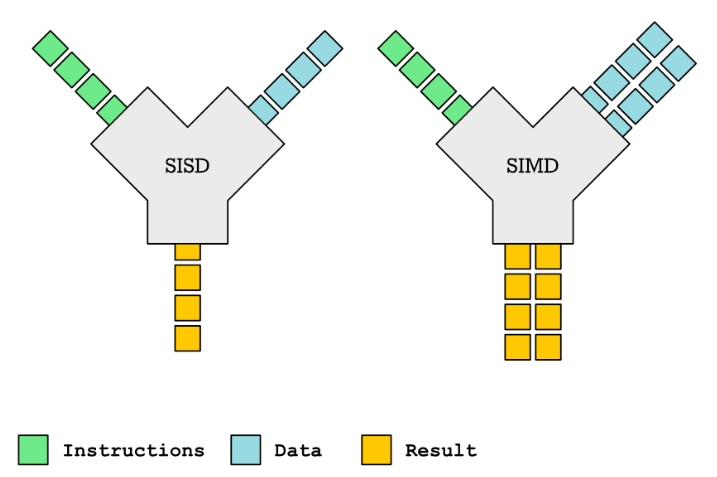
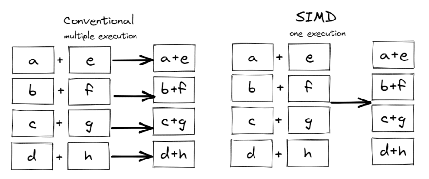
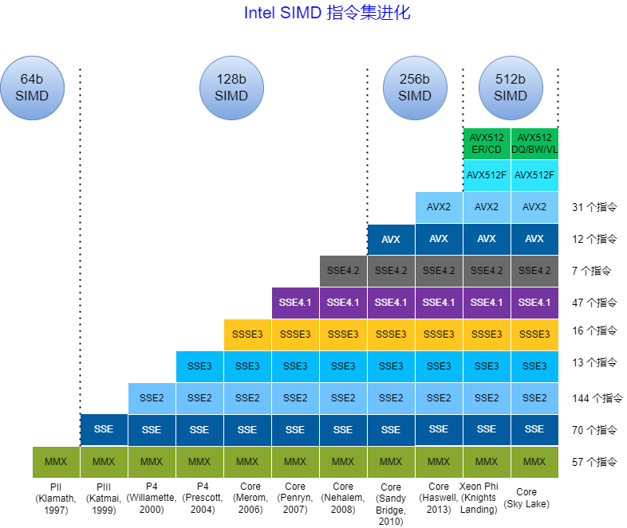
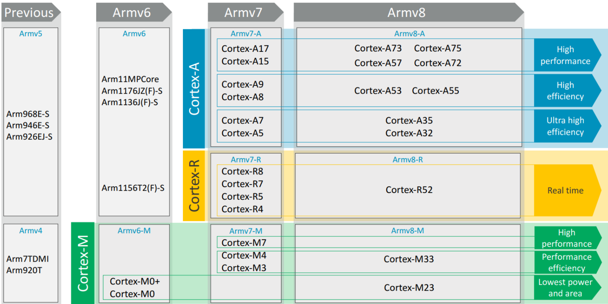
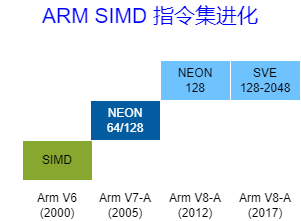

# RISC-V RVV第1讲之RVV简介

## 1. 背景

学习RISC-V V扩展（RISC-V Vector Extension，即RVV）很长时间了，刚入门的时候，对函数进行RVV优化时，总是弄不清使用什么指令好，后面才慢慢熟悉，所以想着把这块知识总结一下，于是准备将RVV v1.0 的spec翻译一下（**注意：翻译并没有一字一句的翻，大略按照自己理解的来翻译的**），穿插讲了相关的一些知识点。英语好的朋友建议直接阅读原Spec。另外，文中给出使用指令的示例（使用intrinsics function 的方式）和一些插图，这样方便初学者快速入门。

RVV-spec源码和pdf下载地址如下：

[Vector Extension 1.0, frozen for public review](https://github.com/riscv/riscv-v-spec/releases/tag/v1.0)

其intrinsic文档路径如下：

https://github.com/riscv-non-isa/rvv-intrinsic-doc

网页查看intrinsic：

https://dzaima.github.io/intrinsics-viewer/ 

另外也提供下载好的spec[]与intrinsic_function[]

以下是正文：

## 2. RVV简介

RVV，即 RISC-V Vector Extension , 是RISC-V的向量扩展。下面简单回顾向量机的历史，大略可以看出RVV的技术路线。

### 2.1 SISD与SIMD

**SISD：** 全称 Single Instruction Single Data，即单指令单数据，传统意义上的cpu都是SISD模式的，也就是一条指令完成一条数据。

**SIMD：** 全称 Single Instruction Multiple Data，即单指令多数据，一条指令完成多个数据的执行操作。

**为什么SIMD有加速效果？**

比如一个向量有4个元素{a, b, c, d}, 另一个向量也有4个元素{e, f, d, h}，它们做向量加法，普通标量（SISD）的做法如做下图所示，需要4次add指令，而SIMD 的做法如右图所示，一次加法指令便完成了4个元素的加法，所以理论上SIMD比SISD要快。

SISD的做法：

~~~c
for (int i = 0; i < N; i++) {
    C[i] = A[i] + B[i];
}
~~~

SIMD的做法：

~~~c
for (int i = 0; i < N; i+=4) {
    vec4 A_tmp = load4(A + i);       // Loads 4 integers into a SIMD register A_tmp
    vec4 B_tmp = load4(B + i);
    vec4 C_tmp = add4(A_tmp, B_tmp); // Adds together vectors of four integers
    store4(C_tmp, C + i);            // Stores four integers
}
~~~

**SIMD的需求背景：**

在一些领域中常常需要对大量的数据执行相同的操作。例如，对图像每个像素进行某种相同操作，或者在音频处理中对一段音频样本进行相同的滤波操作，相同类型的数据（像素或音频样本）执行相同的操作，这就是典型的数据并行性的应用。

**SIMD的优缺点：**

见参考1，简单罗列如下：

**SIMD的优点：**

1. 几乎市面上的cpu都支持SIMD（除了低端嵌入式芯片外）
2. SIMD是最易实现的并行方案（采用多线程，多核等方案会更复杂）
3. 编译器可以支持自动向量化

**SIMD的缺点：**

1. SIMD 没有分支的概念，通常使用bit masking来模拟
2. SIMD 只能处理简单类型（整数，定点，浮点等）
3. 数据的布局很重要，SIMD只适合处理规整的数据（数据要摆放整齐）
4. SIMD 不擅长处理存在数据依赖的情况（比如：不适合数据存在上下依赖的情形）

### 2.2 X86 的 SIMD 发展路线

**MMX指令集：**

MMX(Multi Media eXtension)指令集是Intel在其x86架构中引入的第一个SIMD指令集。只支持整数SIMD运算（没有新增寄存器，复用8个64位浮点寄存器，实际上Pentium 寄存器是80位，MMX只用了64位）。

对于16位数据，MMX指令集可以充分发挥效用；对于8位数据，需要一些技巧才能充分利用；而对于32位数据，由于MMX指令集的设计限制，MMX指令几乎无法带来加速。

以下这段引用自《算力芯片-高性能CPU/GPU/NPU 微架构分析》，指出SIMD的一个缺点：

> 注意：SIMD 类的并行计算要求数据是对齐的，即数据的组织和排列必须满足某些特定的要求。如果数据没有对齐，就需要额外的操作来进行数据对齐，这会消耗额外的计算时间。对于数据对齐要求比较高的场景，使用任何一种 SIMD 技术都可能会带来一定的开销。
>

**SSE指令集：**

SSE(Streaming SIMD Extension)指令集是继MMX指令集之后的扩展指令集，其单指令操作宽度为128位（SSE新增8个128位寄存器，SEE3 增加到16个128位寄存器），并且支持浮点数。在常见的SSE4指令集中，可以使用128位的XMM寄存器来操作浮点数，也就是说，每个XMM寄存器可以容纳4个单精度浮点数或2个双精度浮点数。

**AVX 指令集：**

AVX 引入了 256 位宽的 YMM 寄存器（在 AVX-512 中进一步扩展到 512 位 ZMM 寄存器），允许同时处理更多的数据元素。这使得 AVX 特别适合于科学计算、媒体处理、图形渲染和其他需要大量数据并行处理的应用程序。

AVX2指令集的核心寄存器资源是16个YMM寄存器(YMM0～YMM15)，每个寄存器是256位的。AVX-512指令集中有32个ZMM寄存器(ZMM0～ZMM31)，每个寄存器是512位的。AVX-512指令集还引入了8个新的64位掩码寄存器(K0～K7)，支持掩码功能（顺便提一下，RVV也支持这项功能，后续相关章节可以看到）。

AVX指令集支持单精度浮点数、双精度浮点数、整数，并且包含非常多的子集。

比如：

AVX-512F ：Foundation，基础指令集

AVX512ER：Conflict Detection，冲突检测

AVX512CD：Exponential and Reciprocal，指数和倒数近似

 AVX512DQ：Prefetch，预取指令

 AVX512BW：Double Precision and Quadword Instructions，双精度浮点和四字节整数指令

 AVX512VL：Byte and Word Instructions，向量长度扩展指令

### 2.3 ARM 的 SIMD 发展路线

作为RSIC处理器的代表，ARM一直走在技术的最前列。不过对于Vector指令集的支持却一直十分谨慎。

先介绍一下ARM的版本：

**ARM版本：**

ARM的版本分为内核版本和处理器版本。内核版本即是ARM的架构，如ARMv1、ARMv2、ARMv3、ARMv4、ARMv5、ARMv6、ARMv7、ARMv8、ARMv9，处理器版本也即ARM处理器，如ARM1、ARM7、ARM9、ARM11、ARM Cortex-A（A7、A9、A15）， ARM Corex-M （M1、M3、M4）

**ARM版本信息简化表如下：**

| 内核架构版本 | 处理器家族                                     |
| ------------ | ---------------------------------------------- |
| ARMv1        | ARM1                                           |
| ARMv2        | ARM2、ARM3                                     |
| ARMv3        | ARM6、ARM7                                     |
| ARMv4        | strongARM、ARM7TDMI、ARM9TDMI                  |
| ARMv5        | ARM7EJ、ARM9E、ARM10E、XScale                  |
| ARMv6        | ARM11、ARM Cortex-M0/M0+、ARM Cortex-M1        |
| ARMv7        | ARM Cortex-A、ARM Cortex-M、ARM Cortex-R       |
| ARMv8        | ARM Cortex-A30、ARM Cortex-A50、ARM Cortex-A70 |
| ARMv9        | Cortex-X2、Cortex-A510、Cortex-A710            |

或者可以大略的参考下图，图片来源于《ARM Cortex-A9 ARM v7-A A programmer's perspective Part1》：

**ARM SIMD指令发展：**

| Arm v6 SIMD扩展                                         | Arm v7-A NEON                                           | Arm v8-A NEON                                           |
| ------------------------------------------------------------ | ------------------------------------------------------------ | ------------------------------------------------------------ |
| 利用Arm 通用寄存器， 支持8/16位整数， 同时计算2x16/4x8 操作数 | 16 个128位 NEON寄存器 支持8/16/32/64位整数 支持单精度浮点，非兼容IEEE754标准 | 32 个128 位NEON 寄存器 支持8/16/32/64 位整数 支持单精度浮点和双精度浮点，兼容IEEE754标准 |
|                                                              |                                                              | **Arm v8-A SVE**                                        |
|                                                              |                                                              | 32 个 向量寄存器（宽度从128位到2048位可配） 支持8/16/32/64 位整数 支持单精度浮点和双精度浮点 |

简单说明如下：

**NENO 指令集：**

即Arm Advanced SIMD，首次在ARM v7-A微架构中引入，NEON的工作原理是使用一组16个128位寄存器或当做32个64位寄存器（Arm v8-A 中是32个128位寄存器），将这些寄存器视为包含固定数量的相同类型数据元素的向量，可以使用一个指令同时对所有这些数据元素执行相同的操作，从而实现数据并行性。

**SVE 指令集：**

SVE(Scalable Vector Extension)，是Armv8-A 架构引入的，其特点是向量宽度是动态可配的，宽度从128位到2048位可配。**SVE的可变长度向量特性保证同样的应用程序无需重新编译代码，可在不同宽度向量SVE架构机器上运行**， SVE 提高了架构对高性能计算 (HPC) 和机器学习 (ML) 应用程序的适用性，这些应用程序需要大量数据处理。

**MVE 指令集：**

MVE（M-Profile Vector Extension），也称为Helium技术，是为ARMv8.1-M系列微控制器设计的一种向量扩展。它旨在为资源受限的嵌入式系统提供高效的SIMD（单指令多数据）计算能力，特别适用于数字信号处理（DSP）、机器学习推理和其他需要并行计算的任务。与SVE和NEON不同，MVE专注于低功耗、低成本的微控制器平台，同时保持了对现有软件生态系统的兼容性。

其关键特性如下：

1. 为了节约硬件资源，MVE复用FPU中的寄存器作为向量寄存器，MVE支持8个向量寄存器，每个向量寄存器是128位；
2. 超过150条新的标量和矢量指令，支持单精度浮点数（32 位）

### 2.4 RISC-V的 V 扩展

RISC-V 的 V 扩展（Vector Extension，简称 RVV）是为 RISC-V 架构设计的一种向量处理扩展，旨在提供强大的 SIMD（Single Instruction, Multiple Data，单指令多数据）能力。RVV 使 RISC-V 处理器能够在高性能计算、数字信号处理（DSP）、机器学习推理等领域中执行高效的并行计算任务。

关键特性：

1. 可配置的向量长度：RVV 支持从 128到 1024 bit甚至更长的向量寄存器长度（最大可到65536bit），具体取决于实现。这种灵活性允许开发者编写与向量长度无关的代码（Vector-Length Agnostic, VLA），从而提高代码的可移植性;
2. 动态调整向量长度：RVV 允许在运行时动态调整向量长度，这使得同一段代码可以在不同配置的硬件上高效运行，而无需重新编译;
3. 统一的指令格式，整数和浮点指令比较统一;
4. 丰富的指令集

## 3 几种SIMD指令集的比较

这里简单比较一下AVX，NENO，SVE，RVV几种指令集，这样可以更清楚了解RVV的特点：

**可变向量长度编程模型(Vector Length Agnostic，VLA)：**

传统的SIMD指令集采用固定大小的向量寄存器，例如NEON指令集采用固定的128位长度的向量寄存器。而支持VLA编程模型的指令集则支持可变长度的向量寄存器。这样允许芯片设计者根据需求选择一个合适的向量长度。VLA设计确保同一个应用程序可以在支持不同向量长度的机器上运行，而不需要重新编译代码，这是VLA的精髓。

* 可变向量长度编程模型(VLA)：RVV 与 arm SVE 
* 定长向量指令集：x86的MMX、SSE、 AVX 以及 arm NENO

也就是说：RVV 可以像arm SVE 一样，同一个应用程序可以在支持不同向量长度的机器上运行，而不需要重新编译代码。具体的实现后续会讲到。

**向量处理器与传统SIMD：**

这些概念比较令人困扰，用户可以自行查阅相关资料，根据Flynn分类法，向量处理器也属于SIMD，所以这里将SIMD分为三种变体：

- 向量处理器
- 传统SIMD/Multimedia 指令级扩展
- Graphics Processor Units (GPUs)

对于传统SIMD，比如RISC-V P扩展，属于传统的SIMD指令，复用标量寄存器，指令是枚举式的，指令也比较轻量，指令实现的功能往往有重叠部分（指令功能不正交），指令条数往往呈现爆炸式增长；而RVV是属于类向量处理器，拥有可变向量长度（即VLA），有专门的向量寄存器，指令功能正交性较好。

**动态向量长度（VL):**

对于Arm Neno指令（intel AVX类似），处理的是定长的数据，如果数据的数量不是向量大小的整数倍，就会出现剩余元素的问题，这些剩余元素需要特别处理，参考ARM官方的[Coding for Neon](https://developer.arm.com/architectures/instruction-sets/simd-isas/neon/neon-programmers-guide-for-armv8-a/coding-for-neon/)，在第4节 Load and store - leftovers给了处理技巧：

* 剩余元素用cpu来算（走标量通路）
* 填充数组（Larger Arrays），即将原始数组扩展到下一个向量大小的倍数
* 重叠计算（Overlapping）
* 单个元素处理（Single Elements）

而对于 RVV支持动态向量长度（VL)，在RVV指令集中，`vl`（Vector Length）是一个关键的控制寄存器，用于指定向量指令操作的数据元素数量，`vl`值可以根据不同的循环迭代或不同的数据集大小来动态调整。

## 参考：

1. [SIMD 与 SISD](https://johnnysswlab.com/crash-course-introduction-to-parallelism-simd-parallelism/)
2. [深入浅出RISC-V “V”向量扩展_RISC-V新闻资讯_RISC-V MCU中文社区](https://www.riscv-mcu.com/article-show-id-541.html)
3. [Intel® Intrinsics Guide](https://www.intel.com/content/www/us/en/docs/intrinsics-guide/index.html)
4. [PC平台主要SIMD扩展发展简史](https://www.cnblogs.com/TaigaCon/p/7835340.html)
5. [SVE架构特性和指令基本用法介绍](https://www.elecfans.com/d/1489475.html)
6. [硬科技：淺談x86的SIMD指令擴張史(下)：AVX到AVX-512](https://www.cool3c.com/article/152953)
7. [SVE | NEON | SIMD | VFP | MVE | MPE 基础介绍](https://blog.csdn.net/sinat_32960911/article/details/139662623)
8. [GitHub - simd-everywhere/simde: Implementations of SIMD instruction sets for systems which don't natively support them.](https://github.com/simd-everywhere/simde)
9. [ARM与RISC-V的向量扩展比较 - 知乎](https://zhuanlan.zhihu.com/p/370293866)
10. [Vector的前世今生（2）：ARM SVE简述 - 极术社区 - 连接开发者与智能计算生态](https://aijishu.com/a/1060000000202149)
11. [Vector的前世今生（1）：从辉煌到低谷 - 极术社区 - 连接开发者与智能计算生态](https://aijishu.com/a/1060000000192076)
12. [DDCA —— SIMD结构和向量处理器 - Astron_fjh - 博客园](https://www.cnblogs.com/Astron-fjh/p/18621129)
