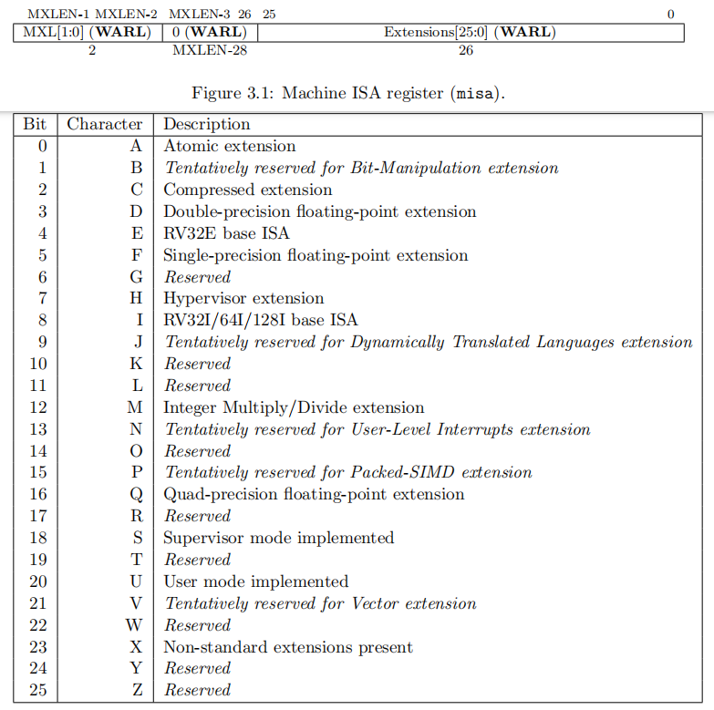
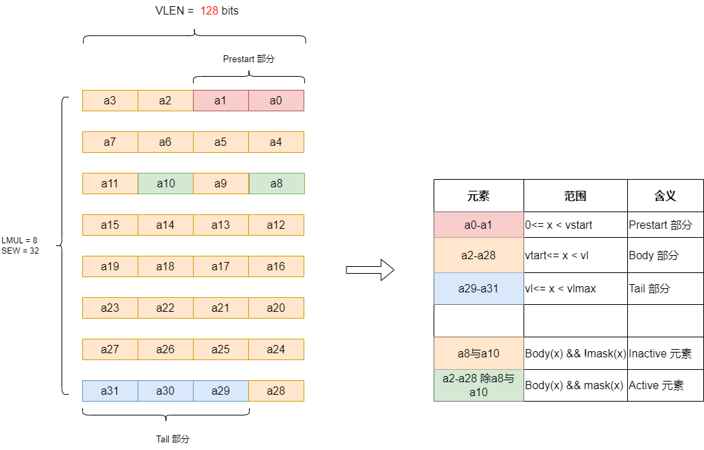

# RISC-V RVV第3讲之RVV编程模型

RVV 拥有独立的32个vector寄存器和7个CSRs寄存器。

编号0x00B-0x00E 寄存器暂时为以后的向量CSR寄存器预留，其中有一些可能镜像到vcsr寄存器中。

## 1 RVV 状态寄存器

### 1.1 misa.V 字段

如果硬件支持V扩展指令，misa寄存器的V字段应该置1, 如果misa.V = 0，说明可能硬件并不支持RVV扩展。

可通过gdb读misa寄存器（需在M态下读），看misa.V 是否为1来判断硬件是否支持RVV扩展：

* misa.V = 0 可能不支持RVV扩展
* misa.V=1 支持RVV扩展

~~~shell
$ info reg misa
~~~

misa.V是多少位？下图是riscv privileged spec中misa寄存器的字段，可见misa.V 占bit21位：

### 1.2 mstatus 中向量上下文状态域（Vector Status, VS）

`mstatus`寄存器中的向量上下文状态域（Vector Status, VS）位于`mstatus[10:9]`。这个VS域是可写的，作用类似于浮点上下文状态域（FS, Floating-Point Status），用于指示当前上下文中是否使用了向量指令集以及向量寄存器的状态。

| `mstatus[10:9]` | VS Meaning | 作用                                                         |
| --------------- | ---------- | ------------------------------------------------------------ |
| 0               | Off        | 表示向量指令集未被启用，尝试执行任何向量指令或访问向量CSR（Control and Status Registers）将导致非法指令异常。 |
| 1               | Initial    | 表示向量指令集处于初始状态，这意味着虽然尚未执行任何会改变向量状态的指令，但是可以开始执行这些指令。 |
| 2               | Clean      | 表示向量指令集已经被使用过，但目前没有未保存的变化。如果执行了任何更改向量状态的指令，VS会被自动设置为Dirty。 |
| 3               | Dirty      | 表示向量指令集已经被使用，并且存在未保存的变化。在这种状态下，必须保存向量寄存器内容才能安全地切换上下文。 |

也即：

* 在VS=Off状态，执行任何向量指令（包括访问向量CSR寄存器）将会导致非法指令异常；
* 在VS=Initial 或 Clean状态，执行任何向量指令（包括访问向量CSR寄存器）将会将VS状态置为VS=Dirty状态
* 当VS=Dirty时，这通常意味着需要保存向量寄存器的内容，以避免在上下文切换过程中丢失数据。一旦向量状态被正确保存，VS域可以被清零，以便其他进程可以安全地使用向量资源。

VS 设置为0-3多个取值是一种软件优化。软件通常会根据VS不同的值来判断是否需要保存RVV上下文，以此来减少上下文交换开销。

### 1.3 sstatus 中向量上下文状态域（Vector Status, VS）

`sstatus`寄存器中的向量上下文状态域位于`sstatus[10:9]`，这个寄存器是`mstatus`寄存器VS域的映射，作用与`mstatus`寄存器VS域相同。

### 1.4 vsstatus 中向量上下文状态域（Vector Status, VS）

在存在Hypervisor扩展的情况下，还有一个类似的`vsstatus`寄存器，其中也包含了一个VS字段，用于管理第二级虚拟化的向量状态。

## 2 RVV 数据寄存器

RVV 有32个vector寄存器，编号v0-v31，每个寄存器的宽度是固定的，宽度为VLEN bits。

## 3 RVV CSR寄存器

RVV 的 7个CSRs 寄存器如下：

整体的描述如下：

| 寄存器名字 | 寄存器描述                                                  | 寄存器的位域                                                 |
| ---------- | ----------------------------------------------------------- | ------------------------------------------------------------ |
| vstart     | 用来指示第一个参与运算的元素索引                            |                                                              |
| vxsat      | 用来表示向量定点饱和标志                                    | vxsat[0]：用于指示定点指令是否做饱和处理；其他XLEN-1位为0（vxsat[XLEN-1:1]为0） |
| vxrm       | 用来表示向量定点数舍入模式                                  |                             |
| vcsr       | 向量状态控制寄存器，目前包含`vxsat`与`vxrm`两个寄存器的镜像 |                             |
| vl         | 向量长度寄存器，用来记录在向量寄存器中处理的元素的数量      |                                                              |
| vtype      | 向量元素类型寄存器，用来描述向量寄存器数据元素类型          |                           |
| vlenb      | 向量寄存器长度，用来指定一个向量寄存器有多少个字节          |                                                              |

以下是详细的描述：

### 3.1 vlenb寄存器

`vlenb`寄存器用来表明一个向量寄存器的长度有多少字节（`VLEN` 以bit计数，`vlenb`以Bypte计数），这个值是在芯片设计时就确定下来的常数。

~~~c
vlenb = VLEN / 8
~~~

**注意：** `vsetvl`指令需要用到`vlenb`寄存器，用来计算`vl` 和 `vtype`

### 3.2 vl寄存器

`vl`寄存器用来设置向量指令处理的数据元素的数量，它只能被vsetvl指令或者首次异常矢量加载指令（fault-only-first）更新。

~~~c
0 <= vl <= VLMAX // vlmax = LMUL*VLEN/SEW
~~~

示意见3.3节

### 3.3 vstart寄存器

向量`vstart`寄存器用来指示第一个参与运算的元素索引。

>一般情况下，`vstart`寄存器只能由硬件执行向量指令时写入，软件不需要管。举例：当硬件执行向量指令时遇到中断或异常，硬件可以将已经处理的元素索引写入`vstart`寄存器，等中断或异常处理完成后，将从`vstart`开始恢复处理
>
>所有vector指令都是从`vstart`中给定的元素索引开始执行，并在执行结束时将vstart CSR重置为零。另外目的寄存器的0-vstart元素采取不打扰策略。
>
>（注：笔者意译）

**注意：**所有向量指令，包括vset{i}vl{i}，都将vstart CSR重置为零。应用程序不应该修改`vstart`，当`vstart!=0`时，一些向量指令可能会引发非法指令异常。

**Prestart部分，Body部分，Tail 部分，Active 元素， Inactive元素：**

下面以一个示例详细的讲述一下向量寄存器的的Prestart部分，Body部分，Tail 部分，Active 元素， Inactive元素，不同部分使用不同颜色块区分。

举例：VLEN = 128 bits，当元素类型为int32_t时，每个RVV寄存器可以装4个元素（VLEN / SEW）, LMUL 可以取{1/2，1， 2,  4, 8}（为什么LMUL不能取1/8 与 1/4? 这是因为ELEN EMUL 与 SEW要满足约束：ELEN * EMUL >= SEW），所以`vlmax = LMUL*VLEN/SEW`

下图所示：

~~~
VLEN = 128 bits
SEW = 32
LMUL = 8

vstart = 2

所以：
Prestart部分[a0,a1]
Body部分 [a2,a28]
Tail部分 [a29, a31]

其中Body部分，可以设置一部分参与运算，一部分不参与运算
Inactive 元素，a8与a10, 不参与运算
Active 元素，a2-a28除a8与a10, 参与运算
~~~

或者换一个视角，将上图重画一下：

### 3.4 vtype寄存器

`vtype`寄存器用来描述向量寄存器中数据元素的类型。只能使用vsetvl指令来动态配置vtype寄存器。

`vtype`寄存器位宽为XLEN，也即当arch为rv32时，`vtype`为32bits，当arch为rv64时，`vtype`为64bits，其中8: XLEN-2 bits为0

**vsew字段：**

`vsew`字段用来动态设置数据元素的位宽。目前支持{8, 16, 32, 64}几种位宽。

位宽对应C语言变量类型为：

| SEW  | 对应的C语言类型    |
| ---- | ------------------ |
| 8    | i8，u8             |
| 16   | i16，u16，_Float16 |
| 32   | i32，u32，float    |
| 64   | i64，u64，double   |

**vmul字段：**

多个向量寄存器可以组合在一起，寄存器组乘系数(Length MULtiplier,LMUL)表示由多少个向量寄存器组成一组，

意味着：单条向量指令可以操作多个向量寄存器。

RVV支持扩宽或缩减指令，意味着向量指令的源操作数和目的操作数可能具有不同的位宽`SEW`，但元素个数是相同的，这意味着源操作数和目的操作数的`LMUL`可能不一致，见第2讲中的`LMUL`与`EMUL`

`LMUL`也可以是一个分数值{1/8，1/4， 1/2}，但是需要满足如下约束条件：

~~~c
ELEN * EMUL >= SEW
~~~
另外`VLMAX`的计算公式如下：
~~~c
VLMAX = LMUL*VLEN/SEW
~~~

| LMUL | 寄存器分组                 |
| ---- | -------------------------- |
| 1/8  | Vn(单个向量寄存器组成一组) |
| 1/4  | Vn(单个向量寄存器组成一组) |
| 1/2  | Vn(单个向量寄存器组成一组) |
| 1    | Vn(单个向量寄存器组成一组) |
| 2    | Vn, Vn+1                   |
| 4    | Vn, Vn+1,Vn+2,Vn+3         |
| 8    | Vn, Vn+1,...，Vn+7         |

注意：

1. 当`LMUL` = 2，Vn索引号必需为2的整数倍，否则会触发非法指令异常；同样当`LMUL` = 4，Vn索引号必需为4的整数倍；同样当`LMUL` = 8，Vn索引号必需为8的整数倍。
2. 掩码操作指令只涉及一个向量寄存器(V0寄存器)，因此不需要LMUL参数

**vma 和 vta字段：**

`vta`(vector tail agnostic) 表示目标向量寄存器中末尾数据元素的处理策略，`vma`(vector mask agnostic)表示非活跃状态的数据元素处理策略。关于末尾元素（Tail）与非活跃元素（Inactive）见3.3节的示意图。

分为两种策略：

* 不打扰策略（undisturbed）： 目标向量寄存器中相应的数据元素保持原值不变
* 未知策略（agnostic）：目标向量寄存器中相应的数据元素可以保持原值不变，也可以写入1

区别是：未知策略可能效率较高（适应某些处理器内部的向量寄存器重命名特性），如果一些数据元素后续计算中用不到的话，可以选择未知策略。

| `vta`字段 | `vma`字段 | 末尾元素   | 非活跃状态元素 |
| --------- | --------- | ---------- | -------------- |
| 0         | 0         | 不打扰策略 | 不打扰策略     |
| 0         | 1         | 不打扰策略 | 未知策略       |
| 1         | 0         | 未知策略   | 不打扰策略     |
| 1         | 1         | 未知策略   | 未知策略       |

反汇编指令：

~~~asm
 ta # Tail agnostic
 tu # Tail undisturbed
 ma # Mask agnostic
 mu # Mask undisturbed
 vsetvli t0, a0, e32, m4, ta, ma # Tail agnostic, mask agnostic，即末尾元素未知，非活跃元素未知
 vsetvli t0, a0, e32, m4, tu, ma # Tail undisturbed, mask agnostic，即末尾元素不打扰，非活跃元素未知
 vsetvli t0, a0, e32, m4, ta, mu # Tail agnostic, mask undisturbed，即末尾元素未知，非活跃元素不打扰
 vsetvli t0, a0, e32, m4, tu, mu # Tail undisturbed, mask undisturbed，即末尾元素不打扰，非活跃元素不打扰
~~~

注意：在v0.9 之前的spec版本，如果在`vsetvl`指令中没有指定`vta`和`vma`字段，则默认设置为`tu`和`mu`，即末尾元素不打扰，非活跃元素不打扰；但在v1.0 spec版本，不指定`vta`和`vma`字段的`vsetvl`指令已经被弃用，现在必需要设置，默认值可能是`ta`和`ma`，建议读者在使用`vsetvl`指令时明确指定`vta`和`vma`字段

**vill字段：**

当`vsetvl`指令尝试写入一个非法值到`vtype`寄存器中，则`vill`字段被置位，之后任何依赖这个`vtype`寄存器执行的指令都会触发一个非法指令异常。

`vill`字段被置位时，`vtype`寄存器中其他XLEN-1位为0

注意：`vsetvl` 以及 Vector Load/Store Whole Register 指令不依赖`vtype`寄存器，也即不受`vill`置位影响。

### 3.5 vxsat寄存器

`vxsat[0]`用于指示定点指令是否做饱和处理；其他XLEN-1位为0（`vxsat[XLEN-1:1]`为0），`vxsat[0]`位被镜像到`vcsr`寄存器中。

### 3.6 vxrm寄存器

`vxrm[1:0]`用于设置定点计算的rounding模式；其他XLEN-2位为0（`vxrm[XLEN-1:1]`为0），`vxrm[1:0]`也被镜像到`vcsr`寄存器中。

舍入（rounding）模式的计算公式如下：

~~~c
roundoff_unsigned(v, d) = (unsigned(v) >> d) + r
roundoff_signed(v, d) = (signed(v) >> d) + r
~~~

其中：`v` 是输入值，`d` 是要右移的位数，`r`由舍入模式决定，有4种舍入模式：

### 3.7 vcsr寄存器

`vcsr`寄存器目前包含`vxsat[0]`与`vxrm[1:0]`的镜像，未来可能包含其他新加csr寄存器的镜像。

### 3.8 复位时向量寄存器的状态

建议硬件设计在reset时`vtype.vill`位被拉高，`vtype`寄存器中剩余的位为零，`vl`被设置为0。

大多数向量指令在使用时都需要使用`vsetvl`指令初始化，`vsetvl`指令会重置`vstart` `vxrm` `vxsat` 寄存器。

## 参考：

1. spec版本：https://github.com/riscv/riscv-v-spec/blob/v1.0/v-spec.adoc
2. [编译入门那些事儿（10）：RISC-V Vector 概述](https://www.hikunpeng.com/developer/techArticles/20240228-7)
3. [RSIC-V——指令集spec阅读笔记——向量扩展0.9_risc-v lmul-CSDN博客](https://blog.csdn.net/qq_39815222/article/details/109570539)