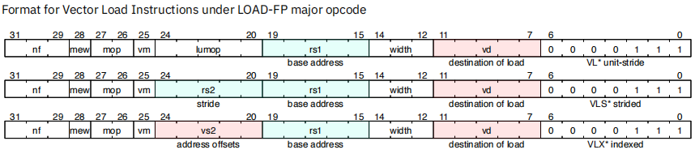
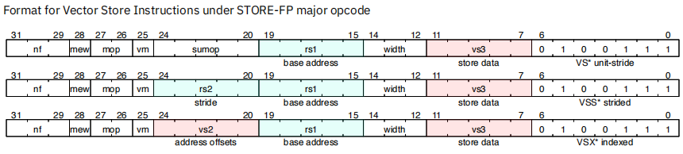
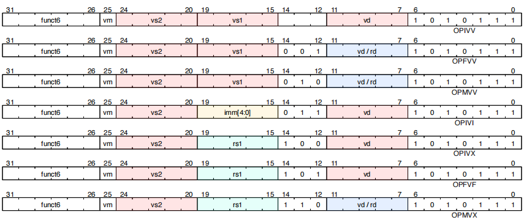
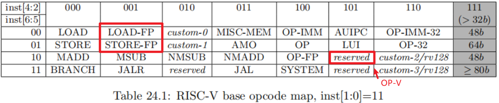
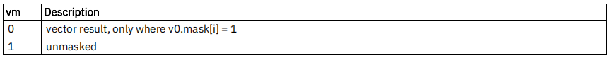
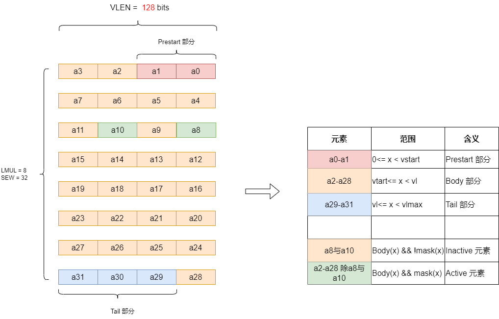

# RISC-V RVV第5讲之RVV 向量指令格式

这一章讲述向量指令格式，RVV指令分为如下几种格式：

**向量load指令（LOAD-FP）：**

**向量store指令（STORE-FP）：**

**向量操作指令（OP-V）：**

**向量设置指令（OP-V）：**

占用的编码空间如下图：

## 1 标量操作

RVV 标量操作的对象可以是立即数，标量寄存器器（x0-x31），浮点寄存器（f0-f31），或向量寄存器的0号元素，标量操作不受`LMUL`参数影响。可参考第16讲的MV指令，可以看到这些指令的作用

## 2 向量操作

RVV向量操作都需要设置`EEW`(有效的元素位宽)和`EMUL`(有效寄存器组乘系数)。用来确定元素位宽和摆放位置，对于大多数指令`EEW`=`SEW`和`EMUL`=`LMUL`，但些加宽指令中，元素的数量是一样的，所以对于目的操作数，寄存器组乘系数需加宽一倍。

`SEW` `EEW` `LMUL` `EMUL` 这四个参数有如下关系：

~~~c
EEW/EMUL = SEW/LMUL
~~~

分为如下情况：

* 一般指令，`EEW`=`SEW` 且 `EMUL`=`LMUL`
* 加宽指令，对于源操作数：`EEW`=`SEW` 且 `EMUL`=`LMUL`， 对于目的操作数：`EEW`=2 * `SEW` 且 `EMUL`= 2 * `LMUL`
* 缩减指令，对于源操作数：`EEW`=2 * `SEW` 且 `EMUL`= 2 * `LMUL`，对于目的操作数：`EEW`=`SEW` 且 `EMUL`=`LMUL`

示例见第2讲。

**注意：** `EMUL`可以取不同值{1/8, 1/4, 1/2, 1, 2, 4, 8} 表明，向量操作数可能占据一个或多个向量寄存器，但编码中使用编号小的寄存器来指定这个向量寄存器组。

例如：

~~~asm
 vmv1r.v v1, v2    # 将v1寄存器内容拷贝到v2
 vmv2r.v v10, v12  # 将v10 v11 寄存器内容拷贝到 v11 v12 
 vmv4r.v v4, v8    # 将v4 v5 v6 v7 寄存器内容拷贝到 v8 v9 v10 v11
 vmv8r.v v0, v8    # 将v0-v7 寄存器内容拷贝到 v8-v15
~~~

向量操作`EMUL`（或`LMUL`）满足如下约束：

~~~c
EMUL <= 8 (LMUL <= 8)
~~~

## 3 向量掩码（Masking）操作

向量指令的bit25位`vm`用来表明是否存在掩码操作。

当向量指令的bit25位`vm` = 0 代表指令存在掩码操作，`vm` = 1 表示一般指令（非掩码操作）

如下汇编指令：

~~~asm
vop.v* v1, v2, v3, v0.t # enabled where v0.mask[i]=1, vm=0
vop.v* v1, v2, v3       # unmasked vector operation, vm=1
~~~

v0.t 表示掩码，其中.t表示ture，当v0.mask[i] = 1，控制的第i个元素进行vop操作

如果没有v0.t掩码，表示不进行掩码操作(vm=1)

**注意：**当前的RVV只支持一个向量掩码寄存器v0，具体细节参考掩码指令一章

## 4 Prestart, Active, Inactive, Body, 和 Tail 部分

第3讲**vstart寄存器**一节已经对这个概念进行了举例说明，重新拷贝到这里：

下面以一个示例详细的讲述一下向量寄存器的的Prestart部分，Body部分，Tail 部分，Active 元素， Inactive元素，不同部分使用不同颜色块区分。

举例：VLEN = 128 bits，当元素类型为int32_t时，每个RVV寄存器可以装4个元素（VLEN / SEW）, LMUL 可以取{1/2，1， 2,  4, 8}（为什么LMUL不能取1/8 与 1/4? 这是因为ELEN EMUL 与 SEW要满足约束：ELEN * EMUL >= SEW），所以`vlmax = LMUL*VLEN/SEW`

下图所示：

~~~
VLEN = 128 bits
SEW = 32
LMUL = 8

vstart = 2

所以：
Prestart部分[a0,a1]
Body部分 [a2,a28]
Tail部分 [a29, a31]

其中Body部分，可以设置一部分参与运算（设置为Active），一部分不参与运算（设置为Inactive）
Inactive 元素，a8与a10, 不参与运算
Active 元素，a2-a28除a8与a10, 参与运算
~~~

或者换一个视角，将上图重画一下：

还有如下几个注意事项：

1. Prestart部分不会拷贝到目的寄存器
2. Tail 部分是否拷贝到目的寄存器受`vta`参数控制
3. Inactive 元素是否拷贝到目的寄存器受`vma`参数控制（vma 和 vta字段见第3讲）

## 参考：

1. [rvv-intrinsic-doc](https://github.com/riscv-non-isa/rvv-intrinsic-doc/blob/main/doc/rvv-intrinsic-spec.adoc)
