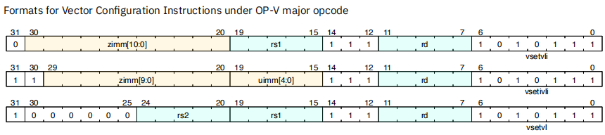
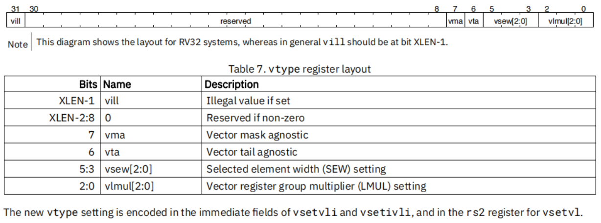
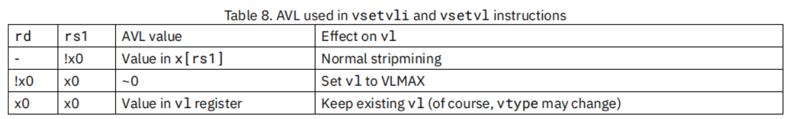

# RISC-V RVV第6讲之向量设置指令

处理大量元素的一种常见方法是“条状挖掘”，即循环的每次迭代都处理一些元素，迭代继续，直到所有元素都被处理完毕。 第一讲提到：RVV支持动态向量长度（VL)特性，也即：应用程序特性将要处理的元素总数（应用程序向量长度或`AVL`）作为输入，通过vsetvl指令计算，然后将计算得到的结果写入`vl`寄存器，每次处理`vl`个元素，迭代继续，直到所有元素都被处理完毕。

RVV 提供3种形式的vsetvl指令用来设置`vl` 与 `vtype`寄存器：

~~~asm
vsetvli rd, rs1, vtypei   # rd = new vl, rs1 = AVL, vtypei = new vtype setting
vsetivli rd, uimm, vtypei # rd = new vl, uimm = AVL, vtypei = new vtype setting
vsetvl rd, rs1, rs2       # rd = new vl, rs1 = AVL, rs2 = new vtype value
~~~

指令中：

入参AVL，即指令中的rs1或uimm，表示要处理的元素总数

入参vtype，即指令中的vtypei 或 rs2，包含了元素宽度`vsew` 和 寄存器组乘系数`vlmul`等参数

指令完成动作：将vtype值设置到`vtype`寄存器，计算得到vl值并写入`vl`寄存器，并将vl值写入rd寄存器返回。

其编码格式如下：

## 1 设置vtype寄存器

可以通过vsetvl指令来设置`vtype`寄存器。

`vtype`寄存器各个字段描述见第3讲3.3节`vtype`寄存器介绍。

**例如：**

~~~asm
 e8  # SEW=8b
 e16 # SEW=16b
 e32 # SEW=32b
 e64 # SEW=64b

 mf8 # LMUL=1/8
 mf4 # LMUL=1/4
 mf2 # LMUL=1/2
 m1  # LMUL=1, assumed if m setting absent
 m2  # LMUL=2
 m4  # LMUL=4
 m8  # LMUL=8

Examples:
 vsetvli t0, a0, e8       # SEW= 8, LMUL=1
 vsetvli t0, a0, e8, m2   # SEW= 8, LMUL=2
 vsetvli t0, a0, e32, mf2 # SEW=32, LMUL=1/2
~~~

**注意：**如果设置不支持vtype值，则`vtype`中vill位将会被置位，`vtype`中剩余的其余位被设置为0，`vl`寄存器也被设置为0

## 2 设置`vl`寄存器

可以通过vsetvl指令来设置`vl`寄存器。RVV并不是能设置`vl`寄存器的，而是将AVL参数传递给vsetvl指令来设置正确的`vl`值。AVL 即应用程序向量长度，指的是应用程序希望处理的数据元素总数。

分为如下情况：

简单解释如下：

1. 当rs1 非x0时，AVL = x[rs1]，计算得到vl值，写入`vl`寄存器，新的vl值也被写入rd寄存器中。
2. 当rs1 为x0，rd 为非x0时，AVL = ~0，即AVL设置为最大整数值，这样将vlmax写入`vl`寄存器，新的vl值也被写入rd寄存器中。
3. 当rs1 rd 都为x0，表示`vl`值不变（vtype 可能改变）

**vl与AVL的关系：**

~~~c
vl = min(AVL, VLMAX)  // VLMAX = LMUL*VLEN/SEW
~~~

也即（备注，这个说法需对着spec再确认一下）：

1. 如果AVL <= VLMAX 则 vl = AVL
2. 如果AVL > VLMAX 则vl = VLMAX

