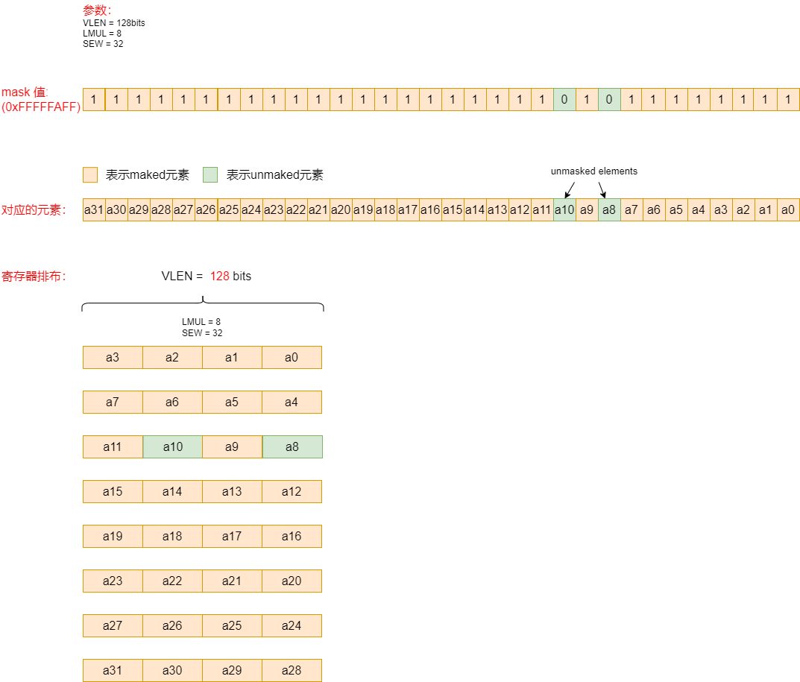

# RISC-V RVV第15 讲之RVV 掩码（Mask）指令

[TOC]

提供了一些指令来操作向量寄掩码值。

mask 是使用1bit来指定一个元素masked或者非masked。

**注意：**大部分RVV指令支持掩码操作数。掩码操作数只能使用v0向量寄存器存放掩码。

汇编代码中有如下两种形式：

* 汇编代码中带有v0.t

  v0.t 表示使用v0 向量寄存器作为掩码，每bit表示对应一个元素的状态。v0.mask[i]=1，表示第i个数据元素处于活跃状态；若v0.mask[i]=0，则表示第i个数据元素处于非活跃状态。

* 省略

  表示目标操作数和源操作数中所有的数据元素都处于活跃状态。

~~~asm
# 汇编代码中带有v0.t
vop.v* v1, v2, v3, v0.t
# 省略
vop.v* v1, v2, v3
~~~

**举例：**

如下图所示：

比如数组 a0, a1, a2... a31 其中有两个元素a8 和 a10 不参与运算，那么我们可以使用一个mask值来指使哪些元素参与运算，1bit来指定一个元素masked或者非masked，bit=0表示非masked，bit=1表示masked。

代码示例如下：

~~~c
#define DATALEN 32
int main(void)
{
  int32_t vec1[DATALEN];
  int32_t res[DATALEN] = {0};

  for (int i = 0; i < DATALEN; i++) {
    vec1[i] = i;
  }

  const int32_t *pSrcA = vec1;

  int32_t *pDes = res;
  uint8_t src1[4] = {0xFF, 0xFA, 0xFF, 0xFF};

  size_t avl = DATALEN;
  size_t vl;
  vint32m8_t op1, rd;

  vl = __riscv_vsetvl_e32m8(avl);
  // load数据
  op1 = __riscv_vle32_v_i32m8(pSrcA, vl);
  pSrcA += vl;

  vbool4_t mask = __riscv_vlm_v_b4(src1, vl);

  rd = __riscv_vadd_vx_i32m8_m (mask, op1, 100, vl);

  // store数据
  __riscv_vse32_v_i32m8 (pDes, rd, vl);
  pDes += vl;

  // 数据打印
  for (int i = 0; i < DATALEN; i++) {
    printf("%d, ", res[i]);
  }
  printf("\r\n");

  return 0;
}
~~~

日志打印如下：

~~~log
res[32] = {100, 101, 102, 103, 104, 105, 106, 107, 8, 109, 10, 111, 112, 113, 114, 115, 116, 117, 118, 119, 120, 121, 122, 123, 124, 125, 126, 127, 128, 129, 130, 131,}
~~~

可见，只有a8与a10 没有参与加100的运算。

### 1 向量mask逻辑指令

向量MASK-寄存器逻辑指令用来操作掩码寄存器，向量MASK寄存器的的每个元素都是一个bit，所以这些指令都是在单个向量寄存器上操作的，与`LMUL`无关，目标寄存器可以与任一个源向量寄存器相同。

~~~shell
vmand.mm vd, vs2, vs1 # vd.mask[i] = vs2.mask[i] && vs1.mask[i]
vmnand.mm vd, vs2, vs1 # vd.mask[i] = !(vs2.mask[i] && vs1.mask[i])
vmandn.mm vd, vs2, vs1 # vd.mask[i] = vs2.mask[i] && !vs1.mask[i]
vmxor.mm vd, vs2, vs1 # vd.mask[i] = vs2.mask[i] ^^ vs1.mask[i]
vmor.mm vd, vs2, vs1 # vd.mask[i] = vs2.mask[i] || vs1.mask[i]
vmnor.mm vd, vs2, vs1 # vd.mask[i] = !(vs2.mask[i] || vs1.mask[i])
vmorn.mm vd, vs2, vs1 # vd.mask[i] = vs2.mask[i] || !vs1.mask[i]
vmxnor.mm vd, vs2, vs1 # vd.mask[i] = !(vs2.mask[i] ^^ vs1.mask[i])
~~~

示例如下：

~~~c
void main(void)
{
  uint8_t src1[2] = {0x0F, 0x73};
  uint8_t src2[2] = {0xF3, 0x31};
  uint8_t res[2] = {0};

  size_t vl;
  vl = __riscv_vsetvlmax_e16m2();

  vbool8_t mask1 = __riscv_vlm_v_b8(src1, vl); // vbool的load操作
  vbool8_t mask2 = __riscv_vlm_v_b8(src2, vl);

  vbool8_t mask = __riscv_vmand_mm_b8(mask1, mask2, vl);
  __riscv_vsm_v_b8 (res, mask, vl);            // vbool的store操作

  for (int i = 0; i < 2; i++) {
    printf("0x%02x \r\n", res[i]);
  }
}
~~~

打印结果为：

~~~log
res[2] = {0x03, 0x31} 即 0x3103 = 0x31F3 & 0x730F
~~~

提供几条伪指令：

~~~shell
vmmv.m vd, vs => vmand.mm vd, vs, vs   # Copy mask register
vmclr.m vd => vmxor.mm vd, vd, vd      # Clear mask register
vmset.m vd => vmxnor.mm vd, vd, vd     # Set mask register
vmnot.m vd, vs => vmnand.mm vd, vs, vs # Invert bits
~~~

### 2 掩码中的向量计数总和

vcpop.m 指令用来统计掩码寄存器（即V0寄存器）中处于活跃状态数据元素的数量，即掩码中bit=1的数量。

~~~shell
vcpop.m rd, vs2, vm
~~~

示例如下：

~~~c
void main(void)
{
  uint8_t src1[2] = {0x04, 0x73};
  size_t vl;
  vl = __riscv_vsetvlmax_e16m2();

  vbool8_t mask1 = __riscv_vlm_v_b8(src1, vl); // vbool的load操作
  unsigned long count = __riscv_vcpop_m_b8 (mask1, vl);
  printf("count = %ld\r\n", count);
}
~~~

打印结果为：

~~~log
count = 6， 即 0x7304 = 0b0111 0011 0000 0100 中bit为1的个数为6。
~~~

### 3 vfirst find-first-set mask bit

将掩码寄存器中第一个不为零元素的索引写入rd中。

~~~shell
vfirst.m rd, vs2, vm
~~~

示例如下：

~~~c
void main(void)
{
  uint8_t src1[2] = {0x04, 0x73};
  size_t vl;
  vl = __riscv_vsetvlmax_e16m2();

  vbool8_t mask1 = __riscv_vlm_v_b8(src1, vl); // vbool的load操作
  unsigned long index = __riscv_vfirst_m_b8 (mask1, vl);
  printf("index = %ld\r\n", index);
}
~~~

打印结果为：

~~~log
index = 2， 即0x7304 = 0b0111 0011 0000 0100 中第一个不为零元素的索引为2。
~~~

### 4 vmsbf.m set-before-first mask bit

将寄存器中第一个1之前的所有bit置1，后面置0，写入rd中。

~~~shell
vmsbf.m vd, vs2, vm
~~~

示例如下：

~~~c
void main(void)
{
  uint8_t src1[2] = {0xE0, 0x73};
	size_t vl;
	uint8_t res[2] = {0};

	vl = __riscv_vsetvlmax_e16m2();

	vbool8_t mask1 = __riscv_vlm_v_b8(src1, vl); // vbool的load操作
	vbool8_t mask = __riscv_vmsbf_m_b8 (mask1, vl);
	__riscv_vsm_v_b8 (res, mask, vl);            // vbool的store操作

	for (int i = 0; i < 2; i++) {
		printf("0x%02x \r\n", res[i]);
	}
}
~~~

打印结果为：

~~~log
res[2] = {0x1f, 0x00}， 即0x73E0 = 0b0111 0011 1110 0000 
      经过vmsbf指令后，变成 0x001F = 0b0000 0000 0001 1111
~~~

### 5 vmsif.m set-including-first mask bit

将寄存器中第一个1之前，包括这一位在内的所有bit置为1，后面置0，写入rd中。

~~~shell
vmsif.m vd, vs2, vm
~~~

示例如下：（如上例相同，只将vmsbf换为vmsif指令，这样可以从结果看出这两个指令的差异）：

~~~~c
void main(void)
{
  uint8_t src1[2] = {0xE0, 0x73};
  size_t vl;
  uint8_t res[2] = {0};

  vl = __riscv_vsetvlmax_e16m2();

  vbool8_t mask1 = __riscv_vlm_v_b8(src1, vl); // vbool的load操作
  vbool8_t mask = __riscv_vmsbf_m_b8 (mask1, vl);
  __riscv_vsm_v_b8 (res, mask, vl);            // vbool的store操作

  for (int i = 0; i < 2; i++) {
    printf("0x%02x \r\n", res[i]);
  }
}
~~~~

打印结果为：

~~~log
 res[2] = {0x3f, 0x00}， 即0x73E0 = 0b0111 0011 1110 0000 
       经过vmsbf指令后，变成 0x003F = 0b0000 0000 0011 1111
~~~

### 6 vmsof.m set-only-first mask bit

将寄存器中第一个1对应bit置为1，其它位为0，写入rd中

~~~shell
vmsof.m vd, vs2, vm
~~~

示例如下：

~~~c
void main(void)
{
  uint8_t src1[2] = {0xE0, 0x73};
  size_t vl;
  uint8_t res[2] = {0};

  vl = __riscv_vsetvlmax_e16m2();

  vbool8_t mask1 = __riscv_vlm_v_b8(src1, vl); // vbool的load操作
  vbool8_t mask = __riscv_vmsof_m_b8 (mask1, vl);
  __riscv_vsm_v_b8 (res, mask, vl);            // vbool的store操作

  for (int i = 0; i < 2; i++) {
    printf("0x%02x \r\n", res[i]);
  }
}
~~~

打印结果为：

~~~log
res[2] = {0x20, 0x00}， 即0x73E0 = 0b0111 0011 1110 0000 
       经过vmsbf指令后，变成 0x0020 = 0b0000 0000 0010 0000
~~~

### 7 使用向量掩码指令的示例

第11讲提到了abs使用mask指令来实现的用例，以及第10讲中首次异常加载指令示例使用mask指令

### 8 Vector Iota Instruction （向量Iota指令）

将向量mask寄存器所有小于索引元素(不包括当前元素)的总和写入目标向量寄存器。

~~~shell
viota.m vd, vs2, vm
~~~

示例如下：

~~~c
void main(void)
{
  uint8_t src1[2] = {0x0F, 0x73};
  size_t vl;
  uint16_t res[16] = {0};

  vl = __riscv_vsetvlmax_e16m2();

  vbool8_t mask1 = __riscv_vlm_v_b8(src1, vl); // vbool的load操作
  vuint16m2_t valm2 = __riscv_viota_m_u16m2 (mask1, vl);
  __riscv_vse16_v_u16m2(res, valm2, vl);

  for (int i = 0; i < 16; i++) {
    printf("0x%02x, ", res[i]);
  }
  printf("\r\n");
}                                           
~~~

打印结果为：

~~~log
// 结果为： res[16] = {0x00, 0x01, 0x02, 0x03, 0x04, 0x04, 0x04, 0x04, 0x04, 0x05, 0x06, 0x06, 0x06, 0x07, 0x08, 0x09}， 
// 0x730F = 0b0111 0011 0000 1111
//        =   9876 6654 4444 3210  
~~~

第16讲中用到iota + vrgather指令来代替decompress操作。

### 9 Vector Element Index Instruction （向量元素索引指令）

vid.v指令将每个元素的索引写入目标向量寄存器组，从0到vl-1。

~~~shell
vid.v vd, vm # Write element ID to destination.
~~~

示例如下：

~~~c
void main(void)
{
  size_t vl;
  uint16_t res[16] = {0};

  vl = __riscv_vsetvlmax_e16m2();

  vuint16m2_t valm2 = __riscv_vid_v_u16m2 (vl);
  __riscv_vse16_v_u16m2(res, valm2, vl);

  for (int i = 0; i < 16; i++) {
    printf("0x%02x, ", res[i]);
  }
  printf("\r\n");
}
~~~

打印结果为：

~~~log
res[16] = {0x00, 0x01, 0x02, 0x03, 0x04, 0x05, 0x06, 0x07, 0x08, 0x09, 0x0a, 0x0b, 0x0c, 0x0d, 0x0e, 0x0f}，
~~~

