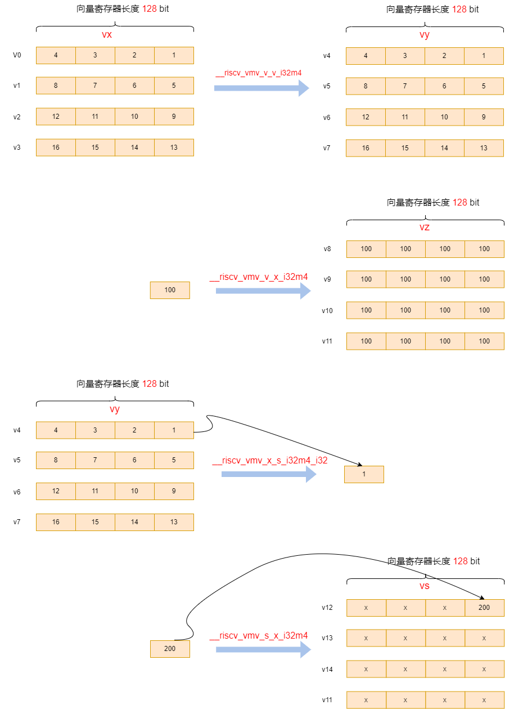
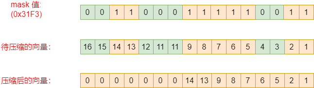

# RISC-V RVV第16 讲之RVV 排列指令

[TOC]

提供一系列排列指令用来在向量寄存器内移动元素。

## 1 标量Move指令

向量-标量Move指令，在标量x寄存器与向量寄存器的元素0之间传输单个值（这条指令会忽略LMUL参数）

~~~shell
vmv.x.s rd, vs2 # x[rd] = vs2[0] (vs1=0)  # 向量move到标量，注意：即使vstart>=vl或者vl=0，这条指令都会执行操作。
vmv.s.x vd, rs1 # vd[0] = x[rs1] (vs2=0)  # 标量move到向量，注意：当vl=0时，无论vstart如何，目标向量寄存器组中都不会更新任何元素。
~~~

## 2 浮点标量移动指令

浮点-标量move指令，在标量f寄存器与向量寄存器的元素0之间传输单个值（这条指令会忽略LMUL参数）

~~~shell
vfmv.f.s rd, vs2 # f[rd] = vs2[0] (rs1=0)
vfmv.s.f vd, rs1 # vd[0] = f[rs1] (vs2=0)
~~~

**有如下不同的Move指令：**

~~~c
vint32m4_t __riscv_vmv_v_v_i32m4 (vint32m4_t src, size_t vl);
vint32m4_t __riscv_vmv_v_x_i32m4 (int32_t src, size_t vl);
int32_t __riscv_vmv_x_s_i32m4_i32 (vint32m4_t src);
vint32m4_t __riscv_vmv_s_x_i32m4 (int32_t src, size_t vl);

vfloat32m4_t __riscv_vmv_v_v_f32m4 (vfloat32m4_t src, size_t vl);
vfloat32m4_t __riscv_vfmv_v_f_f32m4 (float32_t src, size_t vl);
float32_t __riscv_vfmv_f_s_f32m4_f32 (vfloat32m4_t src);
vfloat32m4_t __riscv_vfmv_s_f_f32m4 (float32_t src, size_t vl);
~~~

示例如下：

~~~c
#define DATALEN 16

void main(void)
{
  int32_t vec1[DATALEN] = { 1, 2, 3, 4, 5, 6, 7, 8, 9, 10, 11, 12, 13, 14, 15, 16 };
  int32_t res[DATALEN] = {0};

  size_t vl;
  vint32m4_t vx, vy, vz, vs;

  vl = __riscv_vsetvl_e32m4(DATALEN);
  vx = __riscv_vle32_v_i32m4(vec1, vl);

  // vmv.v.v
  vy = __riscv_vmv_v_v_i32m4 (vx, vl);

  __riscv_vse32_v_i32m4(res, vy, vl);

  for (int i = 0; i < DATALEN; i++) {
    printf("%d, ", res[i]);
  }
  printf("\r\n");

  // vmv.v.x
  vz = __riscv_vmv_v_x_i32m4 (100, vl);

  __riscv_vse32_v_i32m4(res, vz, vl);

  for (int i = 0; i < DATALEN; i++) {
    printf("%d, ", res[i]);
  }
  printf("\r\n");

  // vmv.x.s
  int32_t s1 = __riscv_vmv_x_s_i32m4_i32 (vy);
  printf("s0 = %d\r\n", s1);

  // vmv.s.x
  vs = __riscv_vmv_s_x_i32m4 (200, vl);

  __riscv_vse32_v_i32m4(res, vs, vl);

  for (int i = 0; i < DATALEN; i++) {
    printf("%d, ", res[i]);
  }
  printf("\r\n");
}
~~~

打印结果为：

~~~log
// vmv.v.v
vy[16] = {1, 2, 3, 4, 5, 6, 7, 8, 9, 10, 11, 12, 13, 14, 15, 16,}
// vmv.v.x
vz[16] = {100, 100, 100, 100, 100, 100, 100, 100, 100, 100, 100, 100, 100, 100, 100, 100,}
// vmv.x.s
s0 = 1
// vmv.s.x
vs[16] = {200, 2, 3, 4, 5, 6, 7, 8, 9, 10, 11, 12, 13, 14, 15, 16,}
~~~

其示意图如下：

## 3 向量滑动指令

向量滑动指令会在向量寄存器组上下移动元素。

注意：向量滑动指令比其它vgather指令实现滑动效果更有效率。尤其是滑动2的指数次幂的偏移时会更快。

### 3.1 向量向上滑动指令

~~~shell
vslideup.vx vd, vs2, rs1, vm  # vd[i+rs1] = vs2[i]
vslideup.vi vd, vs2, uimm, vm # vd[i+uimm] = vs2[i]
~~~

示例如下：

~~~c
#define DATALEN 16
int main(void)
{
  int32_t vec1[DATALEN] = {1, 2, 3, 4, 5, 6, 7, 8, 9, 10, 11, 12, 13, 14, 15, 16};
  int32_t res[DATALEN] = {0};

  size_t vl;
  vint32m4_t vx;
  vl = __riscv_vsetvl_e32m4(DATALEN);
  vx = __riscv_vle32_v_i32m4(vec1, vl);
  
  vx = __riscv_vslideup_vx_i32m4 (vx, vx, 3, vl);
  __riscv_vse32_v_i32m4(res, vx, vl);

  for (int i = 0; i < DATALEN; i++) {
    printf("%d, ", res[i]);
  }
  printf("\r\n");
}
~~~

打印结果为：

~~~log
res[16] = {1, 2, 3, 1, 2, 3, 4, 5, 6, 7, 8, 9, 10, 11, 12, 13};  // 向上移动了3个元素，低位的3个元素保持不变
~~~

如果我们调整我们调整vl参数，可以看到有趣的结果：

~~~c
// 调整 vl = 3
vx = __riscv_vslideup_vx_i32m4 (vx, vx, 3, 3);
// 打印结果为：
res[16] = {1, 2, 3, 4, 5, 6, 7, 8, 9, 10, 11, 12, 13, 14, 15, 16};  // 向上移动了3个元素

// 调整 vl = 4
vx = __riscv_vslideup_vx_i32m4 (vx, vx, 3, 4);
// 打印结果为：
res[16] = {1, 2, 3, 1, 5, 6, 7, 8, 9, 10, 11, 12, 13, 14, 15, 16,};  // 向上移动了3个元素

// 调整 vl = 8
vx = __riscv_vslideup_vx_i32m4 (vx, vx, 3, 8);
// 打印结果为：
res[16] = {1, 2, 3, 1, 2, 3, 4, 5, 9, 10, 11, 12, 13, 14, 15, 16};  // 向上移动了3个元素

// 调整 vl = 16
vx = __riscv_vslideup_vx_i32m4 (vx, vx, 3, 16);
// 打印结果为：
res[16] = {1, 2, 3, 1, 2, 3, 4, 5, 6, 7, 8, 9, 10, 11, 12, 13};  // 向上移动了3个元素
~~~

### 3.2 Vector Slidedown Instructions（向量向下滑动指令）

~~~shell
vslidedown.vx vd, vs2, rs1, vm # vd[i] = vs2[i+rs1]
vslidedown.vi vd, vs2, uimm, vm # vd[i] = vs2[i+uimm]
~~~

示例如下：

~~~c
#define DATALEN 16
void main(void)
{
  int32_t vec1[DATALEN] = {1, 2, 3, 4, 5, 6, 7, 8, 9, 10, 11, 12, 13, 14, 15, 16};
  int32_t res[DATALEN] = {0};

  size_t vl;
  vint32m4_t vx;
  vl = __riscv_vsetvl_e32m4(DATALEN);
  vx = __riscv_vle32_v_i32m4(vec1, vl);

  vx = __riscv_vslidedown_vx_i32m4 (vx, 3, vl);
  __riscv_vse32_v_i32m4(res, vx, vl);

  for (int i = 0; i < DATALEN; i++) {
    printf("%d, ", res[i]);
  }
  printf("\r\n");
}
~~~

打印结果为：

~~~log
res[16] = {4, 5, 6, 7, 8, 9, 10, 11, 12, 13, 14, 15, 16, 0, 0, 0};
~~~

同样的，如果我们调整我们调整vl参数，可以看到有趣的结果：

~~~c
// 调整 vl = 3
vx = __riscv_vslidedown_vx_i32m4 (vx, vx, 3, 3);
// 打印结果为：
res[16] = {4, 5, 6, 4, 5, 6, 7, 8, 9, 10, 11, 12, 13, 14, 15, 16};  // 向下移动了3个元素

// 调整 vl = 4
vx = __riscv_vslidedown_vx_i32m4 (vx, vx, 3, 4);
// 打印结果为：
res[16] = {4, 5, 6, 7, 5, 6, 7, 8, 9, 10, 11, 12, 13, 14, 15, 16,};  // 向下移动了3个元素

// 调整 vl = 8
vx = __riscv_vslidedown_vx_i32m4 (vx, vx, 3, 8);
// 打印结果为：
res[16] = {4, 5, 6, 7, 8, 9, 10, 11, 9, 10, 11, 12, 13, 14, 15, 16,};  // 向下移动了3个元素

// 调整 vl = 16
vx = __riscv_vslidedown_vx_i32m4 (vx, vx, 3, 16);
// 打印结果为：
res[16] = {4, 5, 6, 7, 8, 9, 10, 11, 12, 13, 14, 15, 16, 0, 0, 0,};  // 向下移动了3个元素
~~~

### 3.3 Vector Slide1up Instruction（向量向上滑动1元素指令） 

slide1up是vslideup指令的特殊情况，只向上移动一个元素，但是允许在空出的元素位置插入一个标量元素。

~~~shell
vslide1up.vx vd, vs2, rs1, vm # vd[0]=x[rs1], vd[i+1] = vs2[i]
vfslide1up.vf vd, vs2, rs1, vm # vd[0]=f[rs1], vd[i+1] = vs2[i]
~~~

示例如下：

~~~c
#define DATALEN 16
void main(void)
{
  int32_t vec1[DATALEN] = {1, 2, 3, 4, 5, 6, 7, 8, 9, 10, 11, 12, 13, 14, 15, 16};
  int32_t res[DATALEN] = {0};

  size_t vl;
  vint32m4_t vx;
  vl = __riscv_vsetvl_e32m4(DATALEN);
  vx = __riscv_vle32_v_i32m4(vec1, vl);

  vx = __riscv_vslide1up_vx_i32m4 (vx, 99, vl);
  __riscv_vse32_v_i32m4(res, vx, vl);

  for (int i = 0; i < DATALEN; i++) {
    printf("%d, ", res[i]);
  }
  printf("\r\n");
}
~~~

打印结果为：

~~~log
res[16] = { 99,  1,  2, 3, 4, 5, 6, 7, 8, 9, 10, 11, 12, 13, 14, 15}; // 可见低位补充了元素99
~~~

同样的，如果我们调整我们调整vl参数，可以看到有趣的结果：

~~~c
// 调整 vl = 4 
vx = __riscv_vslide1up_vx_i32m4 (vx, 99, 4);
// 打印结果为：
res[16] = {99, 1, 2, 3, 0, 0, 0, 0, 0, 0, 0, 0, 0, 0, 0, 0,}
~~~

### 3.4 Vector Slide1down Instruction（向量向下滑动1元素指令） 

slide1down是vslideup指令的特殊情况，只向上移动一个元素，但是允许在空出的元素位置插入一个标量元素。

~~~shell
vslide1down.vx vd, vs2, rs1, vm # vd[i] = vs2[i+1], vd[vl-1]=x[rs1]
vfslide1down.vf vd, vs2, rs1, vm # vd[i] = vs2[i+1], vd[vl-1]=f[rs1]
~~~

示例如下：

~~~c
#define DATALEN 16
void main(void)
{
  int32_t vec1[DATALEN] = {1, 2, 3, 4, 5, 6, 7, 8, 9, 10, 11, 12, 13, 14, 15, 16};
  int32_t res[DATALEN] = {0};

  size_t vl;
  vint32m4_t vx;
  vl = __riscv_vsetvl_e32m4(DATALEN);
  vx = __riscv_vle32_v_i32m4(vec1, vl);

  vx = __riscv_vslide1down_vx_i32m4 (vx, 99, vl);
  __riscv_vse32_v_i32m4(res, vx, vl);

  for (int i = 0; i < DATALEN; i++) {
    printf("%d, ", res[i]);
  }
  printf("\r\n");
}
~~~

打印结果为：

~~~log
res[16] = { 2, 3, 4, 5, 6, 7, 8, 9, 10, 11, 12, 13, 14, 15, 16, 99}; // 可见高位补充了元素99
~~~

同样的，如果我们调整我们调整vl参数，可以看到有趣的结果：

~~~c
// 调整 vl = 4 
vx = __riscv_vslide1down_vx_i32m4 (vx, 99, 4);
// 打印结果为：
res[16] = {2, 3, 4, 99, 5, 6, 7, 8, 9, 10, 11, 12, 13, 14, 15, 16,}
~~~

## 4 向量寄存器收集指令（Vector Register Gather Instructions）

vrgather 是在向量寄存器里进行索引。

**注意：**vrgather 与 按索引的load & store差别是：vrgather 是在向量寄存器里进行索引，另外其index 以元素为单位，表示第几个元素，不用再乘以位宽。

~~~shell
vrgather.vv vd, vs2, vs1, vm # vd[i] = (vs1[i] >= VLMAX) ? 0 : vs2[vs1[i]];
vrgatherei16.vv vd, vs2, vs1, vm # vd[i] = (vs1[i] >= VLMAX) ? 0 : vs2[vs1[i]];
~~~

示例如下：

~~~c
#define DATALEN 16

void main(void)
{
  int32_t vec1[DATALEN] = { 1, 2, 3, 4, 5, 6, 7, 8, 9, 10, 11, 12, 13, 14, 15, 16 };
   // 与 index load&store不同
  uint32_t index[DATALEN] = { 5, 5, 5, 5, 5, 5, 5, 5, 11, 11, 11, 11, 15, 15, 15, 15 };
  int32_t res[DATALEN] = {0};

  size_t vl;
  vint32m4_t vx;
  vuint32m4_t vy;
  vl = __riscv_vsetvl_e32m4(DATALEN);
  vx = __riscv_vle32_v_i32m4(vec1, vl);
  vy = __riscv_vle32_v_u32m4(index, vl);

  vx = __riscv_vrgather_vv_i32m4 (vx, vy, vl);

  __riscv_vse32_v_i32m4(res, vx, vl);

  for (int i = 0; i < DATALEN; i++) {
    printf("%d, ", res[i]);
  }
  printf("\r\n");
}
~~~

打印结果为：

~~~log
res[16] = { 6, 6, 6, 6, 6, 6, 6, 6, 12, 12, 12, 12, 16, 16, 16, 16,}; // 相当于在向量寄存器里索引
~~~

## 5 Vector Compress Instruction（向量压缩指令）

向量压缩指令允许从源向量寄存器中挑选出由向量掩码寄存器标记的元素打包到目标向量寄存器开始处，简单来说：compress指令用于将数据中某些数据“剔除”，实现数据压缩。

~~~shell
vcompress.vm vd, vs2, vs1 # Compress into vd elements of vs2 where vs1 is enabled
~~~

示例代码如下：

~~~c
#define DATALEN 16

void main(void)
{
  int32_t vec1[DATALEN] = { 1, 2, 3, 4, 5, 6, 7, 8, 9, 10, 11, 12, 13, 14, 15, 16 };
  uint8_t compress_t[2] = {0xF3, 0x31};
  int32_t res[DATALEN] = {0};

  size_t vl;
  vint32m4_t vx;
  vbool8_t mask;
  vl = __riscv_vsetvl_e32m4(DATALEN);

  mask = __riscv_vlm_v_b8(compress_t, vl);
  vx = __riscv_vle32_v_i32m4(vec1, vl);

  vx = __riscv_vcompress_vm_i32m4 (vx, mask, vl);
  __riscv_vse32_v_i32m4(res, vx, vl);

  for (int i = 0; i < DATALEN; i++) {
    printf("%d, ", res[i]);
  }
  printf("\r\n");
}
~~~

打印结果为：

~~~log
res[16] = { 1, 2, 5, 6, 7, 8, 9, 13, 14, 0, 0, 0, 0, 0, 0, 0,};
~~~

下图可以清晰的看到这条指令的作用，vcompress指令需要找出mask数据中1的位置（index），再根据位置实现数据重排列。

### 5.1 Vector Compress Instruction（向量解压缩指令）

RVV扩展没有直接提供解压缩指令，因为解压缩很容易用iota + vrgather指令来代替。

示例代码如下：

~~~c
#define DATALEN 16

void main(void)
{
  int32_t vec1[DATALEN] = { 1, 2, 3, 4, 5, 6, 7, 8, 9, 10, 11, 12, 13, 14, 15, 16 };
  uint8_t compress_t[2] = {0xF3, 0x31};
  int32_t res[DATALEN] = {100, 200, 300, 400, 500, 600, 700, 800, 900, 1000, 1100, 1200, 1300, 1400, 1500, 1600};

  size_t vl;
  vint32m4_t vx, vy;
  vbool8_t mask;
  vl = __riscv_vsetvl_e32m4(DATALEN);
  vx = __riscv_vle32_v_i32m4(vec1, vl);
  vy = __riscv_vle32_v_i32m4(res, vl);

  mask = __riscv_vlm_v_b8(compress_t, vl);
  vuint32m4_t valm4 = __riscv_viota_m_u32m4 (mask, vl);

  vy = __riscv_vrgather_vv_i32m4_mu (mask, vy, vx, valm4, vl);

  __riscv_vse32_v_i32m4(res, vy, vl);
  for (int i = 0; i < DATALEN; i++) {
    printf("%d, ", res[i]);
  }
  printf("\r\n");
}
~~~

打印结果如下：

~~~log
res[16] = {1, 2, 300, 400, 3, 4, 5, 6, 7, 1000, 1100, 1200, 8, 9, 1500, 1600,}
~~~

## 6 整个向量寄存器的移动（Whole Vector Register Move ）

整个寄存器拷贝指令。

~~~shell
vmv<nr>r.v vd, vs2 # General form
vmv1r.v v1, v2 # Copy v1=v2
vmv2r.v v10, v12 # Copy v10=v12; v11=v13
vmv4r.v v4, v8 # Copy v4=v8; v5=v9; v6=v10; v7=v11
vmv8r.v v0, v8 # Copy v0=v8; v1=v9; ...; v7=v15
~~~
