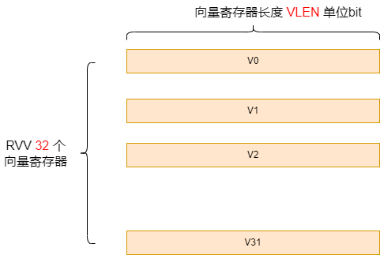
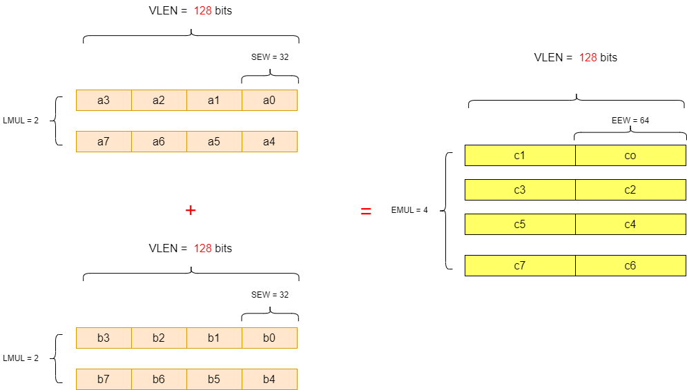

# RISC-V RVV第2讲之RVV常见名词解释

[TOC]

## 1 RVV 中常见缩略词

RVV中有一些常用缩写词，看RVV spec时需要弄明白这些概念。

以下列一下RVV中常见的单词缩写

| 单词缩写 | 全称                      | 含义                                                         |
| -------- | ------------------------- | ------------------------------------------------------------ |
| VLEN     | Vector Length in bits     | 向量寄存器长度，单位bits                                     |
| ELEN     | Element Length            | 最大元素宽度，单位bits，常见的ELEN=32 和 ELEN=64，即最大元素宽度就是XLEN值 |
| SEW      | Selected Element Width    | 被选中的元素位宽，见下文详细描述                             |
| EEW      | Effective Element Width   | 与SEW类似，有效的元素位宽，用于向量操作数。对于加宽指令，目的数据元素的位宽会加宽一倍 |
| LMUL     | Vector Length Multiplier  | 寄存器组乘系数，表示一个寄存器组由多少个向量寄存器组成       |
| EMUL     | Effective Element Width   | 与LMUL类似，表示有效寄存器组乘系数，对于加宽指令，目的寄存器组乘系数会加宽一倍 |
| AVL      | Application Vector Length | 应用程序向量长度，指的是应用程序希望处理的数据元素总数       |
| VL       | Vector Length             | 向量长度，`vl`（Vector Length）是一个关键的控制寄存器，RVV并不是能设置`vl`寄存器的，而是将AVL参数传递给vsetvl指令来设置正确的`vl`值 |

## 2 RVV 中缩略词的含义

**ELEN**：

ELEN 表示VPU支持的最大元素宽度，约束：`ELEN >= 8`，且ELEN是2的幂，常见的ELEN=32 和 ELEN=64

**VLEN**：

`VLEN`表示单个向量寄存器的位数，**约束：**`VLEN≥ELEN`，`VLEN`必须是2的幂，且`VLEN` <= 65536（即2的16次幂）, 常见的`VLEN `= 128bits，256bits，512bits，1024bits等

`VLEN`在芯片设计时就确定下来了，怎么获取VPU的`VLEN`？直接读取`vlenb` 寄存器然后乘以8 即可（原因是`vlenb` 以 Bypte为单位，`VLEN`以bit为单位），见第3讲

注意：标准向量扩展（Section Standard Vector Extensions）和架构配置文件可能会对 `ELEN` 和 `VLEN` 设置进一步的限制:

1. 未来V扩展可能允许使用多个向量寄存器来保存一个元素，`ELEN` > `VLEN`，但当前版本不支持这么做。

2. `VLEN` <= 2^16

**SEW**：

`SEW` 表示被选中的元素位宽，`SEW`可以取8/16/32/64

| SEW  | 对应的C语言数据类型                      |
| ---- | ---------------------------------------- |
| 8    | int8_t，uint8_t                          |
| 16   | int16_t，uint16_t, float16_t, bfloat16_t |
| 32   | int32_t，uint32_t, float32_t             |
| 64   | int64_t，uint64_t, float64_t             |

**EEW**:

`EEW`表示有效的元素位宽，用于向量操作数，一般情况下`EEW`=`SEW`，但有些加宽指令中，数据元素的位宽会加宽一倍也即`EEW`=`2 * SEW`

比如rvv中`vwadd` 扩宽加为例，`EEW`=`2 * SEW`：

~~~sh
# Widening signed integer add/subtract, 2 * SEW = SEW + SEW
vwadd.vv vd, vs2, vs1, vm # vector-vector
~~~

**LMUL**：

`LMUL`表示寄存器组乘系数，表示一个寄存器组由多少个向量寄存器组成，`LMUL` 可取值1/8，1/4，1/2， 1，2， 4，8 这并不意味着在什么情况下`LMUL` 都能取上述所有值之一，`LMUL`需要满足如下约束（第8讲5.1节有更详细的讨论）：

~~~sh
ELEN * EMUL >= SEW
~~~

**EMUL**：

`EMUL`表示有效寄存器组乘系数，一般情况下`EMUL`=`LMUL`，有些加宽指令中，元素的数量是一样的，所以对于目的操作数，寄存器组乘系数需加宽一倍。

`SEW` `EEW` `LMUL` `EMUL` 这四个参数有如下关系：

~~~c
EEW/EMUL = SEW/LMUL
~~~

分为如下情况：

* 一般指令，`EEW`=`SEW` 且 `EMUL`=`LMUL`
* 加宽指令，对于源操作数：`EEW`=`SEW` 且 `EMUL`=`LMUL`， 对于目的操作数：`EEW`=2 * `SEW` 且 `EMUL`= 2 * `LMUL`
* 缩减指令，对于源操作数：`EEW`=2 * `SEW` 且 `EMUL`= 2 * `LMUL`，对于目的操作数：`EEW`=`SEW` 且 `EMUL`=`LMUL`

**举例：**

以 A + B = C 向量扩宽加法举例：

A B 输入数据类型为int32，

C的数据类型为Int64

假设VLEN=128bits，那么一个向量寄存器可以放{a0~a3} 共4个元素，如果`LMUL`=2 时，意味着使用两个向量寄存器，一共可以装{a0~a7}共8个元素，此时`EEW`=`SEW` 且 `EMUL`=`LMUL`，向量B也是类似

对于输出C向量，数据类型为Int64，VLEN=128bits，那么一个向量寄存器可以放{c0~c1} 共2个元素，很明显2个寄存器存放不了8个int64 元素，所以LMUL也要扩宽，也即`EEW`=2 * `SEW` 且 `EMUL`= 2 * `LMUL`

## 参考：

1. [rvv1.0 spec](https://github.com/riscv/riscv-v-spec/blob/v1.0/v-spec.adoc)