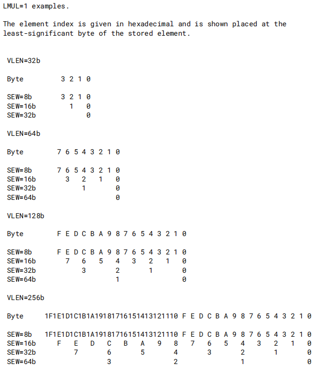
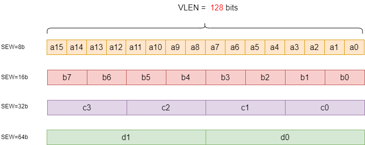
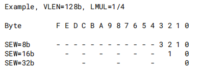
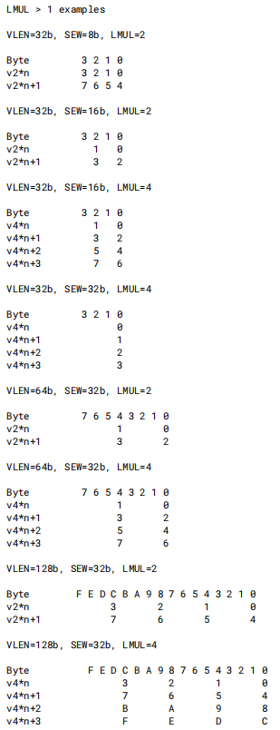
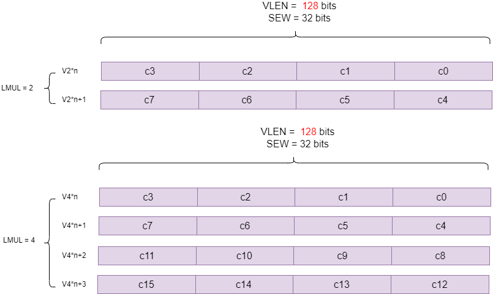
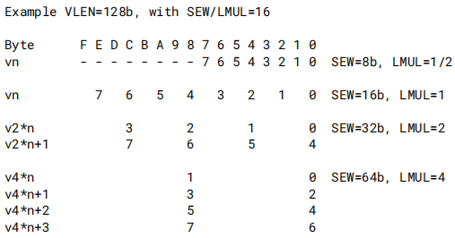

# RISC-V RVV第4讲之RVV 数据在向量寄存器的布局

[TOC]

这一章讲述不同的`SEW`、 `LMUL` 以及`VLEN`参数下向量寄存器中元素的排布。

## 1 LMUL = 1

当`LMUL` = 1，意味着只使用单个向量寄存器，用来将数据摆放到这个寄存器里。

如下图表示不同`VLEN`下， 不同`SEW`的元素单个向量寄存器（`LMUL` = 1）的排布。

以上图`VLEN` =128bits 为例，说明不同宽度的元素摆放到单个向量寄存器中的情况：

~~~c
// VLEN =128bits时，单个向量寄存器可以保存16个int8 或者 8个int16 或 4个int32 或 2个int64
int8_t  a[16];
int16_t b[8];
int32_t c[4];
int64_t d[2];
~~~

## 2 LMUL < 1

当`LMUL` < 1，意味着只使用单个向量寄存器的一部分。向量寄存器中剩余部分（下图画横线部分）被视为尾部（Tail部分）的一部分，尾部元素必须服从vta设置。

## 3 LMUL > 1

当`LMUL` > 1，意味着可以使用多个向量寄存器用来统一存放数据。

以上图`VLEN` =128bits `SEW` = 32为例，说明多个向量寄存器存放数据情况：

~~~c
// VLEN = 128bits时，LMUL = 2 表示2个向量寄存器可以保存8个int32
int32_t c[8];

// VLEN = 128bits时，LMUL = 4 表示4个向量寄存器可以保存16个int32
int32_t c[16];
~~~

## 4 混合宽度运算

spec 允许不同宽度（即 `SEW` ）的元素进行运算，只需要元素个数一致。也即满足如下约束：

~~~c
SEW/LMUL 相等，也即 VLMAX = LMUL*VLEN/SEW 也是一个常数
~~~

下例显示了在`VLEN` =128bits时四种不同的填充元素宽度（8b、16b、32b、64b）以及不同的寄存器组乘系数（`LMUL` = 1/2，1, 2, 4），每组的`SEW/LMUL`都等于16 ，这样每个组都可以持有相同数量的向量元素（在本例中为`VLMAX`=8）

## 5 掩码寄存器的布局

向量掩码只占用一个向量寄存器，与`SEW` 与 `LMUL`无关。掩码一个bit对应一个元素。

对于 VLMAX = LMUL*VLEN/SEW ， 当LMUL=8以及SEW=8 时，VLMAX取最大值，值为VLEN，也即向量寄存器组最多存储VLEN个元素，一个掩码寄存器（VLEN bits）正好能够对应。后面在第15章讲mask的章节再详细描述。

## 参考：

1. [rvv-intrinsic-doc](https://github.com/riscv-non-isa/rvv-intrinsic-doc/blob/main/doc/rvv-intrinsic-spec.adoc)

