# RISC-V RVV第10讲之RVV向量加载存储指令

[TOC]

RVV load & store指令用于从内存和向量寄存器之间搬运数据，具体来说可以分为如下2种情况：

1. 将内存数据搬运到向量寄存器中，即RVV load指令
2. 将向量寄存器的内容存到内存中，即RVV store指令

**RVV优化的关键点是：**数据的布局很重要，SIMD只适合处理规整的数据，我们需要将数据摆放“整齐”，然后进行向量运算。所以需要我们比较熟悉load & store指令。

## 1 RVV load & store 指令的3种类型

RVV load & store 指令支持三种寻址模式，分别为：

* Unit-Stride load & store,  即单位步长的load&store
* Strided  load & store, 即跨步长的load&store
* Indexed load & store，即按索引的load & store，也称聚合加载/离散存储模式（gather-load/scatter-store）

## 2 RVV load & store 指令的格式

第5讲已经简单的提过向量load & store的指令格式。下图更详细的指明指令中各个域的含义：

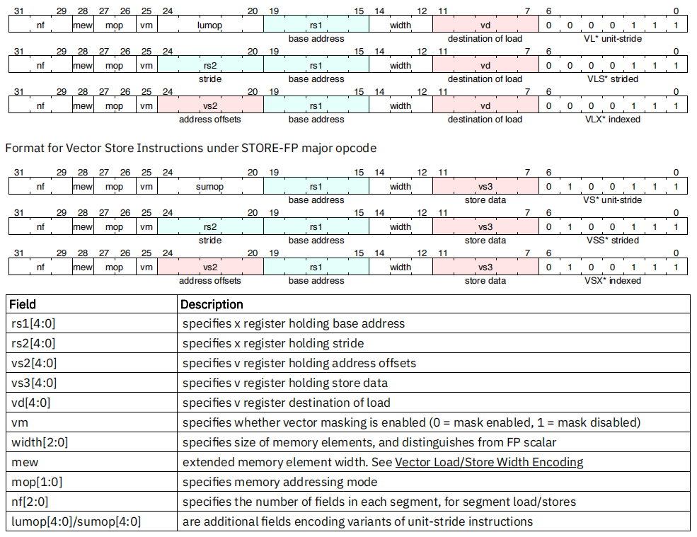

## 3  RVV load & store 

### 3.1 单位步长的load&store (Unit-Stride load & store)

单位步长的load&store 指令用来load&store连续的内存数据。

~~~asm
# Vector unit-stride loads and stores

# vd 表示目的向量寄存器，rs1表示内存基地址, vm 表示掩码操作数 (v0.t or 空)
vle8.v vd, (rs1), vm  # 加载8位宽的数据元素
vle16.v vd, (rs1), vm # 加载16位宽的数据元素
vle32.v vd, (rs1), vm # 加载32位宽的数据元素
vle64.v vd, (rs1), vm # 加载64位宽的数据元素

# vs3 表示向量寄存器元素, rs1表示内存基地址, vm 表示掩码操作数 (v0.t or 空)
vse8.v vs3, (rs1), vm  # 存储8位宽的数据元素
vse16.v vs3, (rs1), vm # 存储16位宽的数据元素
vse32.v vs3, (rs1), vm # 存储32位宽的数据元素
vse64.v vs3, (rs1), vm # 存储64位宽的数据元素
~~~

其中`vm` 表示掩码参数，其值为v0.t 或 为空，为v0.t时表示使用v0寄存器当做掩码寄存器，不带`vm`字段时表示目标向量寄存器的所有数据都是活跃的。

另外：提供单位步长的掩码load&stote指令，见第15讲RVV Mask指令示例的用法。

~~~c
# Vector unit-stride mask load
vlm.v vd, (rs1) # Load byte vector of length ceil(vl/8)

# Vector unit-stride mask store
vsm.v vs3, (rs1) # Store byte vector of length ceil(vl/8)
~~~

**intrinsics 示例：**

~~~c
#define DATALEN 16
int main(void)
{
  int32_t vec1[DATALEN] = {1, 2, 3, 4, 5, 6, 7, 8, 9, 10, 11, 12, 13, 14, 15, 16};
  int32_t res[DATALEN] = {0};

  vint32m4_t vx;
  size_t avl = DATALEN;

  size_t vl = __riscv_vsetvl_e32m4(avl);  // 设置参数

  vx = __riscv_vle32_v_i32m4(vec1, vl);   // load

  __riscv_vse32_v_i32m4 (res, vx, vl);    // store数据，可以将vx线性化，顺序装到MEM地址为pDes的地方
	
  // 数据打印
  for (int i = 0; i < DATALEN; i++) {
  	printf("%d, ", res[i]);
  }
  printf("\r\n");

  return 0;
}
~~~

打印结果为：

~~~log
res[16] = {1, 2, 3, 4, 5, 6, 7, 8, 9, 10, 11, 12, 13, 14, 15, 16};
~~~

上述例子展示的是将数据从连续内存load到RVV寄存器中，然后又将RVV寄存器数据store回内存，然后打印观察。数据类型为int32，`lmul ` = 4

编译，得到可执行文件为 vl_test.elf，分别使用VLEN=128 和 VLEN=256的qemu环境运行这个elf：

~~~sh
# VLEN=128的qemu环境运行
$ qemu-riscv64 -cpu rv64,g=true,c=true,v=true,vlen=128,elen=64,vext_spec=v1.0 ./vl_test.elf

# VLEN=256的qemu环境运行
$ qemu-riscv64 -cpu rv64,g=true,c=true,v=true,vlen=256,elen=64,vext_spec=v1.0 ./vl_test.elf
~~~

打印结果为：

~~~log
1, 2, 3, 4, 5, 6, 7, 8, 9, 10, 11, 12, 13, 14, 15, 16
~~~

**调试：**

通过gdb查看RVV寄存器。

~~~sh
# VLEN=128的qemu环境，并启动调试接口1234
$ qemu-riscv64 -cpu rv64,g=true,c=true,v=true,vlen=128,elen=64,vext_spec=v1.0 -g 1234 ./vle_test.elf
# 新建一个gdb终端
$ riscv64-unknown-linux-gnu-gdb
(gdb) target remote localhost:1234
(gdb) file vle_test.elf
# 进行gdb调试，单步到  vx = __riscv_vle32_v_i32m4(pSrc, vl);  之后，查看向量寄存器
(gdb) info reg all

# VLEN=256的qemu环境，并启动调试接口1234
$ qemu-riscv64 -cpu rv64,g=true,c=true,v=true,vlen=256,elen=64,vext_spec=v1.0 -g 1234 ./vle_test.elf
# 然后启动gdb调试，单步到  vx = __riscv_vle32_v_i32m4(pSrc, vl);  之后，查看向量寄存器
~~~

可见，VLEN=128 和VLEN=256的vx变量排布示意图如下：（示例中存放的寄存器是v0-v4，实际情况要看汇编写到哪几个寄存器，另外VLEN=256 的v2/v3寄存器不确定）

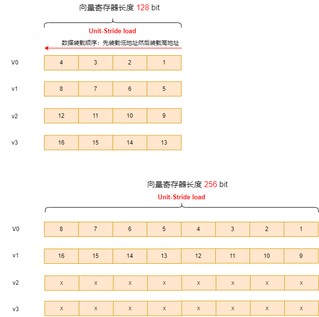

为了方便，后面举例都以VLEN=128为例，并且只介绍load过程，因为store方式与load方式类似，只不过load数据是从内存到向量寄存器，store时数据是从向量寄存器到内存。

### 3.2 跨步长的load&store (Strided  load & store)

跨步长的load&store 指令用来load&store间隔相等步长的内存数据（支持0间距或者步长为负值）。

~~~shell
 # Vector strided loads and stores
 # vd destination, rs1 base address, rs2 byte stride
 vlse8.v vd, (rs1), rs2, vm  # 8位宽的数据跨步长的load
 vlse16.v vd, (rs1), rs2, vm # 16位宽的数据跨步长的load
 vlse32.v vd, (rs1), rs2, vm # 32位宽的数据跨步长的load
 vlse64.v vd, (rs1), rs2, vm # 64位宽的数据跨步长的load
 
 # vs3 store data, rs1 base address, rs2 byte stride
 vsse8.v vs3, (rs1), rs2, vm  # 8位宽的数据跨步长的store
 vsse16.v vs3, (rs1), rs2, vm # 16位宽的数据跨步长的store
 vsse32.v vs3, (rs1), rs2, vm # 32位宽的数据跨步长的store
 vsse64.v vs3, (rs1), rs2, vm # 64位宽的数据跨步长的store
~~~

示例如下：

~~~c
#define DATALEN 16
int main(void)
{
  int32_t vec1[DATALEN] = {1, 2, 3, 4, 5, 6, 7, 8, 9, 10, 11, 12, 13, 14, 15, 16, };
  int32_t res[DATALEN] = {0};

  vint32m4_t vx;
  size_t avl = DATALEN;
  // 以字节为单位，对于EEW=32bit，bstride = 16 表示跨过4个元素
  ptrdiff_t bstride = 16;
  size_t vl = __riscv_vsetvl_e32m4(avl);

  vx = __riscv_vlse32_v_i32m4(vec1, bstride, vl);

  __riscv_vse32_v_i32m4 (res, vx, vl);

  // 数据打印
  for (int i = 0; i < DATALEN; i++) {
    printf("%d, ", res[i]);
  }
  printf("\r\n");

  return 0;
}
~~~

打印结果为：

~~~log
res[4] = {1, 5, 9, 13}
~~~

**注意：vl 与 avl，步长bstride，以及数组大小的约束关系**

~~~sh
# sizeof(Array[]) 表示数组大小，单位为字节
有效vl = MIN(sizeof(Array[])/bstride, avl)
~~~

通过gdb查看RVV寄存器，可见vx的排布如下图：

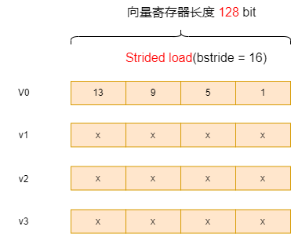

步长bstride的单位为字节，可以取正值、0或负值，举例如下：

**注意：**步长bstride 需设置为 `SEW` （以字节为单位）的整数倍，否则结果可能不符合预期。

例如，数据类型为int32，也即SEW = 32bit（4字节），则步长bstride需要设置为4字节的整数倍，如-8, -4, 0, 4, 8, 12, 16等值

* 设置**bstride = 4**（表示 4Bytes 即 e32）时，每隔32bit取一个元素，和上一节中的Unit-Stride load 结果相同，寄存器排布为：

  

* 设置**bstride = 8** 时，每隔一个e32取一个元素，pDes[16] = {1, 3, 5, 7, 9, 11, 13, 15...} 可以实现分奇偶取数的目的。

  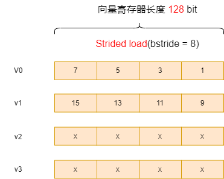

* 设置**bstride = 0** 时，只会取元素0，上述用例结果为 pDes[16] = {1, 1, 1, 1, 1, 1, 1, 1, 1, 1, 1, 1, 1, 1, 1, 1};

  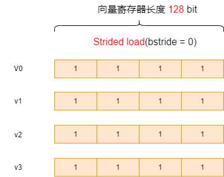

* 设置**bstride = -4** 时，并修改上述用例，从数组尾部作为基地址（修改部分如下），则会实现倒序效果，

  pDes[16] = {16, 15, 14, 13, 12, 11, 10, 9, 8, 7, 6, 5, 4, 3, 2, 1}
  
  ~~~c
  - ptrdiff_t bstride = 16;
  + ptrdiff_t bstride = -4;
  
  - vx = __riscv_vlse32_v_i32m4(pSrc, bstride, vl);
  + vx = __riscv_vlse32_v_i32m4(pSrc + 15, bstride, vl);
  ~~~

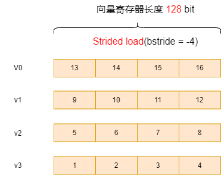

* 设置**bstride  为其它值** 时

上面提到过，步长bstride 需设置为 `SEW` （以字节为单位）的整数倍，否则结果可能不符合预期。

举例：如果设置的步长不是`SEW`的整数倍，例如设置 bstride = 3

则结果为：

~~~log
res[16] = {1, 512, 196608, 67108864, 4, 1280, 393216, 117440512, 7, 2048, 589824, 167772160, 10, 2816, 786432, 218103808}，
~~~

将其以16进制显示，则更方便分析：

~~~log
res[16] = {0x1, 0x200, 0x30000, 0x4000000, 0x4, 0x500, 0x60000, 0x7000000, 0x7, 0x800, 0x90000, 0xa000000, 0xa, 0xb00, 0xc0000, 0xd000000}
~~~

下图表示bstride = 3的取数过程：

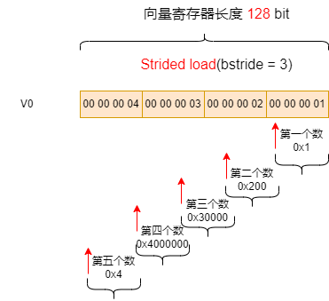

### 3.3  按索引的load & store (Indexed load & store)

按索引的load & store也称聚合加载/离散(scatter/gather）存储模式。

按索引的load 可以装载指定index的元素（并不要求是数据连续的或者有固定间隔，而是用index向量来描述装载元素相对起始点的位置）， 按索引的Store 可以将向量寄存器中的元素存储到index 指定的位置。

使用按索引的load & store有如下几点要注意：

1. 按索引的load & store 方式，首先需要先load index向量。（这一步是比单位步长和跨步长load多做的，所以按索引的load & store性能是最差）
2. index向量描述的是相对起点的偏移，只能是正整数（从intrinsic中的index变量类型为无符号类型可以看出这点）。
3. 按索引的load & store 可以实现单位步长和跨步长的load&store的效果，但性能是最差的；

按索引的load & store 支持以下两种形式：

* 有序索引(indexed-ordered)：访问内存时按照索引的顺序有序地访问
* 无序索引(indexed-unordered)：访问内存时不能保证数据元素的访问顺序

~~~shell
 # Vector indexed loads and stores
 # 向量无序load
 # vd destination, rs1 base address, vs2 byte offsets
 vluxei8.v vd, (rs1), vs2, vm  # unordered 8-bit indexed load of SEW data
 vluxei16.v vd, (rs1), vs2, vm # unordered 16-bit indexed load of SEW data
 vluxei32.v vd, (rs1), vs2, vm # unordered 32-bit indexed load of SEW data
 vluxei64.v vd, (rs1), vs2, vm # unordered 64-bit indexed load of SEW data
 
 # 向量有序load
 # vd destination, rs1 base address, vs2 byte offsets
 vloxei8.v vd, (rs1), vs2, vm  # ordered 8-bit indexed load of SEW data
 vloxei16.v vd, (rs1), vs2, vm # ordered 16-bit indexed load of SEW data
 vloxei32.v vd, (rs1), vs2, vm # ordered 32-bit indexed load of SEW data
 vloxei64.v vd, (rs1), vs2, vm # ordered 64-bit indexed load of SEW data
 
 # 向量无序store
 # vs3 store data, rs1 base address, vs2 byte offsets
 vsuxei8.v vs3, (rs1), vs2, vm  # unordered 8-bit indexed store of SEW data
 vsuxei16.v vs3, (rs1), vs2, vm # unordered 16-bit indexed store of SEW data
 vsuxei32.v vs3, (rs1), vs2, vm # unordered 32-bit indexed store of SEW data
 vsuxei64.v vs3, (rs1), vs2, vm # unordered 64-bit indexed store of SEW data
 
 # 向量有序store
 # vs3 store data, rs1 base address, vs2 byte offsets
 vsoxei8.v vs3, (rs1), vs2, vm  # ordered 8-bit indexed store of SEW data
 vsoxei16.v vs3, (rs1), vs2, vm # ordered 16-bit indexed store of SEW data
 vsoxei32.v vs3, (rs1), vs2, vm # ordered 32-bit indexed store of SEW data
 vsoxei64.v vs3, (rs1), vs2, vm # ordered 64-bit indexed store of SEW data
~~~

示例如下：

~~~c
#define DATALEN 16
int main(void)
{
  int vec1[DATALEN] = {1, 2, 3, 4, 5, 6, 7, 8, 9, 10, 11, 12, 13, 14, 15, 16};
  int res[DATALEN] = {0};

  vint32m4_t vx;
  size_t avl = DATALEN;

  vuint32m4_t bindex;
  // 注意index单位为byte
  uint32_t index_table[4] = {7 * 4, 3 * 4, 10 * 4, 8 * 4};

  size_t vl = __riscv_vsetvl_e32m4(avl);

  bindex = __riscv_vle32_v_u32m4(index_table, vl);

  vx = __riscv_vloxei32_v_i32m4(vec1, bindex, vl);

  __riscv_vse32_v_i32m4 (res, vx, vl);

  // 数据打印
  for (int i = 0; i < 4; i++) {
    printf("%d, ", res[i]);
  }
  printf("\r\n");
}
~~~

打印结果为：

~~~log
8, 4, 11, 9
~~~

其取数示意图如下：

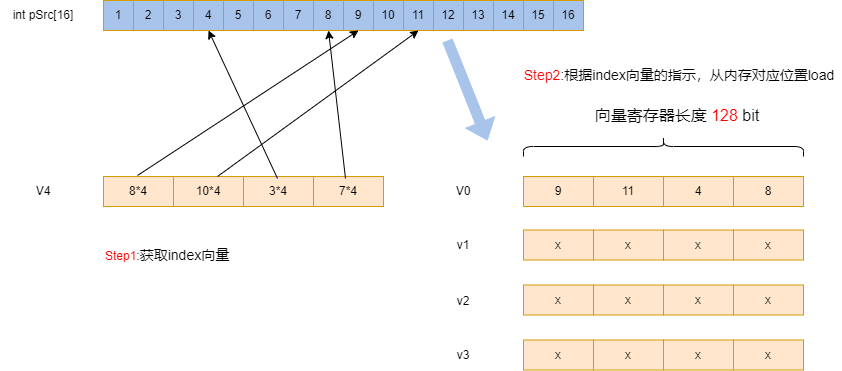

step1：获取index向量，index_table[4] = {7 * 4, 3 * 4, 10 * 4, 8 * 4};

step2：按照index向量的指示，从对应位置load数据，比如index = 7 * 4 指示pSrc[7]

## 4 RVV segment load & store

RVV load & store 编码中有个`nf[2:0]`位域，这个参数用来指令segment参数。

RVV segment load & store 又分为3种类型：

* Sgement Unit-Stride load & store,  即单位步长的Sgement load&store
* Sgement Strided  load & store, 即跨步长的Sgement load&store
* Sgement Indexed load & store，即按索引的Sgement load & store

### 4.1 单位步长的Sgement load&store (Sgement Unit-Stride load & store)

~~~shell
# Format
 vlsseg<nf>e<eew>.v vd, (rs1), rs2, vm  # Strided segment loads
 vssseg<nf>e<eew>.v vs3, (rs1), rs2, vm # Strided segment stores
 # Examples
 vsetvli a1, t0, e8, ta, ma
 vlsseg3e8.v v4, (x5), x6 # Load bytes at addresses x5+i*x6 into v4[i],
 # and bytes at addresses x5+i*x6+1 into v5[i],
 # and bytes at addresses x5+i*x6+2 into v6[i].
 # Examples
 vsetvli a1, t0, e32, ta, ma
 vssseg2e32.v v2, (x5), x6 # Store words from v2[i] to address x5+i*x6
 # and words from v3[i] to address x5+i*x6+4
~~~

示例如下：

~~~c
#define DATALEN 16
int main(void)
{
  int vec1[DATALEN] = {1, 2, 3, 4, 5, 6, 7, 8, 9, 10, 11, 12, 13, 14, 15, 16};
  int res[DATALEN] = {0};

  size_t avl = 7;

  size_t vl = __riscv_vsetvl_e32m4(avl);  // 设置参数

  vint32m4x2_t vtuple = __riscv_vlseg2e32_v_i32m4x2 (vec1, vl);
  
  vint32m4_t vx = __riscv_vget_v_i32m4x2_i32m4 (vtuple, 0);
  vint32m4_t vy = __riscv_vget_v_i32m4x2_i32m4 (vtuple, 1);
  
  // 数据打印
  __riscv_vse32_v_i32m4 (res, vx, vl);
  printf("vx is:\r\n");
  for (int i = 0; i < 8; i++) {
    printf("%d, ", res[i]);
  }
  printf("\r\n");
  
  __riscv_vse32_v_i32m4 (res, vy, vl);
  printf("vy is:\r\n");
  for (int i = 0; i < 8; i++) {
    printf("%d, ", res[i]);
  }
  printf("\r\n");
 
  return 0;
}
~~~

打印结果为：

~~~sh
# 结果如下，可以实现一次segment load 分奇偶的目的
vx[16] = {1, 3, 5, 7, 9, 11, 13, x}
vy[16] = {2, 4, 6, 8, 10, 12, 14, x}
~~~

上例中vx、vy在寄存器中的排布如下(注意示例中故意将avl取7，表明在segment load&store 时，avl <=  数组长度/`nf`)：

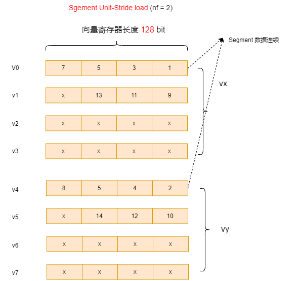

另外举一个nf=4的Segment Unit-Stride load的例子，可以看到**约束：**

~~~sh
nf * lmul <= 8
~~~

示例如下：

~~~c
#define DATALEN 16
int main(void)
{
  int vec1[DATALEN] = {1, 2, 3, 4, 5, 6, 7, 8, 9, 10, 11, 12, 13, 14, 15, 16};
  int res[DATALEN] = {0};

  size_t avl = 7;

  size_t vl = __riscv_vsetvl_e32m2(avl);  // 设置参数

  vint32m2x4_t vtuple = __riscv_vlseg4e32_v_i32m2x4 (vec1, vl);
  
  vint32m2_t va = __riscv_vget_v_i32m2x4_i32m2 (vtuple, 0);
  vint32m2_t vb = __riscv_vget_v_i32m2x4_i32m2 (vtuple, 1);
  
  vint32m2_t vc = __riscv_vget_v_i32m2x4_i32m2 (vtuple, 2);
  vint32m2_t vd = __riscv_vget_v_i32m2x4_i32m2 (vtuple, 3);
  
  // 数据打印
  __riscv_vse32_v_i32m2 (res, va, vl);
  printf("va is:\r\n");
  for (int i = 0; i < avl; i++) {
    printf("%d, ", res[i]);
  }
  printf("\r\n");
  
  __riscv_vse32_v_i32m2 (res, vb, vl);
  printf("vb is:\r\n");
  for (int i = 0; i < avl; i++) {
    printf("%d, ", res[i]);
  }
  printf("\r\n");
  
  __riscv_vse32_v_i32m2 (res, vc, vl);
  printf("vc is:\r\n");
  for (int i = 0; i < avl; i++) {
    printf("%d, ", res[i]);
  }
  printf("\r\n");
  
  __riscv_vse32_v_i32m2 (res, vd, vl);
  printf("vd is:\r\n");
  for (int i = 0; i < avl; i++) {
    printf("%d, ", res[i]);
  }
  printf("\r\n");
 
  return 0;
}
~~~

其结果为:

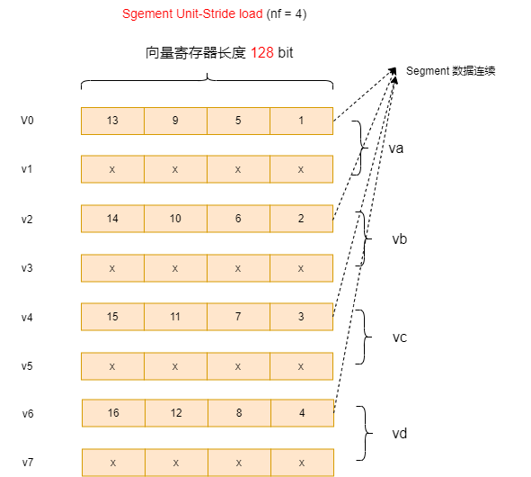

### 4.2 跨步长的Sgement load&store (Sgement Strided load & store)

~~~shell
 # Format
 vlsseg<nf>e<eew>.v vd, (rs1), rs2, vm # Strided segment loads
 vssseg<nf>e<eew>.v vs3, (rs1), rs2, vm # Strided segment stores
 # Examples
 vsetvli a1, t0, e8, ta, ma
 vlsseg3e8.v v4, (x5), x6 # Load bytes at addresses x5+i*x6 into v4[i],
 # and bytes at addresses x5+i*x6+1 into v5[i],
 # and bytes at addresses x5+i*x6+2 into v6[i].
 # Examples
 vsetvli a1, t0, e32, ta, ma
 vssseg2e32.v v2, (x5), x6 # Store words from v2[i] to address x5+i*x6
 # and words from v3[i] to address x5+i*x6+4
~~~

示例如下：

~~~c
#define DATALEN 16
int main(void)
{
  int vec1[DATALEN] = {1, 2, 3, 4, 5, 6, 7, 8, 9, 10, 11, 12, 13, 14, 15, 16};
  int res[DATALEN] = {0};

  size_t avl = 10;

  size_t vl = __riscv_vsetvl_e32m4(avl);  // 设置参数
  
  ptrdiff_t bstride = 4; // 一个int32元素步长
  vint32m4x2_t vtuple = __riscv_vlsseg2e32_v_i32m4x2 (vec1, bstride, vl);
  
  vint32m4_t vx = __riscv_vget_v_i32m4x2_i32m4 (vtuple, 0);
  vint32m4_t vy = __riscv_vget_v_i32m4x2_i32m4 (vtuple, 1);
  
  // 数据打印
  __riscv_vse32_v_i32m4 (res, vx, vl);
  printf("vx is:\r\n");
  for (int i = 0; i < avl; i++) {
    printf("%d, ", res[i]);
  }
  printf("\r\n");
  
  __riscv_vse32_v_i32m4 (res, vy, vl);
  printf("vy is:\r\n");
  for (int i = 0; i < avl; i++) {
    printf("%d, ", res[i]);
  }
  printf("\r\n");

  return 0;
}
~~~

打印结果为：

~~~log
vx[16] = {1, 2, 3, 4, 5, 6, 7, 8, 9, 10}
vy[16] = {2, 3, 4, 5, 6, 7, 8, 9, 10, 11}
~~~

 上例bstride = 4时，vx vy 在寄存器中的排布如下图：

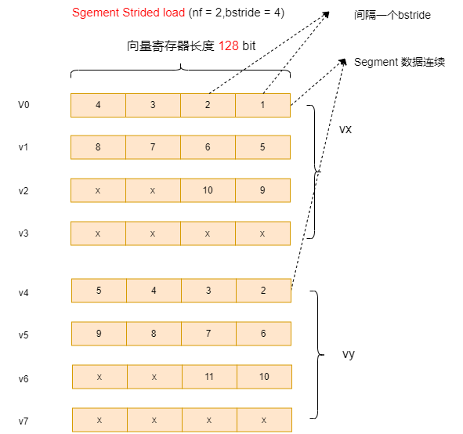

如果设置bstride = 8（2个元素步长），则排布如下，结果与上节 vlseg2e32 效果类似：

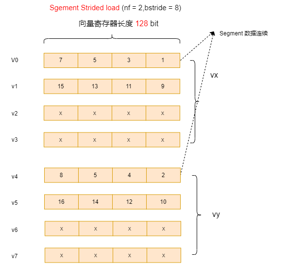

### 4.3  按索引的Sgement load & store (Sgement Indexed load & store)

~~~shell
 # Format
 vluxseg<nf>ei<eew>.v vd, (rs1), vs2, vm # Indexed-unordered segment loads
 vloxseg<nf>ei<eew>.v vd, (rs1), vs2, vm # Indexed-ordered segment loads
 vsuxseg<nf>ei<eew>.v vs3, (rs1), vs2, vm # Indexed-unordered segment stores
 vsoxseg<nf>ei<eew>.v vs3, (rs1), vs2, vm # Indexed-ordered segment stores
 # Examples
 vsetvli a1, t0, e8, ta, ma
 vluxseg3ei32.v v4, (x5), v3 # Load bytes at addresses x5+v3[i] into v4[i],
 # and bytes at addresses x5+v3[i]+1 into v5[i],
 # and bytes at addresses x5+v3[i]+2 into v6[i].
 # Examples
 vsetvli a1, t0, e32, ta, ma
 vsuxseg2ei32.v v2, (x5), v5 # Store words from v2[i] to address x5+v5[i]
 # and words from v3[i] to address x5+v5[i]+4
~~~

示例如下：

在3.3节例子基础上作修改。

~~~c
#define DATALEN 16
int main(void)
{
  int vec1[DATALEN] = {1, 2, 3, 4, 5, 6, 7, 8, 9, 10, 11, 12, 13, 14, 15, 16};
  int res[DATALEN] = {0};

  size_t avl = 16;

  vuint32m4_t bindex;
  uint32_t index_table[4] = {7 * 4, 3 * 4, 10 * 4, 8 * 4}; // 注意index单位为byte

  size_t vl = __riscv_vsetvl_e32m4(avl);                   // 设置参数

  bindex = __riscv_vle32_v_u32m4(index_table, vl);
  
  vint32m4x2_t vtuple = __riscv_vloxseg2ei32_v_i32m4x2 (vec1, bindex, vl);
  
  vint32m4_t vx = __riscv_vget_v_i32m4x2_i32m4 (vtuple, 0);
  vint32m4_t vy = __riscv_vget_v_i32m4x2_i32m4 (vtuple, 1);
  
  // 数据打印
  __riscv_vse32_v_i32m4 (res, vx, vl);
  printf("vx is:\r\n");
  for (int i = 0; i < DATALEN; i++) {
    printf("%d, ", res[i]);
  }
  printf("\r\n");
  
  __riscv_vse32_v_i32m4 (res, vy, vl);
  printf("vy is:\r\n");
  for (int i = 0; i < DATALEN; i++) {
    printf("%d, ", res[i]);
  }
  printf("\r\n");
}
~~~

打印结果为：

~~~log
vx[16] = {8, 4, 11, 9}
vy[16] = {9, 5, 12, 10}
~~~

其数据排布示意如下：

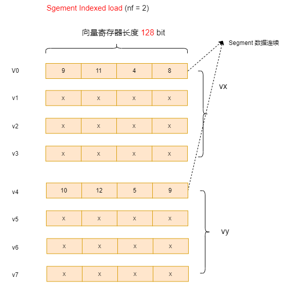

## 5 RVV Load/Store Whole Register 指令

当向量寄存器中的数据元素位宽或数量未知或者修改vl以及vtype寄存器的开销很大时，我们不能使用前文介绍的加载指令。RVV提供了另外一种加载全部向量数据的指令。加载全部向量数据的指令常常用于保存和恢复向量寄存器的值（如操作系统上下文切换）。

~~~asm
 # Format of whole register load and store instructions.
 vl1r.v v3, (a0) # Pseudoinstruction equal to vl1re8.v
 vl2r.v v2, (a0) # Pseudoinstruction equal to vl2re8.v v2, (a0)
 vl4r.v v4, (a0) # Pseudoinstruction equal to vl4re8.v
 vl8r.v v8, (a0) # Pseudoinstruction equal to vl8re8.v
 
 vs1r.v v3, (a1) # Store v3 to address in a1
 vs2r.v v2, (a1) # Store v2-v3 to address in a1
 vs4r.v v4, (a1) # Store v4-v7 to address in a1
 vs8r.v v8, (a1) # Store v8-v15 to address in a1
~~~

**注意：**没有intrinsics API来对应RVV中的`vmv<nr>r.v`指令

## 6 首次异常加载指令(Unit-stride Fault-Only-First Loads)

有些场景我们无法确定要处理的数据长度，例如，在C语言中通过判断字符是否为'\0'确定字符串是否结束。而在向量加载指令中，如果加载了字符串结束后的数据，那么会造成非法访问，导致程序出错。

RVV引入了首次异常加载指令。首次异常加载指令常常用于待处理数据元素长度不确定的场合。

首次异常加载指令示例，可参考： https://github.com/riscv-non-isa/rvv-intrinsic-doc/blob/main/examples/rvv_strcpy.c

~~~c
 # Vector unit-stride fault-only-first loads
 # vd destination, rs1 base address, vm is mask encoding (v0.t or <missing>)
 vle8ff.v vd, (rs1), vm # 8-bit unit-stride fault-only-first load
 vle16ff.v vd, (rs1), vm # 16-bit unit-stride fault-only-first load
 vle32ff.v vd, (rs1), vm # 32-bit unit-stride fault-only-first load
 vle64ff.v vd, (rs1), vm # 64-bit unit-stride fault-only-firstdd load
~~~

**参考：**

1. [RISC-V向量扩展中向量的加载与存储](https://lstlx.com/post/RVV_vectors_load-store/)

