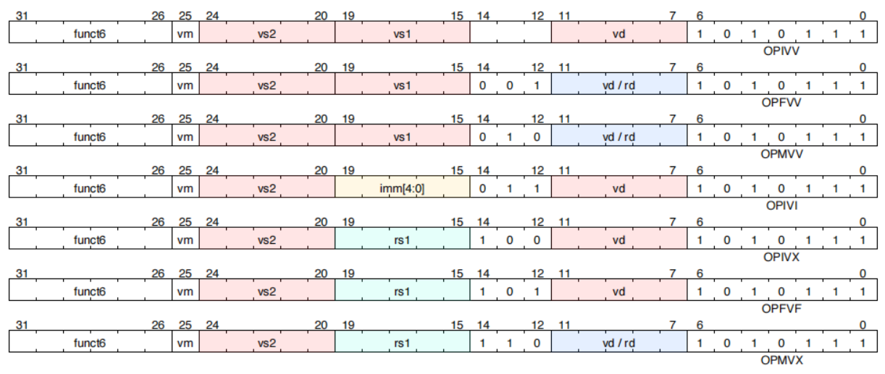
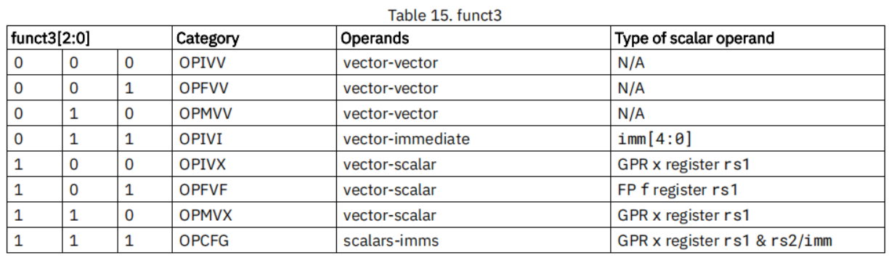
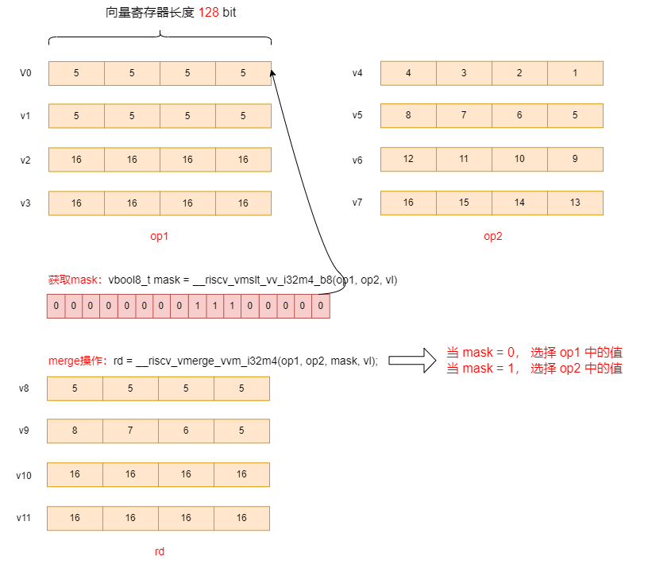

# RISC-V RVV第11 讲之RVV整数算术指令

[TOC]

这一章介绍RVV整数算术指令。

## 1 RVV向量算术指令格式

向量算术指令使用新的opcode(OP-V=1010111)，见第5章第一节示意图。

### 1.1 向量算术指令编码

funct3 字段用来表明参与计算的操作数类型：

举例如下：

| funct3[2:0] | Category | Operands         | 例子               | 例子对应的opcode |
| ----------- | -------- | ---------------- | ------------------ | ---------------- |
| 000         | OPIVV    | vector-vector    | vadd.vv v1,v2,v3   | 022180d7         |
| 001         | OPFVV    | vector-vector    | vfadd.vv v1,v2,v3  | 022190d7         |
| 010         | OPMVV    | vector-vector    | vwadd.vv v8,v4,v2  | c6412457         |
| 011         | OPIVI    | vector-immediate | vadd.vi v1,v2,5    | 0222b0d7         |
| 100         | OPIVX    | vector-scalar    | vadd.vx v1,v2,a0   | 022540d7         |
| 101         | OPFVF    | vector-scalar    | vfadd.vf v1,v2,ft0 | 022050d7         |
| 110         | OPMVX    | vector-scalar    | vwadd.vx v8,v4,a0  | c6456457         |
| 111         | OPCFG    | scalars-imms     |                    |                  |

所有向量浮点算术指令都遵循IEEE-754/2008 标准，并且支持动态舍入模式（由`frm`寄存器控制）

### 1.2 算术指令

向量算术指令（两个操作数）：

~~~asm
# Assembly syntax pattern for vector binary arithmetic instructions
# Operations returning vector results, masked by vm (v0.t, <nothing>)
vop.vv vd, vs2, vs1, vm # integer vector-vector vd[i] = vs2[i] op vs1[i]
vop.vx vd, vs2, rs1, vm # integer vector-scalar vd[i] = vs2[i] op x[rs1]
vop.vi vd, vs2, imm, vm # integer vector-immediate vd[i] = vs2[i] op imm
vfop.vv vd, vs2, vs1, vm # FP vector-vector operation vd[i] = vs2[i] fop vs1[i]
vfop.vf vd, vs2, rs1, vm # FP vector-scalar operation vd[i] = vs2[i] fop f[rs1]
~~~

向量算术指令（三个操作数）：

~~~asm
# Assembly syntax pattern for vector ternary arithmetic instructions (multiply-add)
# Integer operations overwriting sum input
vop.vv vd, vs1, vs2, vm # vd[i] = vs1[i] * vs2[i] + vd[i]
vop.vx vd, rs1, vs2, vm # vd[i] = x[rs1] * vs2[i] + vd[i]
# Integer operations overwriting product input
vop.vv vd, vs1, vs2, vm # vd[i] = vs1[i] * vd[i] + vs2[i]
vop.vx vd, rs1, vs2, vm # vd[i] = x[rs1] * vd[i] + vs2[i]
# Floating-point operations overwriting sum input
vfop.vv vd, vs1, vs2, vm # vd[i] = vs1[i] * vs2[i] + vd[i]
vfop.vf vd, rs1, vs2, vm # vd[i] = f[rs1] * vs2[i] + vd[i]
# Floating-point operations overwriting product input
vfop.vv vd, vs1, vs2, vm # vd[i] = vs1[i] * vd[i] + vs2[i]
vfop.vf vd, rs1, vs2, vm # vd[i] = f[rs1] * vd[i] + vs2[i]
~~~

### 1.3 加宽算术指令

提供向量加宽算术指令，其中目标向量寄存器组的大小为EEW=2\*SEW和EMUL=2\*LMUL。这些指令通常在操作码前加上vw\*，或者对于向量浮点指令，加上vfw\*

~~~asm
# Assembly syntax pattern for vector widening arithmetic instructions
# Double-width result, two single-width sources: 2*SEW = SEW op SEW
vwop.vv vd, vs2, vs1, vm # integer vector-vector vd[i] = vs2[i] op vs1[i]
vwop.vx vd, vs2, rs1, vm # integer vector-scalar vd[i] = vs2[i] op x[rs1]
# Double-width result, first source double-width, second source single-width: 2*SEW = 2*SEW op SEW
vwop.wv vd, vs2, vs1, vm # integer vector-vector vd[i] = vs2[i] op vs1[i]
vwop.wx vd, vs2, rs1, vm # integer vector-scalar vd[i] = vs2[i] op x[rs1]
~~~

### 1.4 缩减算术指令

提供向量缩减算术指令，其中源向量寄存器组的大小为EEW=2\*SEW和EMUL=2\*LMUL。这些指令通常在操作码前加上vn\*前缀，或者对于向量浮点指令，加上vfn\*前缀

~~~asm
# Assembly syntax pattern for vector narrowing arithmetic instructions
# Single-width result vd, double-width source vs2, single-width source vs1/rs1
# SEW = 2*SEW op SEW
vnop.wv vd, vs2, vs1, vm # integer vector-vector vd[i] = vs2[i] op vs1[i]
vnop.wx vd, vs2, rs1, vm # integer vector-scalar vd[i] = vs2[i] op x[rs1]
~~~

## 2 RVV向量算术指令

提供一组向量整数算术指令，**注意：**除非另有说明，这组整数运算将环绕溢出。

### 2.1 向量整数加减法

向量的加法与减法。

~~~shell
# 整数加法
vadd.vv vd, vs2, vs1, vm # 向量-向量运算
vadd.vx vd, vs2, rs1, vm # 向量-标量运算
vadd.vi vd, vs2, imm, vm # 向量-立即数运算

# 整数减法
vsub.vv vd, vs2, vs1, vm # Vector-vector
vsub.vx vd, vs2, rs1, vm # vector-scalar

# 整数反减（vector-scalar格式）
# 向量操作数可以使用x0的反减指令来得到其相反数，类似如：vneg.v vd,vs = vrsub.vx vd, vs, x0
vrsub.vx vd, vs2, rs1, vm # vd[i] = x[rs1] - vs2[i]
vrsub.vi vd, vs2, imm, vm # vd[i] = imm - vs2[i]
~~~

示例如下：

~~~c
// 整数加法
#define DATALEN 16
int main(void)
{
  const int32_t vec1[DATALEN] = { 1, 2, 3, 4, 5, 6, 7, 8, 9, 10, 11, 12, 13, 14, 15, 16 };
  const int32_t vec2[DATALEN] = { 1, 1, 1, 1, 1, 1, 1, 1, 1, 1, 1, 1, 1, 1, 1, 1 };

  int32_t res[DATALEN] = {0};

  const int32_t *pSrcA = vec1;
  const int32_t *pSrcB = vec2;
  int32_t *pDes = res;

  size_t avl = DATALEN;
  size_t vl;
  vint32m4_t op1, op2, rd;

  for (; (vl = __riscv_vsetvl_e32m4(avl)) > 0; avl -= vl) {
    // load数据
    op1 = __riscv_vle32_v_i32m4(pSrcA, vl);
    op2 = __riscv_vle32_v_i32m4(pSrcB, vl);
    pSrcA += vl;
    pSrcB += vl;

    // 向量加法
    rd = __riscv_vadd_vv_i32m4(op1, op2, vl);

    // store数据
    __riscv_vse32_v_i32m4 (pDes, rd, vl);
    pDes += vl;
  }

  // 数据打印
  for (int i = 0; i < DATALEN; i++) {
    printf("%d, ", res[i]);
  }
  printf("\r\n");

  return 0;
}
~~~

打印结果为：

~~~log
res = {2, 3, 4, 5, 6, 7, 8, 9, 10, 11, 12, 13, 14, 15, 16, 17,}
~~~

整数减法与整数加法类似，不再举例

整数反减的示例如下：

~~~c
// 整数反减

#define DATALEN 16
int main(void)
{
  const int32_t vec1[DATALEN] = { 1, 2, 3, 4, 5, 6, 7, 8, 9, 10, 11, 12, 13, 14, 15, 16 };

  int32_t res[DATALEN] = {0};

  const int32_t *pSrcA = vec1;
  int32_t *pDes = res;

  size_t avl = DATALEN;
  size_t vl;
  vint32m4_t op1, rd;
  int32_t op2 = 0; // 被减数

  for (; (vl = __riscv_vsetvl_e32m4(avl)) > 0; avl -= vl) {
    // load数据
    op1 = __riscv_vle32_v_i32m4(pSrcA, vl);
    pSrcA += vl;

    // 向量反减
    rd = __riscv_vrsub_vx_i32m4(op1, op2, vl);

    // store数据
    __riscv_vse32_v_i32m4 (pDes, rd, vl);
    pDes += vl;
  }

  // 数据打印
  for (int i = 0; i < DATALEN; i++) {
    printf("%d, ", res[i]);
  }
  printf("\r\n");
  return 0;
}
~~~

打印结果为：

~~~log
res = {-1, -2, -3, -4, -5, -6, -7, -8, -9, -10, -11, -12, -13, -14, -15, -16}
~~~

当被减数为0时，vrsub指令与vneg等价， vneg是一个伪指令：

~~~asm
vneg.v vd,vs = vrsub.vx vd,vs,x0
# vint32m4_t __riscv_vneg_v_i32m4(vint32m4_t vs, size_t vl);
~~~

### 2.2 向量扩宽加减法

比如：两个int16 类型数据相加，如果结果也是int16类型，可能发生溢出，所以提供扩宽的加减法（包括有符号数与无符号数）。

~~~shell
# 扩宽的无符号数加减法 2*SEW = SEW +/- SEW
vwaddu.vv vd, vs2, vs1, vm # vector-vector
vwaddu.vx vd, vs2, rs1, vm # vector-scalar
vwsubu.vv vd, vs2, vs1, vm # vector-vector
vwsubu.vx vd, vs2, rs1, vm # vector-scalar

# 扩宽的有符号数加减法 2*SEW = SEW +/- SEW
vwadd.vv vd, vs2, vs1, vm # vector-vector
vwadd.vx vd, vs2, rs1, vm # vector-scalar
vwsub.vv vd, vs2, vs1, vm # vector-vector
vwsub.vx vd, vs2, rs1, vm # vector-scalar

# 扩宽的无符号数加减法 2*SEW = 2*SEW +/- SEW
vwaddu.wv vd, vs2, vs1, vm # vector-vector
vwaddu.wx vd, vs2, rs1, vm # vector-scalar
vwsubu.wv vd, vs2, vs1, vm # vector-vector
vwsubu.wx vd, vs2, rs1, vm # vector-scalar

# 扩宽的有符号数加减法 2*SEW = 2*SEW +/- SEW
vwadd.wv vd, vs2, vs1, vm # vector-vector
vwadd.wx vd, vs2, rs1, vm # vector-scalar
vwsub.wv vd, vs2, vs1, vm # vector-vector
vwsub.wx vd, vs2, rs1, vm # vector-scalar
~~~

示例如下：

~~~shell
# 向量-向量扩宽加法
# 例子展示 vec1 = {32767, 32767 ..} 与 vec2 = {100, 100 ..}相加的结果 res = {32867, 32867 ...},如果不使用扩宽指令，结果将会溢出
# 例子中将普通vadd与扩宽vwadd指令放到一起进行对比

#define DATALEN 16
int main(void)
{
  int16_t vec1[DATALEN];
  int16_t vec2[DATALEN];
  
  for (int i = 0; i < DATALEN; i++) {
    vec1[i] = 32767;
    vec2[i] = 100;
  }

  int16_t res16[DATALEN] = {0};
  int32_t res32[DATALEN] = {0};

  const int16_t *pSrcA = vec1;
  const int16_t *pSrcB = vec2;
  int16_t *pDes16 = res16;
  int32_t *pDes32 = res32;

  size_t avl = DATALEN;
  size_t vl;
  vint16m2_t op1, op2, rd16;
  vint32m4_t rd32;

  for (; (vl = __riscv_vsetvl_e16m2(avl)) > 0; avl -= vl) {
    // load数据
    op1 = __riscv_vle16_v_i16m2(pSrcA, vl);
    op2 = __riscv_vle16_v_i16m2(pSrcB, vl);
    pSrcA += vl;
    pSrcB += vl;

    // 向量加法
    rd16 = __riscv_vadd_vv_i16m2(op1, op2, vl);

    // store数据
    __riscv_vse16_v_i16m2 (pDes16, rd16, vl);
    pDes16 += vl;

    // 向量扩宽加法
    rd32 = __riscv_vwadd_vv_i32m4(op1, op2, vl);

    // store数据
    __riscv_vse32_v_i32m4 (pDes32, rd32, vl);
    pDes32 += vl;
  }

  // 数据打印
  printf("vadd not widen:\r\n");
  for (int i = 0; i < DATALEN; i++) {
    printf("%d, ", res16[i]);
  }
  printf("\r\n");

  // 数据打印
  printf("vadd with widen(vwadd):\r\n");
  for (int i = 0; i < DATALEN; i++) {
    printf("%d, ", res32[i]);
  }
  printf("\r\n");

  return 0;
}
~~~

打印结果为：

~~~log
vadd not widen:
res16[16] = {-32669, -32669, -32669, -32669, -32669, -32669, -32669, -32669, -32669, -32669, -32669, -32669, -32669, -32669, -32669, -32669,}
vadd with widen(vwadd):
res32[16] = {32867, 32867, 32867, 32867, 32867, 32867, 32867, 32867, 32867, 32867, 32867, 32867, 32867, 32867, 32867, 32867,}
~~~

上述对比可以看到普通vadd将会发生溢出（32767 + 100 = 32867，是16位有符号数-32669的补码表示）， 而加宽vwadd指令运算结果符合预期。

**将数据类型加宽：**

一个向量元素可以通过加0扩宽，如 vint32m4_t rd = vwadd_vx_i32m4 (vint16m2_t op1,  0,  vl); 也可以通过vwcvt进行扩宽。

vwcvt 也是一条伪指令：

~~~asm
vwcvt.x.x.v vd,vs,vm = vwadd.vx vd,vs,x0,vm
vwcvtu.x.x.v vd,vs,vm = vwaddu.vx vd,vs,x0,vm
~~~

示例如下：

~~~c
// 将vint16m2_t 扩宽至 vint32m4_t
#define DATALEN 16
int main(void)
{
  int16_t vec1[DATALEN] = {0};
  int32_t res[DATALEN] = {0};

  for (int i = 0; i < DATALEN; i++) {
    vec1[i] = 32767;
  }

  int16_t *pSrcA = vec1;
  int32_t *pDes = res;

  size_t avl = DATALEN;

  vint16m2_t op1;
  vint32m4_t rd;

  size_t vl;

  for (; (vl = __riscv_vsetvl_e16m2(avl)) > 0; avl -= vl) {
    op1 = __riscv_vle16_v_i16m2(vec1, vl);
    pSrcA += vl;

    // rd = __riscv_vwadd_vx_i32m4 (op1, 0, vl); // 方法1： 加0扩宽
    rd = __riscv_vwcvt_x_x_v_i32m4(op1, vl);     // 方法2： 使用vwcvt指令
    // rd = __riscv_vsext_vf2_i32m4(op1, vl);    // 方法3： 使用vsext指令，这几种方法是等价的

    __riscv_vse32_v_i32m4 (pDes, rd, vl);
    pDes += vl;
  }

  // 数据打印
  for (int i = 0; i < DATALEN; i++) {
    printf("%d, ", res[i]);
  }
  printf("\r\n");

  return 0;
}
~~~

打印结果为：

~~~log
res[16] = {32767, 32767, 32767, 32767, 32767, 32767, 32767, 32767, 32767, 32767, 32767, 32767, 32767, 32767, 32767, 32767}
~~~

### 2.3 向量整数扩宽/缩减指令

显式的向量扩展指令，无符号扩展（补充0），有符号扩展（补符号位），包括2, 4, 8倍的扩宽。

应用程序中存在不同位宽变量相互转换，比如从内存中load一系列8bit 数据，最终加到64bit的sum变量中，所以需要提供向量扩宽/缩减指令。

~~~shell
vzext.vf2 vd, vs2, vm # 2倍零扩宽（源操作数：EEW = SEW/2, EMUL = (EEW/SEW) * LMUL，目的操作数：SEW，LMUL）
vsext.vf2 vd, vs2, vm # 2倍有符号扩宽 （源操作数：EEW = SEW/2, EMUL = (EEW/SEW) * LMUL，目的操作数：SEW，LMUL）
vzext.vf4 vd, vs2, vm # 4倍零扩宽（源操作数：EEW = SEW/4, EMUL = (EEW/SEW) * LMUL，目的操作数：SEW，LMUL）
vsext.vf4 vd, vs2, vm # 4倍有符号扩宽（源操作数：EEW = SEW/4, EMUL = (EEW/SEW) * LMUL，目的操作数：SEW，LMUL）
vzext.vf8 vd, vs2, vm # 8倍零扩宽（源操作数：EEW = SEW/8, EMUL = (EEW/SEW) * LMUL，目的操作数：SEW，LMUL）
vsext.vf8 vd, vs2, vm # 8倍有符号扩宽（源操作数：EEW = SEW/8, EMUL = (EEW/SEW) * LMUL，目的操作数：SEW，LMUL）
~~~

例如：

~~~shell
# vint8m1_t 扩展为 vint16m2_t （2倍扩展）
vint16m2_t __riscv_vsext_vf2_i16m2(vint8m1_t vs2, size_t vl);
# vint8m1_t 扩展为 vint32m4_t （4倍扩展）
vint32m4_t __riscv_vsext_vf4_i32m4(vint8m1_t vs2, size_t vl);
# vint8m1_t 扩展为 vint64m8_t  （8倍扩展）
vint64m8_t __riscv_vsext_vf8_i64m8(vint8m1_t vs2, size_t vl);
~~~

另外，也有缩减指令，只能2倍缩减

~~~asm
# vint16m2_t 缩减为 vint8m1_t （2倍缩减）
vint8m1_t __riscv_vncvt_x_x_w_i8m1 (vint16m2_t src, size_t vl);
~~~

注意：vncvt 是一个伪指令，等价 vnsrl 指令，下文会讲到。

~~~asm
vncvt.x.x.w vd,vs,vm = vnsrl.wx vd,vs,x0,vm
~~~

### 2.4 带有进位的加法与借位的减法

为了支持多字整数运算，提供带携带位的操作指令，即进位加法与借位减法。

**进位加：**

~~~asm
 # Produce sum with carry.
 # vd[i] = vs2[i] + vs1[i] + v0.mask[i]
 vadc.vvm vd, vs2, vs1, v0 # Vector-vector
 # vd[i] = vs2[i] + x[rs1] + v0.mask[i]
 vadc.vxm vd, vs2, rs1, v0 # Vector-scalar
 # vd[i] = vs2[i] + imm + v0.mask[i]
 vadc.vim vd, vs2, imm, v0 # Vector-immediate
 # Produce carry out in mask register format
 # vd.mask[i] = carry_out(vs2[i] + vs1[i] + v0.mask[i])
 vmadc.vvm vd, vs2, vs1, v0 # Vector-vector
 # vd.mask[i] = carry_out(vs2[i] + x[rs1] + v0.mask[i])
 vmadc.vxm vd, vs2, rs1, v0 # Vector-scalar
 # vd.mask[i] = carry_out(vs2[i] + imm + v0.mask[i])
 vmadc.vim vd, vs2, imm, v0 # Vector-immediate
 # vd.mask[i] = carry_out(vs2[i] + vs1[i])
 vmadc.vv vd, vs2, vs1 # Vector-vector, no carry-in
 # vd.mask[i] = carry_out(vs2[i] + x[rs1])
 vmadc.vx vd, vs2, rs1 # Vector-scalar, no carry-in
 # vd.mask[i] = carry_out(vs2[i] + imm)
 vmadc.vi vd, vs2, imm # Vector-immediate, no carry-in
~~~

**借位减：**

~~~asm
 # Produce difference with borrow.
 # vd[i] = vs2[i] - vs1[i] - v0.mask[i]
 vsbc.vvm vd, vs2, vs1, v0 # Vector-vector
 # vd[i] = vs2[i] - x[rs1] - v0.mask[i]
 vsbc.vxm vd, vs2, rs1, v0 # Vector-scalar
 # Produce borrow out in mask register format
 # vd.mask[i] = borrow_out(vs2[i] - vs1[i] - v0.mask[i])
 vmsbc.vvm vd, vs2, vs1, v0 # Vector-vector
 # vd.mask[i] = borrow_out(vs2[i] - x[rs1] - v0.mask[i])
 vmsbc.vxm vd, vs2, rs1, v0 # Vector-scalar
 # vd.mask[i] = borrow_out(vs2[i] - vs1[i])
 vmsbc.vv vd, vs2, vs1 # Vector-vector, no borrow-in
 # vd.mask[i] = borrow_out(vs2[i] - x[rs1])
 vmsbc.vx vd, vs2, rs1 # Vector-scalar, no borrow-in
~~~

这个可能使用得不多，所以这里略过。

### 2.5 向量逻辑指令

~~~shell
# 按位操作指令

# 与
vand.vv vd, vs2, vs1, vm # Vector-vector
vand.vx vd, vs2, rs1, vm # vector-scalar
vand.vi vd, vs2, imm, vm # vector-immediate

# 或
vor.vv vd, vs2, vs1, vm # Vector-vector
vor.vx vd, vs2, rs1, vm # vector-scalar
vor.vi vd, vs2, imm, vm # vector-immediate

# 异或
vxor.vv vd, vs2, vs1, vm # Vector-vector
vxor.vx vd, vs2, rs1, vm # vector-scalar
vxor.vi vd, vs2, imm, vm # vector-immediate
~~~

与立即数-1异或等同与vnot操作。

vnot 是一条伪指令：

~~~asm
vnot.v vd, vs, vm = vxor.vi vd, vs, -1, vm
~~~

示例如下：

~~~c
#define DATALEN 16
int main(void)
{
  int16_t vec1[DATALEN] = {0};
  int16_t res[DATALEN] = {0};

  for (int i = 0; i < DATALEN; i++) {
    vec1[i] = 1653;
  }

  int16_t *pSrcA = vec1;
  int16_t *pDes = res;

  size_t avl = DATALEN;

  vint16m2_t op1;
  vint16m2_t rd;

  size_t vl;

  for (; (vl = __riscv_vsetvl_e16m2(avl)) > 0; avl -= vl) {
    op1 = __riscv_vle16_v_i16m2(pSrcA, vl);
    pSrcA += vl;

    rd = __riscv_vxor_vx_i16m2(op1, -1, vl);       // vxor指令
    // rd = __riscv_vnot_v_i16m2(op1, vl);         // vnot指令; 这两种写法等价

    __riscv_vse16_v_i16m2 (pDes, rd, vl);
    pDes += vl;
  }

  // 数据打印
  for (int i = 0; i < DATALEN; i++) {
    printf("%d, ", res[i]);
  }
  printf("\r\n");

  return 0;
}
~~~

打印结果为：

~~~log
// NOT(1653) = -1654
res[16] = {-1654, -1654, -1654, -1654, -1654, -1654, -1654, -1654, -1654, -1654, -1654, -1654, -1654, -1654, -1654, -1654}
~~~

### 2.6 向量移位操作

提供一套完整的向量移位指令。包括：1 逻辑左移（sll），逻辑右移（srl），算术右移（sra），算术左移与逻辑左移一样的操作。

~~~shell
# Bit shift operations

# 逻辑左移与算术左移
vsll.vv vd, vs2, vs1, vm # Vector-vector
vsll.vx vd, vs2, rs1, vm # vector-scalar
vsll.vi vd, vs2, uimm, vm # vector-immediate

# 逻辑右移(无符号数)
vsrl.vv vd, vs2, vs1, vm # Vector-vector
vsrl.vx vd, vs2, rs1, vm # vector-scalar
vsrl.vi vd, vs2, uimm, vm # vector-immediate

# 算术右移(有符号数)
vsra.vv vd, vs2, vs1, vm # Vector-vector
vsra.vx vd, vs2, rs1, vm # vector-scalar
vsra.vi vd, vs2, uimm, vm # vector-immediate
~~~

示例如下：

~~~c
// 向量-向量逻辑左移
#define DATALEN 16
int main(void)
{
  const int16_t vec1[DATALEN] = {1, 2, 3, 4, 5, 6, 7, 8, 9, 10, 11, 12, 13, 14, 15, 16};
  const uint16_t vec2[DATALEN] = {2, 2, 2, 2, 3, 3, 3, 3, 4, 4, 4, 4, 5, 5, 5, 5};

  int16_t res[DATALEN] = {0};

  const int16_t *pSrcA = vec1;
  const uint16_t *pSrcB = vec2;
  int16_t *pDes = res;

  size_t avl = DATALEN;
  size_t vl;
  vint16m2_t op1;
  vuint16m2_t shift;
  vint16m2_t rd;

  for (; (vl = __riscv_vsetvl_e32m4(avl)) > 0; avl -= vl) {
    op1 = __riscv_vle16_v_i16m2(pSrcA, vl);
    shift = __riscv_vle16_v_u16m2(pSrcB, vl);
    pSrcA += vl;
    pSrcB += vl;
    // 逻辑左移
    rd = __riscv_vsll_vv_i16m2(op1, shift, vl);
    __riscv_vse16_v_i16m2 (pDes, rd, vl);
    pDes += vl;
  }

  // 数据打印
  for (int i = 0; i < DATALEN; i++) {
    printf("%d, ", res[i]);
  }
  printf("\r\n");

  return 0;
}
~~~

打印结果为：

~~~log
res[16] = {1 << 2, 2 << 2, 3 << 2, 4 << 2, 5 << 3, 6 << 3, 7 << 3, 8 << 3, 
           9 << 4, 10 << 4, 11 << 4, 12 << 4, 13 << 5, 14 << 5, 15 << 5, 16 << 5};
~~~

### 2.7 缩减整数右移

操作数右移，可以将一个较宽的数据变为一个较短的数（会截断高位）。如32bit的数右移16位，所得的结果为16bit，未来的扩展可能会增加(4*SEW) >> SEW的操作。

~~~shell
 # 缩减逻辑右移, SEW = (2*SEW) >> SEW
 vnsrl.wv vd, vs2, vs1, vm # vector-vector
 vnsrl.wx vd, vs2, rs1, vm # vector-scalar
 vnsrl.wi vd, vs2, uimm, vm # vector-immediate
 
 #  缩减算术右移, SEW = (2*SEW) >> SEW
 vnsra.wv vd, vs2, vs1, vm  # vector-vector
 vnsra.wx vd, vs2, rs1, vm  # vector-scalar
 vnsra.wi vd, vs2, uimm, vm # vector-immediate
~~~

示例如下：

在上例基础上做一点修改：

~~~c
#define DATALEN 16
int main(void)
{
  int16_t vec1[DATALEN];
  int8_t res[DATALEN] = {0};

  int16_t *pSrcA = vec1;
  int8_t *pDes = res;

  for (int i = 0; i < DATALEN; i++) {
    vec1[i] = 1967;
  }
  size_t shift = 4;

  size_t avl = DATALEN;
  size_t vl;
  vint16m2_t op1;

  vint8m1_t rd;

  for (; (vl = __riscv_vsetvl_e32m4(avl)) > 0; avl -= vl) {
    op1 = __riscv_vle16_v_i16m2(pSrcA, vl);
    pSrcA += vl;
    // 缩减右移
    rd = __riscv_vnsra_wx_i8m1(op1, shift, vl);
    __riscv_vse8_v_i8m1 (pDes, rd, vl);
    pDes += vl;
  }

  // 数据打印
  for (int i = 0; i < DATALEN; i++) {
    printf("%d, ", res[i]);
  }
  printf("\r\n");

  return 0;
}
~~~

打印结果为：

~~~log
res[16] = {122, 122, 122, 122, 122, 122, 122, 122, 122, 122, 122, 122, 122, 122, 122, 122}
~~~

### 2.8 向量整数比较指令

向量整数比较指令用来获取掩码。掩码是放在一个矢量寄存器中，其每一bit表示向量比较的结果（true为1，false为0）

~~~shell
# =
vmseq.vv vd, vs2, vs1, vm # Vector-vector
vmseq.vx vd, vs2, rs1, vm # vector-scalar
vmseq.vi vd, vs2, imm, vm # vector-immediate

# !=
vmsne.vv vd, vs2, vs1, vm # Vector-vector
vmsne.vx vd, vs2, rs1, vm # vector-scalar
vmsne.vi vd, vs2, imm, vm # vector-immediate

# <, unsigned
vmsltu.vv vd, vs2, vs1, vm # Vector-vector
vmsltu.vx vd, vs2, rs1, vm # Vector-scalar

# <, signed
vmslt.vv vd, vs2, vs1, vm # Vector-vector
vmslt.vx vd, vs2, rs1, vm # vector-scalar

# <=, unsigned
vmsleu.vv vd, vs2, vs1, vm # Vector-vector
vmsleu.vx vd, vs2, rs1, vm # vector-scalar
vmsleu.vi vd, vs2, imm, vm # Vector-immediate

# <=, signed
vmsle.vv vd, vs2, vs1, vm # Vector-vector
vmsle.vx vd, vs2, rs1, vm # vector-scalar
vmsle.vi vd, vs2, imm, vm # vector-immediate

# >, unsigned
vmsgtu.vx vd, vs2, rs1, vm # Vector-scalar
vmsgtu.vi vd, vs2, imm, vm # Vector-immediate

# >, signed
vmsgt.vx vd, vs2, rs1, vm # Vector-scalar
vmsgt.vi vd, vs2, imm, vm # Vector-immediate

# Following two instructions are not provided directly
# >=, unsigned
# vmsgeu.vx vd, vs2, rs1, vm # Vector-scalar
# >=, signed
# vmsge.vx vd, vs2, rs1, vm  # Vector-scalar
~~~

示例如下：

~~~c
// 实现一个abs功能

#define DATALEN 16
void main(void)
{
  int16_t vec1[DATALEN] = {-1, -2, -3, -4, 5, 6, 7, 8, 9, 10, 11, 12, -13, -14, -15, 16};
  int16_t res[DATALEN] = {0};
  
  size_t avl = DATALEN;
  size_t vl;
  vint16m2_t vx, v_zero;
  int16_t *pSrc = vec1;
  int16_t *pDest = res;

  v_zero = __riscv_vmv_v_x_i16m2(0, vl);
  for (; (vl = __riscv_vsetvl_e16m2(avl)) > 0; avl -= vl) {
    vx = __riscv_vle16_v_i16m2(pSrc, vl);
    pSrc += vl;
    // 当向量中的元素<0时，将mask对应的bit置1
    vbool8_t mask = __riscv_vmslt_vx_i16m2_b8(vx, 0, vl);
    // 将maskbit置1的元素求相反数
    vx = __riscv_vssub_vv_i16m2_m(mask, v_zero, vx, vl);

    __riscv_vse16_v_i16m2(pDest, vx, vl);
    pDest += vl;
  }

  // 数据打印
  for (int i = 0; i < DATALEN; i++) {
    printf("%d, ", res[i]);
  }
  printf("\r\n");
}
~~~

打印结果如下，可见实现了求绝对值的功能：

~~~log
res[16] = {1, 2, 3, 4, 5, 6, 7, 8, 9, 10, 11, 12, 13, 14, 15, 16}
~~~

### 2.9 向量最大/最小值指令

支持有符号数和无符号数的最小/最大值指令。

~~~shell
# 最小值, Unsigned
vminu.vv vd, vs2, vs1, vm # Vector-vector
vminu.vx vd, vs2, rs1, vm # vector-scalar
# 最小值，Signed
vmin.vv vd, vs2, vs1, vm # Vector-vector
vmin.vx vd, vs2, rs1, vm # vector-scalar
# 最大值，Unsigned
vmaxu.vv vd, vs2, vs1, vm # Vector-vector
vmaxu.vx vd, vs2, rs1, vm # vector-scalar
# 最大值，Signed
vmax.vv vd, vs2, vs1, vm # Vector-vector
vmax.vx vd, vs2, rs1, vm # vector-scalar
~~~

示例如下：

~~~c
// 求两个向量的最大值
#define DATALEN 16
int main(void)
{
  int32_t vec1[DATALEN] = {1, 2, 3, 4, 5, 6, 7, 8, 9, 10, 11, 12, 13, 14, 15, 16};
  int32_t vec2[DATALEN] = {5, 5, 5, 5, 5, 5, 5, 5, 16, 16, 16, 16, 16, 16, 16, 16};
  int32_t res[DATALEN] = {0};

  const int32_t *pSrcA = vec1;
  const int32_t *pSrcB = vec2;
  int32_t *pDes = res;

  size_t avl = DATALEN;
  size_t vl;
  vint32m4_t op1, op2, rd;

  for (; (vl = __riscv_vsetvl_e32m4(avl)) > 0; avl -= vl) {
    // load数据
    op1 = __riscv_vle32_v_i32m4(pSrcA, vl);
    op2 = __riscv_vle32_v_i32m4(pSrcB, vl);
    pSrcA += vl;
    pSrcB += vl;

    // 求向量的最大值
    rd = __riscv_vmax_vv_i32m4(op1, op2, vl);

    // store数据
    __riscv_vse32_v_i32m4 (pDes, rd, vl);
    pDes += vl;
  }

  // 数据打印
  for (int i = 0; i < DATALEN; i++) {
    printf("%d, ", res[i]);
  }
  printf("\r\n");

	return 0;
}
~~~

打印结果为：

~~~log
res[16] = {5, 5, 5, 5, 5, 6, 7, 8, 16, 16, 16, 16, 16, 16, 16, 16}
~~~

### 2.10 向量单宽整数乘法指令

提供乘法指令。

~~~shell
# 有符号单宽乘法，返回低字节数据
vmul.vv vd, vs2, vs1, vm # Vector-vector
vmul.vx vd, vs2, rs1, vm # vector-scalar

# 有符号单宽乘法，返回高字节数据
vmulh.vv vd, vs2, vs1, vm # Vector-vector
vmulh.vx vd, vs2, rs1, vm # vector-scalar

# 无符号单宽乘法，返回高字节数据
vmulhu.vv vd, vs2, vs1, vm # Vector-vector
vmulhu.vx vd, vs2, rs1, vm # vector-scalar

# 有符号-无符号单宽乘法，返回高字节数据
vmulhsu.vv vd, vs2, vs1, vm # Vector-vector
vmulhsu.vx vd, vs2, rs1, vm # vector-scalar
~~~

示例如下：

~~~c
// 求两个向量的乘法

#define DATALEN 16
int main(void)
{
  const int32_t vec1[DATALEN] = { 1, 2, 3, 4, 5, 6, 7, 8, 9, 10, 11, 12, 13, 14, 15, 16 };
  const int32_t vec2[DATALEN] = { 1, 2, 3, 4, 5, 6, 7, 8, 9, 10, 11, 12, 13, 14, 15, 16 };

  int32_t res[DATALEN] = {0};

  const int32_t *pSrcA = vec1;
  const int32_t *pSrcB = vec2;
  int32_t *pDes = res;

  size_t avl = DATALEN;
  size_t vl;
  vint32m4_t op1, op2, rd;

  for (; (vl = __riscv_vsetvl_e32m4(avl)) > 0; avl -= vl) {
    // load数据
    op1 = __riscv_vle32_v_i32m4(pSrcA, vl);
    op2 = __riscv_vle32_v_i32m4(pSrcB, vl);
    pSrcA += vl;
    pSrcB += vl;

    // 向量乘法
    rd = __riscv_vmul_vv_i32m4(op1, op2, vl);

    // store数据
    __riscv_vse32_v_i32m4 (pDes, rd, vl);
    pDes += vl;
  }

  // 数据打印
  for (int i = 0; i < DATALEN; i++) {
    printf("%d, ", res[i]);
  }
  printf("\r\n");

  return 0;
}
~~~

打印结果为：

~~~log
res[16] = {1, 4, 9, 16, 25, 36, 49, 64, 81, 100, 121, 144, 169, 196, 225, 256,}
~~~

### 2.11 向量整数除法指令

提供除法和余数指令。

~~~shell
 # 无符号除法
 vdivu.vv vd, vs2, vs1, vm # Vector-vector
 vdivu.vx vd, vs2, rs1, vm # vector-scalar

 # 有符号除法
 vdiv.vv vd, vs2, vs1, vm # Vector-vector
 vdiv.vx vd, vs2, rs1, vm # vector-scalar
 
 # 无符号求余
 vremu.vv vd, vs2, vs1, vm # Vector-vector
 vremu.vx vd, vs2, rs1, vm # vector-scalar
 
 # 有符号求余
 vrem.vv vd, vs2, vs1, vm # Vector-vector
 vrem.vx vd, vs2, rs1, vm # vector-scalar
~~~

示例如下：

~~~c
// 向量-标量的除法

#define DATALEN 16
int main(void)
{
  const int32_t vec1[DATALEN] = { 1, 2, 3, 4, 5, 6, 7, 8, 9, 10, 11, 12, 13, 14, 15, 16 };

  int32_t res[DATALEN] = {0};

  const int32_t *pSrcA = vec1;
  int32_t *pDes = res;

  size_t avl = DATALEN;
  size_t vl;
  vint32m4_t op1, rd;
  int32_t op2 = 4;

  for (; (vl = __riscv_vsetvl_e32m4(avl)) > 0; avl -= vl) {
    // load数据
    op1 = __riscv_vle32_v_i32m4(pSrcA, vl);
    pSrcA += vl;

    // 向量除法
    rd = __riscv_vdiv_vx_i32m4(op1, op2, vl);

    // store数据
    __riscv_vse32_v_i32m4 (pDes, rd, vl);
    pDes += vl;
  }

  // 数据打印
  for (int i = 0; i < DATALEN; i++) {
    printf("%d, ", res[i]);
  }
  printf("\r\n");

  return 0;
}
~~~

打印结果为：

~~~log
res[16] = {0, 0, 0, 1, 1, 1, 1, 2, 2, 2, 2, 3, 3, 3, 3, 4}
~~~

### 2.12 加宽向量整数乘法指令

提供扩宽乘法指令，SEW-bit * SEW-bit = 2*SEW-bit

~~~shell
# Widening signed-integer multiply
vwmul.vv vd, vs2, vs1, vm # vector-vector
vwmul.vx vd, vs2, rs1, vm # vector-scalar

# Widening unsigned-integer multiply
vwmulu.vv vd, vs2, vs1, vm # vector-vector
vwmulu.vx vd, vs2, rs1, vm # vector-scalar

# Widening signed(vs2)-unsigned integer multiply
vwmulsu.vv vd, vs2, vs1, vm # vector-vector
vwmulsu.vx vd, vs2, rs1, vm # vector-scalar
~~~

### 2.13 单宽度向量整数乘加指令

提供乘加等指令。

~~~shell
# Integer multiply-add, overwrite addend
vmacc.vv vd, vs1, vs2, vm # vd[i] = +(vs1[i] * vs2[i]) + vd[i]
vmacc.vx vd, rs1, vs2, vm # vd[i] = +(x[rs1] * vs2[i]) + vd[i]
# Integer multiply-sub, overwrite minuend
vnmsac.vv vd, vs1, vs2, vm # vd[i] = -(vs1[i] * vs2[i]) + vd[i]
vnmsac.vx vd, rs1, vs2, vm # vd[i] = -(x[rs1] * vs2[i]) + vd[i]
# Integer multiply-add, overwrite multiplicand
vmadd.vv vd, vs1, vs2, vm # vd[i] = (vs1[i] * vd[i]) + vs2[i]
vmadd.vx vd, rs1, vs2, vm # vd[i] = (x[rs1] * vd[i]) + vs2[i]
# Integer multiply-sub, overwrite multiplicand
vnmsub.vv vd, vs1, vs2, vm # vd[i] = -(vs1[i] * vd[i]) + vs2[i]
vnmsub.vx vd, rs1, vs2, vm # vd[i] = -(x[rs1] * vd[i]) + vs2[i]
~~~

示例如下：

~~~c
// 实现 C += A * B 的功能 
#define DATALEN 16
int main(void)
{
  const int32_t vec1[DATALEN] = { 1, 2, 3, 4, 5, 6, 7, 8, 9, 10, 11, 12, 13, 14, 15, 16 };
  const int32_t vec2[DATALEN] = { 1, 2, 3, 4, 5, 6, 7, 8, 9, 10, 11, 12, 13, 14, 15, 16 };

  int32_t res[DATALEN] = { 1, 2, 3, 4, 5, 6, 7, 8, 9, 10, 11, 12, 13, 14, 15, 16};

  const int32_t *pSrcA = vec1;
  const int32_t *pSrcB = vec2;
  int32_t *pDes = res;

  size_t avl = DATALEN;
  size_t vl;
  vint32m4_t op1, op2, rd;

  for (; (vl = __riscv_vsetvl_e32m4(avl)) > 0; avl -= vl) {
    // load数据
    op1 = __riscv_vle32_v_i32m4(pSrcA, vl);
    op2 = __riscv_vle32_v_i32m4(pSrcB, vl);
    pSrcA += vl;
    pSrcB += vl;

    rd = __riscv_vle32_v_i32m4(pDes, vl);
    // 向量乘加
    rd = __riscv_vmacc_vv_i32m4(rd, op1, op2, vl);

    // store数据
    __riscv_vse32_v_i32m4 (pDes, rd, vl);
    pDes += vl;
  }

  // 数据打印
  for (int i = 0; i < DATALEN; i++) {
    printf("%d, ", res[i]);
  }
  printf("\r\n");

  return 0;
}
~~~

打印结果为：

~~~log
res[16] = {2, 6, 12, 20, 30, 42, 56, 72, 90, 110, 132, 156, 182, 210, 240, 272,}
~~~

### 2.14 加宽向量整数乘加指令

提供扩宽的乘加等指令。

~~~asm
# Widening unsigned-integer multiply-add, overwrite addend
vwmaccu.vv vd, vs1, vs2, vm # vd[i] = +(vs1[i] * vs2[i]) + vd[i]
vwmaccu.vx vd, rs1, vs2, vm # vd[i] = +(x[rs1] * vs2[i]) + vd[i]
# Widening signed-integer multiply-add, overwrite addend
vwmacc.vv vd, vs1, vs2, vm # vd[i] = +(vs1[i] * vs2[i]) + vd[i]
vwmacc.vx vd, rs1, vs2, vm # vd[i] = +(x[rs1] * vs2[i]) + vd[i]
# Widening signed-unsigned-integer multiply-add, overwrite addend
vwmaccsu.vv vd, vs1, vs2, vm # vd[i] = +(signed(vs1[i]) * unsigned(vs2[i])) + vd[i]
vwmaccsu.vx vd, rs1, vs2, vm # vd[i] = +(signed(x[rs1]) * unsigned(vs2[i])) + vd[i]
# Widening unsigned-signed-integer multiply-add, overwrite addend
vwmaccus.vx vd, rs1, vs2, vm # vd[i] = +(unsigned(x[rs1]) * signed(vs2[i])) + vd[i]
~~~

### 2.15 向量整数合并指令

向量整数合并指令根据掩码来合并两个源操作数。

~~~asm
vmerge.vvm vd, vs2, vs1, v0 # vd[i] = v0.mask[i] ? vs1[i] : vs2[i]
vmerge.vxm vd, vs2, rs1, v0 # vd[i] = v0.mask[i] ? x[rs1] : vs2[i]
vmerge.vim vd, vs2, imm, v0 # vd[i] = v0.mask[i] ? imm : vs2[i]
~~~

示例如下：

~~~c
#define DATALEN 16
int main(void)
{
  const int32_t vec1[DATALEN] = {5, 5, 5, 5, 5, 5, 5, 5, 16, 16, 16, 16, 16, 16, 16, 16};
  const int32_t vec2[DATALEN] = {1, 2, 3, 4, 5, 6, 7, 8, 9, 10, 11, 12, 13, 14, 15, 16};

  int32_t res[DATALEN] = {0};

  const int32_t *pSrcA = vec1;
  const int32_t *pSrcB = vec2;
  int32_t *pDes = res;

  size_t avl = DATALEN;
  size_t vl;
  vint32m4_t op1, op2, rd;

  for (; (vl = __riscv_vsetvl_e32m4(avl)) > 0; avl -= vl) {
    // load数据
    op1 = __riscv_vle32_v_i32m4(pSrcA, vl);
    op2 = __riscv_vle32_v_i32m4(pSrcB, vl);
    pSrcA += vl;
    pSrcB += vl;
    
    vbool8_t mask = __riscv_vmslt_vv_i32m4_b8(op1, op2, vl);

    // merge，要注意当mask = 0，时取op1的值，当mask=1时，取op2的值
    rd = __riscv_vmerge_vvm_i32m4(op1, op2, mask, vl);

    // store数据
    __riscv_vse32_v_i32m4 (pDes, rd, vl);
    pDes += vl;
  }

  // 数据打印
  for (int i = 0; i < DATALEN; i++) {
    printf("%d, ", res[i]);
  }
  printf("\r\n");

  return 0;
}
~~~

打印结果为：

~~~log
res[16] = {5, 5, 5, 5, 5, 6, 7, 8, 16, 16, 16, 16, 16, 16, 16, 16,}
~~~

可见：merge和vmslt 组合可以实现vmax一样的效果，当然merge与掩码配合可以完成其它功能。

示意图如下：

### 2.16 向量Move指令

有如下几种Move指令：

~~~asm
vmv.v.v vd, vs1 # vd[i] = vs1[i]
vmv.v.x vd, rs1 # vd[i] = x[rs1]
vmv.v.i vd, imm # vd[i] = imm  

vmv.x.s rd, vs2 # x[rd] = vs2[0] (vs1=0)
vmv.s.x vd, rs1 # vd[0] = x[rs1] (vs2=0)
~~~

对应有如下intrinsic API：

~~~c
vint32m4_t __riscv_vmv_v_v_i32m4 (vint32m4_t src, size_t vl);
vint32m4_t __riscv_vmv_v_x_i32m4 (int32_t src, size_t vl);
int32_t __riscv_vmv_x_s_i32m4_i32 (vint32m4_t src);
vint32m4_t __riscv_vmv_s_x_i32m4 (int32_t src, size_t vl);

vfloat32m4_t __riscv_vmv_v_v_f32m4 (vfloat32m4_t src, size_t vl);
vfloat32m4_t __riscv_vfmv_v_f_f32m4 (float32_t src, size_t vl);
float32_t __riscv_vfmv_f_s_f32m4_f32 (vfloat32m4_t src);
vfloat32m4_t __riscv_vfmv_s_f_f32m4 (float32_t src, size_t vl);
~~~

move的示例放到第16讲排列指令中一起举例。

