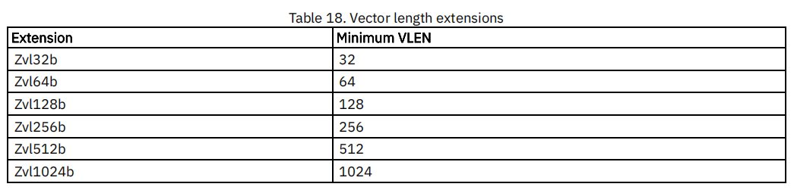
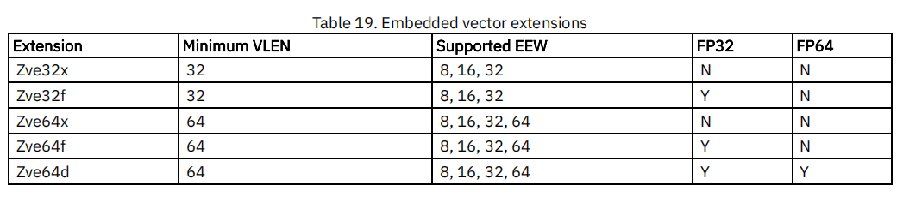

# RISC-V RVV第17讲之RVV 标准向量扩展

完整的V扩展使用单个V字母来表示，V扩展还可以拆分为子扩展，子扩展以zve前缀命名，用户可以根据实际嵌入式芯片的实际需要来选择子扩展，以此减少芯片面积。

另外还提供zvl扩展，用来指示最小向量长度。

## 1 Zvl*：最小向量长度标准扩展

标准向量扩展对VLEN有一定要求，如：`VLEN≥ELEN`，`VLEN`必须是2的幂，且`VLEN` <= 65536（即2的16次幂）, 常见的`VLEN `= 128bits，256bits，512bits。

所以提供一组向量长度扩展（zvl）以指定RVV扩展的最小向量长度，这个参数可以提供给编译器来进行自动向量化，或者宣传硬件能力等。

通过下面的命令可以查看march所对应的zvl扩展，以-march=rv64imafdcv_zvl512b为例。

~~~sh
$ riscv64-unknown-linux-gnu-gcc -march=rv64imafdcv_zvl512b -dM -E - < /dev/null | grep zvl

#define __riscv_zvl32b 1000000
#define __riscv_zvl128b 1000000
#define __riscv_zvl256b 1000000
#define __riscv_zvl512b 1000000
#define __riscv_zvl64b 1000000
~~~

## 2 Zve*: 向量子扩展

以下5个子扩展提供不同程度的RVV支持，比如：

* zve32x与zve64x只支持整数运算，而不支持浮点数运算

* zve32f 与 zve64f支持整数运算与单精度浮点运算，不支持双精度浮点运算

* zve64d支持整数运算，单精度浮点运算，双精度浮点运算

这些扩展中的任何一个都可以与XLEN=32或XLEN=64的基础ISA组合，比如：rv32imafdc_zve32f，rv32imafdc_zve64d 等。

有如下约束：

1. 所有Zve\*扩展都支持EEW = 8、16和32，Zve64\* 扩展除支持EEW = 8、16和32外，也支持EEW = 64；
2. 所有Zve\*扩展都支持向量配置指令（见第6讲向量设置指令vsetvli/vsetivli/vsetvl）
3. 所有Zve\*扩展都支持所有向量加载和存储指令（见第10讲向量加载存储指令），但Zve64*扩展在XLEN=32时不支持EEW=64的索引load&store（如march=rv32imafc_zve64f 不支持 `vluxei64.v` `vloxei64.v` `vsuxei64.v` `vsoxei64.v` 指令）
4. 所有Zve\*扩展都支持所有向量整数指令（见第11讲整数算术指令），但Zve64*扩展不支持EEW=64的`vmulh`指令
5. 所有Zve\*扩展都支持所有向量定点算术指令（见第12讲定点算术指令），但Zve64*扩展不支持EEW=64的`vsmul`指令
6. 所有Zve\*扩展都支持所有单宽度，扩宽/缩减指令
7. 所有Zve\*扩展都支持所有mask指令（见第15讲Mask指令）
8. zve32x与zve64x只支持整数运算，而不支持浮点数运算
9. zve32f 与 zve64f支持整数运算与单精度浮点运算，不支持双精度浮点运算
10. zve64d支持整数运算，单精度浮点运算，双精度浮点运算

## 3  V扩展

完整的RVV扩展使用单个V字母来表示。

完整的RVV扩展将设置misa.v位，V向量扩展需要Zvl128b

