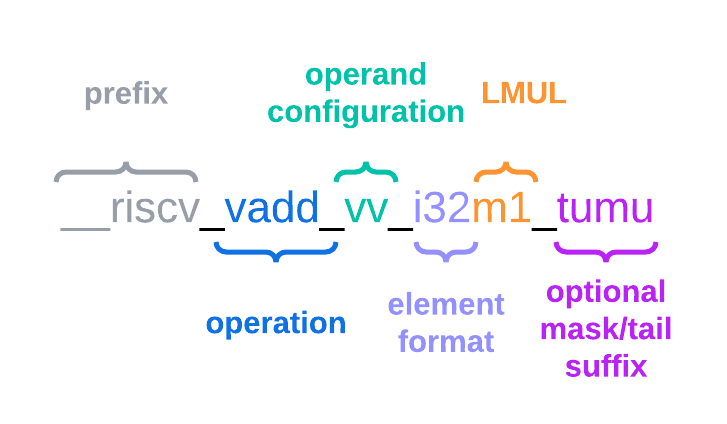

# RISC-V RVV第7讲之intrinsic 编程

[TOC]

这一章用来讲述rvv intrinsics编程。

## 1 手撸汇编 VS intrinsics 函数编程

对于一段C语言代码，编译器编译后可以得到汇编指令。如果想利用rvv指令，有如下几种方式：

* 1 编译器自动向量化：也即如果开启V扩展，编译器会自动优化生成rvv指令，目前还在发展中；
* 2 手撸汇编：也即编程的最高境界，所以难度不言而喻；
* 3 intrinsics 编程：在汇编语言上封装了一层，允许程序员使用类似于C/C++等高级语言的语法来调用特定的CPU指令，上手更加简单，程序可读性和可维护性更高。

**手撸汇编 VS intrinsics 函数编程的对比如下：**

| VS       | 手撸汇编                                                     | intrinsics 函数编程                                          |
| -------- | ------------------------------------------------------------ | ------------------------------------------------------------ |
| 性能     | 对于指定平台，汇编可能呈现最好性能，直接在硬件层面编写代码允许开发者针对特定架构进行高度优化，包括充分利用CPU的流水线、缓存等特性。 | 现在的编译器已经能够得到和手撸汇编差不多的性能了，灵活度有限，尽管提供了对硬件特性的访问，但Intrinsics并不能覆盖所有的低级编程需求，有时候还是需要回到汇编级别来完成特定任务。 |
| 可移植性 | 较差，移植起来较困难                                         | 较好，使用类C接口，移植起来相对比较容易                      |
| 可维护性 | 相比C语言，较难编程，开发效率低，容易出错，可读性差          | 跟C语言类似，对细节进行了封装，有效避免违反一些约束条件，比较容易编程与维护 |

后面主要以**intrinsics 函数编程**为例来讲解RVV指令。

## 2 intrinsics 函数编程

这一篇《RISC-V Vector Programming in C with Intrinsics.pdf》文档写得很好，所以这里直接翻译其中的一段片段。

如果你已经了解了基础的RVV指令，下一步就是尝试使用这些指令，要么手撸汇编，要么使用RVV intrinsics函数，RVV intrinsics函数是一种低级函数，只是将汇编指令进行封装，基本上可与RVV 指令一对一映射，这样方便调用，使得RVV  intrinsics 编程无需汇编专业知识即可使用。

### 2.1 使用RVV intrinsics的第一个实例

下例用来实现两个向量之间的加法，使用的RVV指令为vadd.vv，LMUL参数设置的为m1，元素数据类型为i32

~~~c
vint32m1_t __riscv_vadd_vv_i32m1 (vint32m1_t op1, vint32m1_t op2, size_t vl);
~~~

RVV intrinsics其字段含义如下：

如果你对RVV指令较熟悉，会发现函数名不只包含指令（vadd.vv）, 还包括RVV的其它配置（元素类型i32，寄存器组乘系数m1），此外，大多数intrinsics都需要一个向量长度参数avl（即入参vl，vsetvl指令根据avl来设置`vl`寄存器）。

由此看来：intrinsics 函数命名中包括了向量指令以及向量配置，这使得使用intrinsics 函数很方便。另外尾部和掩码策略也可以附加到intrinsics 函数中。

~~~c
// vm=1, vta=1 （非掩码，尾部元素未知）
vint32m1_t __riscv_vadd_vv_i32m1(vint32m1_t vs2, vint32m1_t vs1, size_t vl);

// vm=1, vta=0 （非掩码，尾部元素不打扰）
vint32m1_t __riscv_vadd_vv_i32m1_tu(vint32m1_t vd, vint32m1_t vs2,
                                    vint32m1_t vs1, size_t vl);
// vm=0, vta=1, vma=1 （掩码，尾部元素未知，非活跃元素未知）
vint32m1_t __riscv_vadd_vv_i32m1_m(vbool32_t vm, vint32m1_t vs2, vint32m1_t vs1,
                                   size_t vl);
// vm=0, vta=0, vma=1 （掩码，尾部元素不打扰，非活跃元素未知）
vint32m1_t __riscv_vadd_vv_i32m1_tum(vbool32_t vm, vint32m1_t vd,
                                     vint32m1_t vs2, vint32m1_t vs1, size_t vl);
// vm=0, vta=1, vma=0 （掩码，尾部元素未知，非活跃元素不打扰）
vint32m1_t __riscv_vadd_vv_i32m1_mu(vbool32_t vm, vint32m1_t vd, vint32m1_t vs2,
                                    vint32m1_t vs1, size_t vl);
// vm=0, vta=0, vma=0 （掩码，尾部元素不打扰，非活跃元素不打扰
vint32m1_t __riscv_vadd_vv_i32m1_tumu(vbool32_t vm, vint32m1_t vd,
                                      vint32m1_t vs2, vint32m1_t vs1,
                                      size_t vl);
~~~

嵌入所有这些配置项给编译器带来了很大的负担，编译器必须生成和优化vsetvl指令和向量操作的序列。

早期的intrinsics 函数被编译成一条vsetvl指令和一条RVV指令，后来，编译器优化了vsetvl指令，只在必要的时候才生成vsetvl指令。

**从哪里查询RVV intrinsics APIs？**

官方参考：https://github.com/riscv-non-isa/rvv-intrinsic-doc/tree/main

在线查询API：https://dzaima.github.io/intrinsics-viewer/

### 2.2 为什么有这么多RVV intrinsics函数？

打开在线网页查看RVV intrinsics，可以见到函数非常多，为什么有这么多的函数呢？有如下几个原因：

**原因1： 有多个不同的数据类型，以及lmul**

具体来说:

1. 支持不同的数据类型(floating-point, signed integer, unsigned integer, boolean, …)，可查看[type-system](https://github.com/riscv-non-isa/rvv-intrinsic-doc/blob/main/doc/rvv-intrinsic-spec.adoc#type-system)
2. 支持不同的元素宽度(8, 16, 32, or 64 bits)
3. 支持不同的lmul(1, 2, 4, 8 or the fractional 1/2, 1/4, 1/8)

如下例中的API都映射到同一个vadd.vv指令：

~~~c
// addition of register groups of one vector reg of 32-bit elements
vint32m1_t __riscv_vadd_vv_i32m1(vint32m1_t, vint32m1_t, size_t);
// addition of register groups of two vector regs of 32-bit elements
vint32m2_t __riscv_vadd_vv_i32m2(vint32m2_t, vint32m2_t, size_t);
// addition of register groups of two vector regs of 64-bit elements
vint64m2_t __riscv_vadd_vv_i64m2(vint64m2_t, vint64m2_t, size_t);
~~~

**原因2： 同一个RVV指令有不同的操作数**

比如vadd指令，分为Vector-vector，vector-scalar，vector-immediate 几种操作数，那么就对应着不同的intrinsics

~~~c
// Integer adds.
vadd.vv vd, vs2, vs1, vm # Vector-vector
vadd.vx vd, vs2, rs1, vm # vector-scalar
vadd.vi vd, vs2, imm, vm # vector-immediate

// 对应如下2个API，以数据类型为vint32m4_t 为例
vint32m4_t __riscv_vadd_vv_i32m4 (vint32m4_t op1, vint32m4_t op2, size_t vl);
vint32m4_t __riscv_vadd_vx_i32m4 (vint32m4_t op1, int32_t op2, size_t vl);
~~~

## 3 显示命名方案与隐式命名

intrinsics APIs 可以分为两个部分，显示（Non-overloaded）intrinsics APIs与隐式（overloaded）intrinsics APIs：

* 显示intrinsics APIs 是不可重载的，显示的指明了`EEW` `LMUL` 等参数，由于显示intrinsics APIs在代码中显式地指定了执行状态，因此该方案可读性更好
* 隐式 intrinsics APIs 是可重载的，其省略了对`vtype`的显示控制，旨在提供一个通用接口，让用户将不同的EEW和EMUL的值作为输入参数

上面列出的如：`__riscv_vadd_vv_i32m4` 与 `__riscv_vadd_vx_i32m4` 等intrinsics 显示的指明了`EEW` `LMUL` 等参数，所以其属于显示intrinsics APIs， 是不可重载的。

隐式intrinsics命名方案允许程序员使用单个重载函数（例如`__riscv_vadd`）来调用所有EEW/LMUL变体，可参考[implicit-overloaded-naming-scheme](https://github.com/riscv-non-isa/rvv-intrinsic-doc/blob/main/doc/rvv-intrinsic-spec.adoc#implicit-overloaded-naming-scheme) 

隐式命名方案存在一些例外情况，参考[exceptions-in-the-implicit-overloaded-naming-scheme](https://github.com/riscv-non-isa/rvv-intrinsic-doc/blob/main/doc/rvv-intrinsic-spec.adoc#exceptions-in-the-implicit-overloaded-naming-scheme)

## 4 RVV intrinsics 的后缀

从前面2.1节的图中可以看出，RVV intrinsics 可以通过一个可选的后缀来扩展属性，以指示操作是否被屏蔽，以及对非活动元素使用哪个策略，以及尾部策略是什么。细节可参考[policy-and-masked-naming-scheme](https://github.com/riscv-non-isa/rvv-intrinsic-doc/blob/main/doc/rvv-intrinsic-spec.adoc#policy-and-masked-naming-scheme)

RVV intrinsics 提供6种不同的后缀：

| 后缀      | 寄存器值               | 含义                                                         |
| --------- | ---------------------- | ------------------------------------------------------------ |
| No suffix | `vm`=1,`vta`=1         | 非掩码，尾部元素未知（unmasked, tail-agnostic）              |
| _tu       | `vm`=1,`vta`=0         | 非掩码，尾部元素不打扰（unmasked, tail-undisturbed）         |
| _m        | `vm`=0,`vta`=1,`vma`=1 | 掩码，尾部元素未知，非活跃元素未知（masked, tail-agnostic, mask-agnostic） |
| _tum      | `vm`=0,`vta`=0,`vma`=1 | 掩码，尾部元素不打扰，非活跃元素未知（masked,tail-undisturbed, mask-agnostic） |
| _mu       | `vm`=0,`vta`=1,`vma`=0 | 掩码，尾部元素未知，非活跃元素不打扰（masked,tail-agnostic, mask-undisturbed） |
| _tumu     | `vm`=0,`vta`=0,`vma`=0 | 掩码，尾部元素不打扰，非活跃元素不打扰（masked,tail-undisturbed, mask-undisturbed） |

## 5 每条RVV intrinsics API 对应着一条真实的RVV指令吗？

每条RVV intrinsics API 并不是一一对应一条真实的RVV指令，比如如下两条intrinsics API 并不对应真实的RVV指令，其它例子见[pseudo-intrinsics](https://github.com/riscv-non-isa/rvv-intrinsic-doc/blob/main/doc/rvv-intrinsic-spec.adoc#pseudo-intrinsics)：

~~~c
// vget 用于从多寄存器向量组中选择单个寄存器
vint8m1_t __riscv_vget_v_i8m8_i8m1(vint8m8_t src, size_t index);
// vreinterpret 将无符号vuint32m1_t 强制转换为 vfloat32m1_t 类型，intrinsics API 仅限于在相同数量的寄存器上进行类型转换。reinterpret 意思是重新解释，没有对应到任何指令，因为`vreinterpret`是不需要操作的。
vfloat32m1_t __riscv_vreinterpret_v_f32m1_u32m1 (vuint32m1_t);
~~~

## 6 一个RVV intrinsics 的例子

vector_add执行两个数组lhs和rhs的元素加法，每个数组都是单精度（float）元素，结果存储在数组dst中。

~~~c
void vector_add(float *dst,
                float *lhs,
                float *rhs,
                size_t avl)
{
    for (size_t vl; avl > 0; avl -= vl, lhs += vl, rhs += vl, dst += vl)
    {
        // compute the number of elements which are going to be
        // processed in this iteration of loop body.
        // this number corresponds to the vector length (vl)
        // and is evaluated from avl (application vector length)
        vl = __riscv_vsetvl_e32m1(avl);
        // loading operands
        vfloat32m1_t vec_src_lhs = __riscv_vle32_v_f32m1(lhs, vl);
        vfloat32m1_t vec_src_rhs = __riscv_vle32_v_f32m1(rhs, vl);
        // actual vector addition
        vfloat32m1_t vec_acc = __riscv_vfadd_vv_f32m1(vec_src_lhs,
                                                      vec_src_rhs,
                                                      vl);
        // storing results
        __riscv_vse32_v_f32m1(dst, vec_acc, vl);
    }
}
~~~

## 参考：

1. [rvv-intrinsic-doc](https://github.com/riscv-non-isa/rvv-intrinsic-doc/blob/main/doc/rvv-intrinsic-spec.adoc)
2. [RISC-V Vector Programming in C with Intrinsics](https://fprox.substack.com/p/risc-v-vector-programming-in-c-with)
3. [Intrinsics – Arm Developer](https://developer.arm.com/architectures/instruction-sets/intrinsics/)
4. [Intel® Intrinsics Guide](https://www.intel.com/content/www/us/en/docs/intrinsics-guide/index.html)
5. [NEON汇编与NEON intrinsics编程的优缺点比较 - ARM技术论坛 - 电子技术论坛 - 广受欢迎的专业电子论坛!](https://bbs.elecfans.com/jishu_2271218_1_1.html)

