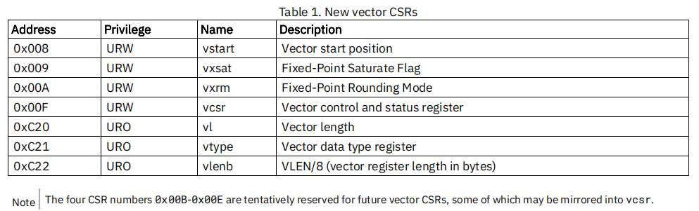
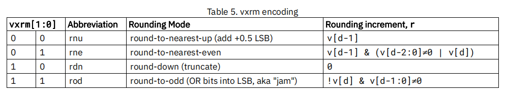
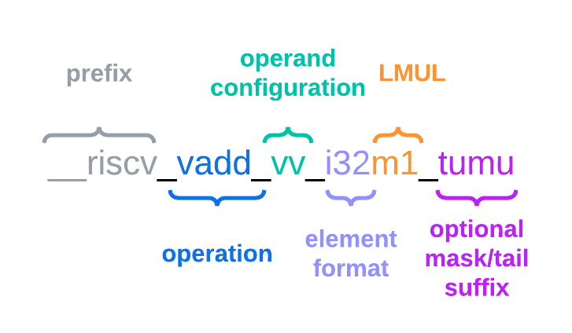

# RISC-V RVV第8讲之RVV intrinsics spec（翻译）

[TOC]

RVV intrinsics doc这一篇文档还是比较重要的，有必要翻译一遍，不过RVV intrinsics还在发展中，我这里只能找其中某一个版本进行翻译，朋友们要注意分辨不同版本的差异，这里选用的是v1.0.x版本，访问链接：[rvv-intrinsics-doc  v1.0.x](https://github.com/riscv-non-isa/rvv-intrinsic-doc/blob/v1.0.x/doc/rvv-intrinsic-spec.adoc)，**注意：**本文只翻译大概意思

## 1 介绍

RVV intrinsics 提供C语言级别的用户接口，方便程序员直接使用RVV扩展指令。如果直接使用手撸汇编，我们需要时刻小心RVV寄存器堆的分配以及RVV参数的配置，这样上手非常困难，幸好编译器提供RVV intrinsics 接口，我们可以像C语言编程一样很方便的调用这些API，将寄存器分配、指令调度等复杂工作交给编译器，极大的降低了上手难度。

简单来说：RVV intrinsics是在RVV指令的基础上进行封装，封装规则见下文的命名规则（Naming scheme）

也即：**RVV intrinsics = RVV指令 + Naming scheme**

## 2 RVV intrinsics的使用

这一节用来描述RVV intrinsics的版本号，头文件等

### 2.1 RVV intrinsics 版本号

目前RVV intrinsics 还正在发展，不同版本之间有一些变化，所以有必要弄清楚编译器支持的intrinsics版本。

GCC/Clang编译器中定义了`__riscv_v_intrinsics`宏，用来表明编译器支持RVV intrinsics 支持的版本。其值使用如下公式表示：

~~~sh
<MAJOR_VERSION> * 1,000,000 + <MINOR_VERSION> * 1,000 + <REVISION_VERSION>
~~~

比如v1.0 的RVV intrinsics，其`__riscv_v_intrinsics`=1000000 （v1.0.0）

**编译器支持的RVV intrinsics版本：**

参考：[rvv-intrinsic-doc README][https://github.com/riscv-non-isa/rvv-intrinsic-doc/blob/main/README.md]

| 编译器版本                                                   | 支持的RVV intrinsics版本                                     |
| ------------------------------------------------------------ | ------------------------------------------------------------ |
| [Clang 19](https://github.com/llvm/llvm-project/blob/llvmorg-19.1.0/llvm/docs/RISCV/RISCVVectorExtension.rst) / [GCC 14](https://github.com/gcc-mirror/gcc/tree/releases/gcc-14) | [v1.0](https://github.com/riscv-non-isa/rvv-intrinsic-doc/tree/v1.0.x) |
| [Clang 17](https://releases.llvm.org/17.0.1/tools/clang/docs/ReleaseNotes.html) / [GCC trunk](https://github.com/gcc-mirror/gcc/tree/master) | [v0.12](https://github.com/riscv-non-isa/rvv-intrinsic-doc/releases/tag/v0.12.0) |
| [Clang 16](https://releases.llvm.org/16.0.0/tools/clang/docs/ReleaseNotes.html) / [GCC 13](https://gcc.gnu.org/gcc-13/changes.html) | [v0.11](https://github.com/riscv-non-isa/rvv-intrinsic-doc/releases/tag/v0.11.1) |

注意：v1.0 与 v0.12 相比变动不大，而v0.11 版本不支持使用tuple type 的 segment load/store API以及带rounding模式的定点/浮点计算API

**查看使用的编译器支持的intrinsics版本：**

可采用如下方式：

~~~sh
$ riscv64-unknown-linux-gnu-gcc -march=rv64imafdcv -mabi=lp64d -dM -E -  < /dev/null | grep intrinsic
#define __riscv_v_intrinsic 12000
~~~

**注意：** 第9讲讲述了开发环境的搭建，包括编译器`riscv64-unknown-linux-gnu-gcc`的下载

输出 __riscv_v_intrinsic = 12000，表明 MAJOR_VERSION = 0，MINOR_VERSION = 12，REVISION_VERSION = 0，也即支持的intrinsics 版本号为v0.12

### 2.2 头文件包含

为了使用编译器提供的intrinsics，需要包含头文件`<riscv_vector.h>`

~~~c
#include <riscv_vector.h>
~~~

### 2.3 RVV子扩展

RISC-V的一个特点是模块化，其RVV也包含一些子扩展，它们（除开必要的依赖）也可以单独的打开关闭，这意味着硬件可以根据需求选择不同的子扩展，进而减少硬件面积开销。包含了头文件`<riscv_vector.h>`，也并不意味着所有intrinsics API都可以使用，而是和扩展有关，可以通过向编译器传递`-march` 选项来进行控制。

参考[riscv-v-spec v1.0](https://github.com/riscv/riscv-v-spec/blob/v1.0/v-spec.adoc)，V 扩展包含如下子扩展：

Table 15. Embedded vector extensions

| Extension | Minimum VLEN | Supported EEW | FP32 | FP64 |
| --------- | ------------ | ------------- | ---- | ---- |
| Zve32x    | 32           | 8, 16, 32     | N    | N    |
| Zve32f    | 32           | 8, 16, 32     | Y    | N    |
| Zve64x    | 64           | 8, 16, 32, 64 | N    | N    |
| Zve64f    | 64           | 8, 16, 32, 64 | Y    | N    |
| Zve64d    | 64           | 8, 16, 32, 64 | Y    | Y    |

举例：在 `-march=rv64gc_zve32x`时， 不支持`vint64m1_t` 和 `__riscv_vle64_v_i64m1` 形式的API，因为`_zve32x`扩展不支持EEW=64

## 3 控制RVV扩展编程模型

RVV intrinsics 提供接口用来控制如下寄存器：

* `vtype`寄存器（设置`vma` `vta` `vsew` `vlmul` 等字段）
* `vxrm`寄存器（设置定点数计算舍入模式，分为`rnu` `rne` `rdn` `rod` 四中舍入模式，见3.4 节描述）
* `frm`字段（`frm`属于`fcsr`寄存器的一个字段，用来设置浮点数计算舍入模式，分为`rte` `rtz` `rdn` `rup` `rmm` 5 种模式）

如第3讲RVV编程模型中所描述的，RVV目前有7个CSR寄存器。如下：

重新整理一下，并标记出哪些寄存器能使用RVV intrinsics 设置：

| 寄存器名 | 权限     | 寄存器描述                          | 能否被RVV intrinsics 设置 | 说明                                                         |
| -------- | -------- | ----------------------------------- | ------------------------- | ------------------------------------------------------------ |
| `vstart` | 可读可写 | 向量start位置                       | 否                        | intrinsics 目前不支持修改`vstart`，对所有intrinsics API`vstart`=0，应用软件不需要设置`vstart` |
| `vxsat`  | 可读可写 | 定点数饱和标记                      | 否                        | intrinsics 目前不支持修改`vxsat`, 因为大多数定点计算不需要`vxsat`,可能后续会补充 |
| `vxrm`   | 可读可写 | 定点数舍入模式                      | 是                        | RVV  intrinsics 提供接口用来控制定点计算的rounding 模式，见3.6节描述 |
| `vcsr`   | 可读可写 | 向量CSR寄存器                       | 是                        | `vcsr`包含`vxrm[1:0]` 和 `vxsat`两个字段，是这两个寄存器的影子寄存器，所以`vxrm`被修改时，`vcsr`中的`vxrm[1:0]`被同步修改 |
| `vl`     | 只读     | 向量长度寄存器                      | 是                        | 只能被`vset{i}vl{i}` 以及 fault-only-first load指令更新      |
| `vtype`  | 只读     | 向量type寄存器                      | 是                        | 设置`vma` `vta` `vsew` `vlmul` 等字段，只能被`vset{i}vl{i}`指令设置 |
| `vlenb`  | 只读     | VLEN/8(vector 寄存器宽度，单位Byte) | 否                        | 硬件涉及确定了VLEN，软件不能改变                             |

**另外**：RVV intrinsics可以设置 `frm`字段（`frm`属于标量浮点`fcsr`寄存器的一个字段，用来设置浮点数计算舍入模式）

在本文中，我们将介绍如何使用API来设置 `vtype` 寄存器的相关字段（如`vma` `vta` `vsew` `vlmul` 等字段），详细内容见后续命名规则一节。

### 3.1  控制EEW与EMUL

RVV intrinsics 的数据类型是强数据类型，意味着 RVV intrinsics 具有严格的类型检查规则，不允许隐式的类型转换或类型混用。

RVV intrinsics 函数后缀明确的指明了目标向量寄存器的EEW与EMUL，使用者可以清楚的知道某个RVV intrinsics 函数的返回值类型。 

下例的intrinsics 函数将会产生vadd.vv指令，入参数据类型为`vint32m1_t` 表明入参的`EEW=32`且`EMUL=1`，计算结果（返回值）数据类型也为`vint32m1_t` 表明返回值的`EEW=32`且`EMUL=1`

~~~c
vint32m1_t __riscv_vadd_vv_i32m1(vint32m1_t vs2, vint32m1_t vs1, size_t vl);
~~~

另一个例子（扩宽加），这个intrinsics 函数将会产生vwadd.vv指令，入参数据类型为`vint16mf2_t` 表明入参的`EEW=16`且`EMUL=1/2`，计算结果（返回值）数据类型也`vint32m1_t` 表明返回值的`EEW=32`且`EMUL=1`

### 3.2 控制处理的元素数量`vl`

RVV intrinsics并不是直接设置`vl`寄存器的，而是传入`avl`（application vector length），然后传递给vsetvl指令来设置正确的`vl`值。

**注意：**

1. 有些intrinsics API不需要`size_t vl`参数，比如：有些指令（如vmv.s.x）对于不同的`vl`长度行为是一样的，那么其对应的intrinsics API就不需要`size_t vl`参数了
2. 具体写入`vl`的值是实时改变的，通过处理`avl`参数，按照spec 约束，来计算正确的`vl`，处理元素数量可以通过`__riscv_vsetvl*` 来计算。

举例：

~~~c
size_t __riscv_vsetvl_e16m8 (size_t avl);
~~~

首先计算：VLMAX = VLEN / e16 * lmul8，vl = min(avl, VLMAX)。

### 3.3 控制掩码(mask)

第一讲提到过：SIMD 没有分支的概念，通常使用bit masking来模拟，所以RVV 引入了掩码（mask）功能，掩码特性允许程序员对向量操作进行精细控制，可以有条件地执行某些元素上的操作而不影响其他元素。

对于掩码操作的指令有对应的intrinsics API，其控制的是`vm`字段，intrinsics APIs 将`vm`，`vta`，`vma`放在一起进行设置。

### 3.4 控制目标尾部元素(`vta`)和目标非活动屏蔽元素(`vma`)的行为

`vta`(vector tail agnostic) 表示目标向量寄存器中末尾数据元素的处理策略，`vma`(vector mask agnostic)表示非活跃状态的数据元素处理策略。

分为两种策略：

* 不打扰策略（undisturbed）： 目标向量寄存器中相应的数据元素保持原值不变
* 未知策略（agnostic）：目标向量寄存器中相应的数据元素可以保持原值不变，也可以写入1

区别是：未知策略可能效率较高（适应某些处理器内部的向量寄存器重命名特性），如果一些数据元素后续计算中用不到的话，可以选择未知策略。

| `vta`字段 | `vma`字段 | 末尾元素   | 非活跃状态元素 |
| --------- | --------- | ---------- | -------------- |
| 0         | 0         | 不打扰策略 | 不打扰策略     |
| 0         | 1         | 不打扰策略 | 未知策略       |
| 1         | 0         | 未知策略   | 不打扰策略     |
| 1         | 1         | 未知策略   | 未知策略       |

intrinsics APIs 将`vm`，`vta`，`vma`放在一起进行设置，见本文的4.1节描述。

### 3.5  控制定点数的rounding 模式

对于定点intrinsics API，提供入参`vxrm`，可用来设置RVV `vxrm`寄存器，从而设置定点算术运算的rounding模式。

入参`vxrm`需要设置为如下常数：

~~~c
enum __RISCV_VXRM {
  __RISCV_VXRM_RNU = 0,
  __RISCV_VXRM_RNE = 1,
  __RISCV_VXRM_RDN = 2,
  __RISCV_VXRM_ROD = 3,
};
~~~

其取值含义为：

**注意：**

1. Rounding 模式不影响 `vsadd`, `vsaddu`, `vssub`, 和 `vssubu` 指令，所以这些intrinsics API没有 `vxrm` 参数
2. intrinsics API目前不支持修改`vxsat`, 因为大多数定点计算不需要`vxsat`,可能后续会补充相关接口

### 3.6 控制浮点数的rounding模式

`fcsr` 浮点控制状态寄存器，分为`frm`字段（用来设置浮点数计算舍入模式）与 `fflags`字段（浮点累计异常标志字段），目前intrinsics APIs 可以`frm`字段，暂时不支持`fflags`字段

对于浮点数指令的rounding模式，分为隐式FP rounding模式和显式FP rounding模式

* 隐式FP rounding模式

  隐式FP rounding模式intrinsics API类似于C语言浮点表达式，当FENV_ACCESS关闭时使用默认舍入模式，当FENV_ACCESS打开时使用fenv动态舍入模式，GNU和LLVM编译器都使用动态舍入模式生成标量浮点指令

* 显式FP rounding模式

  显式FP rounding模式可以设置`frm`，其intrinsics API在函数名中后跟一个`_rm`后缀。API 中的参数必须是一个常量整型表达式，可以取以下的枚举值：

  ~~~c
  enum __RISCV_FRM {
    __RISCV_FRM_RNE = 0, // 最近偶数舍入
    __RISCV_FRM_RTZ = 1, // 向0舍入
    __RISCV_FRM_RDN = 2, // 向下（负无穷）舍入
    __RISCV_FRM_RUP = 3, // 向上（正无穷）舍入
    __RISCV_FRM_RMM = 4, // 向最大尾数舍入
  }; 
  ~~~

  

## 4 命名规则

intrinsics APIs 可以设置定点和浮点向量计算的`vtype`，`vl`，以及`vxrm`，这一点从intrinsics API的命名中可以看出来，参照上一节的内容。

intrinsics APIs 同样可以设置RVV 的掩码（mask）功能，intrinsics APIs 将`vm`，`vta`，`vma` 放到一个后缀中，通过枚举来区分不同情况，见4.1节描述 

intrinsics APIs 可以分为两个部分，显示（Non-overloaded）intrinsics APIs与隐式（overloaded）intrinsics APIs：

* 显示intrinsics APIs 是不可重载的，显示的指明了`EEW` `LMUL` 等参数，由于显示intrinsics APIs在代码中显式地指定了执行状态，因此该方案可读性更好
* 隐式 intrinsics APIs 是可重载的，其省略了对`vtype`的显示控制，旨在提供一个通用接口，让用户将不同的EEW和EMUL的值作为输入参数

本节介绍这两种类型的内部函数的通用命名规则以及例外情况。

## 4.1 掩码命名方案

intrinsics APIs 提供可以控制`vm`，`vta`，`vma`的接口，见如下列表：

| 后缀      | 寄存器值               | 含义                                                         |
| --------- | ---------------------- | ------------------------------------------------------------ |
| No suffix | `vm`=1,`vta`=1         | 非掩码，尾部元素未知（unmasked, tail-agnostic）              |
| _tu       | `vm`=1,`vta`=0         | 非掩码，尾部元素不打扰（unmasked, tail-undisturbed）         |
| _m        | `vm`=0,`vta`=1,`vma`=1 | 掩码，尾部元素未知，非活跃元素未知（masked, tail-agnostic, mask-agnostic） |
| _tum      | `vm`=0,`vta`=0,`vma`=1 | 掩码，尾部元素不打扰，非活跃元素未知（masked,tail-undisturbed, mask-agnostic） |
| _mu       | `vm`=0,`vta`=1,`vma`=0 | 掩码，尾部元素未知，非活跃元素不打扰（masked,tail-agnostic, mask-undisturbed） |
| _tumu     | `vm`=0,`vta`=0,`vma`=0 | 掩码，尾部元素不打扰，非活跃元素不打扰（masked,tail-undisturbed, mask-undisturbed） |

以`vadd`指令，EEW=32 EMUL=1 为例：

~~~c
// vm=1, vta=1
vint32m1_t __riscv_vadd_vv_i32m1(vint32m1_t vs2, vint32m1_t vs1, size_t vl);
// vm=1, vta=0
vint32m1_t __riscv_vadd_vv_i32m1_tu(vint32m1_t vd, vint32m1_t vs2,
                                    vint32m1_t vs1, size_t vl);
// vm=0, vta=1, vma=1
vint32m1_t __riscv_vadd_vv_i32m1_m(vbool32_t vm, vint32m1_t vs2, vint32m1_t vs1,
                                   size_t vl);
// vm=0, vta=0, vma=1
vint32m1_t __riscv_vadd_vv_i32m1_tum(vbool32_t vm, vint32m1_t vd,
                                     vint32m1_t vs2, vint32m1_t vs1, size_t vl);
// vm=0, vta=1, vma=0
vint32m1_t __riscv_vadd_vv_i32m1_mu(vbool32_t vm, vint32m1_t vd, vint32m1_t vs2,
                                    vint32m1_t vs1, size_t vl);
// vm=0, vta=0, vma=0
vint32m1_t __riscv_vadd_vv_i32m1_tumu(vbool32_t vm, vint32m1_t vd,
                                      vint32m1_t vs2, vint32m1_t vs1,
                                      size_t vl);
~~~

**注意：**

1. 当设置 `vta`=1（即 tail-agnostic 策略）或`vma`=1 （即 mask-agnostic 策略）时，无法保证尾部/屏蔽元素是什么，用户不应该假定尾部/屏蔽元素保持不变
2. 伪指令的 intrinsics APIs 有点不同

### 4.2 显示intrinsics命名规则

一般来说，intrinsics 函数的命名规则如下：

~~~c
__riscv_{V_INSTRUCTION_MNEMONIC}_{OPERAND_MNEMONIC}_{RETURN_TYPE}_{ROUND_MODE}_{POLICY}{(...)
~~~

字段含义：

* `V_INSTRUCTION_MNEMONIC`字段: 表示所使用的RVV指令，如`vadd`, `vfmacc`, `vsadd` 等
* `OPERAND_MNEMONIC`字段： 表示入参类型，如 `v`, `vv`, `vx`, `vs`, `vvm`, `vxm`
* `RETURN_TYPE` 字段：表示返回值类型，取决于向量指令的返回类型是否为掩码寄存器，对于表示带有非掩码目标寄存器的指令的intrinsics，`RETURN_TYPE` 字段为 EEW-EMUL对；对于用掩码目标寄存器的intrinsics，`RETURN_TYPE` 字段为`b1 | b2 | b4 | b8 | b16 | b32 | b64` 之一, 数值等于`EEW`/`EMUL`
* `ROUND_MODE`字段：即`rm` 后缀，表示3.6节提到的浮点计算的rounding模式，其他intrinsics APIs 没有这个字段
* `POLICY`字段：表示是否掩码，`vta`，`vma`采用未知策略还是不打扰策略，见上文4.1节描述

参考第7讲的描述。

通用的命名方案不足以表示所有的intrinsics API，下一节展示一些例外情况。

### 4.3 显示intrinsics命名方案中的例外情况

有些intrinsics APIs 不符合7.2节的一般命名规范，这一节列出的就是例外情况

* 标量移动（mv）指令

  仅对返回类型进行编码将导致mv指令 intrinsics API命名冲突，所以在intrinsics API后缀中加入输入向量类型和输出标量类型。

  ~~~c
  int8_t __riscv_vmv_x_s_i8m1_i8 (vint8m1_t vs2, size_t vl);
  int8_t __riscv_vmv_x_s_i8m2_i8 (vint8m2_t vs2, size_t vl);
  int8_t __riscv_vmv_x_s_i8m4_i8 (vint8m4_t vs2, size_t vl);
  int8_t __riscv_vmv_x_s_i8m8_i8 (vint8m8_t vs2, size_t vl);
  ~~~

* Reduction 指令

  仅对返回类型进行编码将导致Reduction指令 intrinsics API命名冲突，所以在intrinsics API后缀中加入输入向量类型和输出向量类型。

  ~~~c
  vint8m1_t __riscv_vredsum_vs_i8m1_i8m1(vint8m1_t vs2, vint8m1_t vs1, size_t vl);
  vint8m1_t __riscv_vredsum_vs_i8m2_i8m1(vint8m2_t vs2, vint8m1_t vs1, size_t vl);
  vint8m1_t __riscv_vredsum_vs_i8m4_i8m1(vint8m4_t vs2, vint8m1_t vs1, size_t vl);
  vint8m1_t __riscv_vredsum_vs_i8m8_i8m1(vint8m8_t vs2, vint8m1_t vs1, size_t vl);
  ~~~

* 进位加/借位减指令

  仅对返回类型进行编码将导致进位加/借位减指令 intrinsics API命名冲突，所以在intrinsics API后缀中加入输入向量类型和输出mask类型。

  ~~~c
  vbool64_t __riscv_vmadc_vvm_i8mf8_b64(vint8mf8_t vs2, vint8mf8_t vs1,
                                        vbool64_t v0, size_t vl);
  vbool64_t __riscv_vmadc_vvm_i16mf4_b64(vint16mf4_t vs2, vint16mf4_t vs1,
                                         vbool64_t v0, size_t vl);
  vbool64_t __riscv_vmadc_vvm_i32mf2_b64(vint32mf2_t vs2, vint32mf2_t vs1,
                                         vbool64_t v0, size_t vl);
  vbool64_t __riscv_vmadc_vvm_i64m1_b64(vint64m1_t vs2, vint64m1_t vs1,
                                        vbool64_t v0, size_t vl);
  ~~~

* `vreinterpret`, `vlmul_trunc`/`vlmul_ext`, and `vset`/`vget` 指令

  仅对返回类型进行编码将导致 intrinsics API命名冲突，所以在intrinsics API后缀前加入输入向量类型，以下以`__riscv_vreinterpret_v`，输入参数`vint32m1_t`为例：
  
  ~~~c
  vfloat32m1_t __riscv_vreinterpret_v_i32m1_f32m1 (vint32m1_t src);
  vuint32m1_t __riscv_vreinterpret_v_i32m1_u32m1 (vint32m1_t src);
  vint8m1_t __riscv_vreinterpret_v_i32m1_i8m1 (vint32m1_t src);
  vint16m1_t __riscv_vreinterpret_v_i32m1_i16m1 (vint32m1_t src);
  vint64m1_t __riscv_vreinterpret_v_i32m1_i64m1 (vint32m1_t src);
  vbool64_t __riscv_vreinterpret_v_i32m1_b64 (vint32m1_t src);
  vbool32_t __riscv_vreinterpret_v_i32m1_b32 (vint32m1_t src);
  vbool16_t __riscv_vreinterpret_v_i32m1_b16 (vint32m1_t src);
  vbool8_t __riscv_vreinterpret_v_i32m1_b8 (vint32m1_t src);
vbool4_t __riscv_vreinterpret_v_i32m1_b4 (vint32m1_t src);
  ~~~

  
  

### 4.4 隐式intrinsics APIs

隐式intrinsics APIs是支持重载的，目的是提供一个通用的接口，支持不同的`EEW`和`EMUL`作为输入，所以隐式intrinsics APIs命名中，不需要将EEW-EMUL对编码，用于显示控制FP rounding 模式的`_rm`后缀也可以被省略。

以`vadd`指令为例，去掉EEW-EMUL对，隐式intrinsics APIs提供如下接口：

~~~c
vint32m1_t __riscv_vadd(vint32m1_t v0, vint32m1_t v1, size_t vl);
vint16m4_t __riscv_vadd(vint16m4_t v0, vint16m4_t v1, size_t vl);
~~~

隐式intrinsics APIs的主要目的是让用户将EEW和EMUL的不同值作为输入参数，因此隐式intrinsics APIs不会省略策略后缀。

以`vfadd`指令为例，隐式intrinsics APIs提供如下接口：

~~~c
vfloat32m1_t __riscv_vfadd(vfloat32m1_t vs2, vfloat32m1_t vs1, size_t vl);
vfloat32m1_t __riscv_vfadd(vbool32_t vm, vfloat32m1_t vs2, vfloat32m1_t vs1,
                           size_t vl);
vfloat32m1_t __riscv_vfadd(vfloat32m1_t vs2, vfloat32m1_t vs1, unsigned int frm,
                           size_t vl);
vfloat32m1_t __riscv_vfadd(vbool32_t vm, vfloat32m1_t vs2, vfloat32m1_t vs1,
                           unsigned int frm, size_t vl);
vfloat32m1_t __riscv_vfadd_tu(vfloat32m1_t vd, vfloat32m1_t vs2,
                              vfloat32m1_t vs1, size_t vl);
vfloat32m1_t __riscv_vfadd_tum(vbool32_t vm, vfloat32m1_t vd, vfloat32m1_t vs2,
                               vfloat32m1_t vs1, size_t vl);
vfloat32m1_t __riscv_vfadd_tumu(vbool32_t vm, vfloat32m1_t vd, vfloat32m1_t vs2,
                                vfloat32m1_t vs1, size_t vl);
vfloat32m1_t __riscv_vfadd_mu(vbool32_t vm, vfloat32m1_t vd, vfloat32m1_t vs2,
                              vfloat32m1_t vs1, size_t vl);
vfloat32m1_t __riscv_vfadd_tu(vfloat32m1_t vd, vfloat32m1_t vs2,
                              vfloat32m1_t vs1, unsigned int frm, size_t vl);
vfloat32m1_t __riscv_vfadd_tum(vbool32_t vm, vfloat32m1_t vd, vfloat32m1_t vs2,
                               vfloat32m1_t vs1, unsigned int frm, size_t vl);
vfloat32m1_t __riscv_vfadd_tumu(vbool32_t vm, vfloat32m1_t vd, vfloat32m1_t vs2,
                                vfloat32m1_t vs1, unsigned int frm, size_t vl);
vfloat32m1_t __riscv_vfadd_mu(vbool32_t vm, vfloat32m1_t vd, vfloat32m1_t vs2,
                              vfloat32m1_t vs1, unsigned int frm, size_t vl);
~~~

通用的命名方案不足以表示所有的隐式 intrinsics API，下一节展示一些例外情况

### 4.5 隐式intrinsics命名方案中的例外情况

以下是通用隐式 intrinsics API 命名的例外情况：

* 扩宽指令

  扩宽指令（如下`vwadd`指令）具有相同的返回值类型，但是入参类型不同，所以在intrinsics API中加入操作助记符（`vv` `vx` `wv` `wx`等），用以区分它们。
  
  ~~~c
  vint32m1_t __riscv_vwadd_vv(vint16mf2_t vs2, vint16mf2_t vs1, size_t vl);
  vint32m1_t __riscv_vwadd_vx(vint16mf2_t vs2, int16_t rs1, size_t vl);
  vint32m1_t __riscv_vwadd_wv(vint32m1_t vs2, vint16mf2_t vs1, size_t vl);
  vint32m1_t __riscv_vwadd_wx(vint32m1_t vs2, int16_t rs1, size_t vl);
  ~~~
  
* Type-convert指令

  类型转换指令（例如： `vfcvt.x.f`, `vfcvt.xu.f`, `vfcvt.rtz.xu.f`等）将返回值类型助记符编码到隐式intrinsics API命名方案中，用以区分不同情况，如下例，将`_x`, `_rtz_x`, `_xu`, 和 `_rtz_xu` 编码到隐式intrinsics API中。

  ~~~c
  vint32m1_t __riscv_vfcvt_x (vfloat32m1_t src, size_t vl);
  vint32m1_t __riscv_vfcvt_rtz_x (vfloat32m1_t src, size_t vl);
  vuint32m1_t __riscv_vfcvt_xu (vfloat32m1_t src, size_t vl);
  vuint32m1_t __riscv_vfcvt_rtz_xu (vfloat32m1_t src, size_t vl);
  ~~~

  

* `vreinterpret`, LMUL truncate/extension, and `vset`/`vget` 指令

  这些伪intrinsics将返回类型编码到它们的重载变体中，以帮助区分它们。
  
  下面以`__riscv_vreinterpret_b8`为例展示了如何将返回类型附加到后缀以进行区分：
  
  ~~~c
  vfloat32m1_t __riscv_vreinterpret_f32m1 (vint32m1_t src);
  vuint32m1_t __riscv_vreinterpret_u32m1 (vint32m1_t src);
  vint8m1_t __riscv_vreinterpret_i8m1 (vint32m1_t src);
  vint16m1_t __riscv_vreinterpret_i16m1 (vint32m1_t src);
  vint64m1_t __riscv_vreinterpret_i64m1 (vint32m1_t src);
  vbool64_t __riscv_vreinterpret_b64 (vint32m1_t src);
  vbool32_t __riscv_vreinterpret_b32 (vint32m1_t src);
vbool16_t __riscv_vreinterpret_b16 (vint32m1_t src);
  vbool8_t __riscv_vreinterpret_b8 (vint32m1_t src);
  vbool4_t __riscv_vreinterpret_b4 (vint32m1_t src);
  ~~~
  

### 4.6 隐式intrinsics命名方案不支持的情况

由于C语言的限制（没有c++模板等特性的帮助），一些内在函数没有重载版本。具有以下任何一种特征的内部函数都不具有重载版本。

1. 输入参数为纯标量类型（例如，无掩码的矢量加载指令intrinsics，`vmv.s.x`）
2. 输入参数仅仅只有`vl`，没有其它入参(例如： `vmclr`, `vmset`, `vid`)
3. 输入参数是bool，输出是向量(例如：`viota`)

## 5  数据类型

RVV intrinsics 的数据类型是强数据类型，意味着RVV intrinsics具有严格的类型检查规则，不允许隐式的类型转换或类型混用。必要时候，可以使用 `vreinterpret` intrinsics 用来进行类型转换。

整数和浮点数数据类型具有SEW和LMUL编码。

### 5.1 整数类型

整数向量类型将EEW-EMUL进行编码。

表头第一行表示EMUL，取值：`mf8 | mf4 | mf2 | m1 | m2 | m4 | m8 |  `

表第一列表示EEW，取值：`i8 | i16 | i32 | i64 | u8 | u16 | u32 | u64 |`

带有星号的类型在`ELEN >= 64 `时可用（即在`Zve32* `扩展下不可用，并且至少需要`Zve64x `扩展）。

可见：ELEN EMUL 与 SEW要满足如下约束：

~~~shell
ELEN * EMUL >= SEW
~~~

| Types    | EMUL=1/8     | EMUL=1/4      | EMUL=1/ 2     | EMUL=1       | EMUL=2       | EMUL=4       | EMUL=8       |
| -------- | ------------ | ------------- | ------------- | ------------ | ------------ | ------------ | ------------ |
| int8_t   | vint8mf8_t*  | vint8mf4_t    | vint8mf2_t    | vint8m1_t    | vint8m2_t    | vint8m4_t    | vint8m8_t    |
| int16_t  | N/A          | vint16mf4_t*  | vint16mf2_t   | vint16m1_t   | vint16m2_t   | vint16m4_t   | vint16m8_t   |
| int32_t  | N/A          | N/A           | vint32mf2_t*  | vint32m1_t   | vint32m2_t   | vint32m4_t   | vint32m8_t   |
| int64_t  | N/A          | N/A           | N/A           | vint64m1_t*  | vint64m2_t*  | vint64m4_t*  | vint64m8_t*  |
| uint8_t  | vuint8mf8_t* | vuint8mf4_t   | vuint8mf2_t   | vuint8m1_t   | vuint8m2_t   | vuint8m4_t   | vuint8m8_t   |
| uint16_t | N/A          | vuint16mf4_t* | vuint16mf2_t  | vuint16m1_t  | vuint16m2_t  | vuint16m4_t  | vuint16m8_t  |
| uint32_t | N/A          | N/A           | vuint32mf2_t* | vuint32m1_t  | vuint32m2_t  | vuint32m4_t  | vuint32m8_t  |
| uint64_t | N/A          | N/A           | N/A           | vuint64m1_t* | vuint64m2_t* | vuint64m4_t* | vuint64m8_t* |

### 5.2 浮点类型

整数向量类型将EEW-EMUL进行编码。

表头第一行表示EMUL，取值：`mf8 | mf4 | mf2 | m1 | m2 | m4 | m8 |  `

表第一列表示EEW，取值：`_Float16 | float | double |`，`_Float16` 需要开`zvfh` 和 `zvfhmin`扩展，float需要开`zve32f`扩展，double需要开`zve64d`扩展

带有星号的类型在`ELEN >= 64 `时可用（即在`Zve32f`扩展下不可用，并且至少需要`Zve64f`扩展）。

| Types    | EMUL=1/8 | EMUL=1/4       | EMUL=1/ 2      | EMUL=1        | EMUL=2        | EMUL=4        | EMUL=8        |
| -------- | -------- | -------------- | -------------- | ------------- | ------------- | ------------- | ------------- |
| _Float16 | N/A      | vfloat16mf4_t* | vfloat16mf2_t  | vfloat16m1_t  | vfloat16m2_t  | vfloat16m4_t  | vfloat16m8_t  |
| float    | N/A      | N/A            | vfloat32mf2_t* | vfloat32m1_t  | vfloat32m2_t  | vfloat32m4_t  | vfloat32m8_t  |
| double   | N/A      | N/A            | N/A            | vfloat64m1_t* | vfloat64m2_t* | vfloat64m4_t* | vfloat64m8_t* |

### 5.3 mask类型

掩码类型中的数字表示`EEW/EMUL`，掩码类型表示遵循掩码寄存器布局的掩码寄存器值。

带有星号的类型在`ELEN >= 64 `时可用（即在`Zve32* `扩展下不可用，并且至少需要`Zve64x `扩展）。

| Types | n = 1    | n = 2    | n = 4    | n = 8    | n = 16    | n = 32    | n = 64     |
| ----- | -------- | -------- | -------- | -------- | --------- | --------- | ---------- |
| bool  | vbool1_t | vbool2_t | vbool4_t | vbool8_t | vbool16_t | vbool32_t | vbool64_t* |

### 5.4 Tuple 类型

Tuple 类型将 `SEW`, `LMUL`, 和 `NFIELD` 进行编码。

在segment load/store指令，以及  [`vget`](https://github.com/riscv-non-isa/rvv-intrinsic-doc/blob/v1.0.x/doc/rvv-intrinsic-spec.adoc#pseudo-vget) [`vset`](https://github.com/riscv-non-isa/rvv-intrinsic-doc/blob/v1.0.x/doc/rvv-intrinsic-spec.adoc#pseudo-vset)来提取/组合它们，整型和浮点都有对应的Tuple类型，NFIELD遵循RVV规范的限制，`EMUL * NFIELDS ≤ 8`

* Tuple types (EMUL=1/8)

  | Non-tuple Types (NFILED=1) | NFIELD=2      | NFIELD=3      | NFIELD=4      | NFIELD=5      | NFIELD=6      | NFIELD=7      | NFIELD=8      |
  | -------------------------- | ------------- | ------------- | ------------- | ------------- | ------------- | ------------- | ------------- |
  | vint8mf8_t                 | vint8mf8x2_t  | vint8mf8x3_t  | vint8mf8x4_t  | vint8mf8x5_t  | vint8mf8x6_t  | vint8mf8x7_t  | vint8mf8x8_t  |
  | vuint8mf8_t                | vuint8mf8x2_t | vuint8mf8x3_t | vuint8mf8x4_t | vuint8mf8x5_t | vuint8mf8x6_t | vuint8mf8x7_t | vuint8mf8x8_t |

* Tuple types (EMUL=1/4)

  | Non-tuple Types (NFILED=1) | NFIELD=2        | NFIELD=3        | NFIELD=4        | NFIELD=5        | NFIELD=6        | NFIELD=7        | NFIELD=8        |
  | -------------------------- | --------------- | --------------- | --------------- | --------------- | --------------- | --------------- | --------------- |
  | vint8mf4_t                 | vint8mf4x2_t    | vint8mf4x3_t    | vint8mf4x4_t    | vint8mf4x5_t    | vint8mf4x6_t    | vint8mf4x7_t    | vint8mf4x8_t    |
  | vuint8mf4_t                | vuint8mf4x2_t   | vuint8mf4x3_t   | vuint8mf4x4_t   | vuint8mf4x5_t   | vuint8mf4x6_t   | vuint8mf4x7_t   | vuint8mf4x8_t   |
  | vint16mf4_t                | vint16mf4x2_t   | vint16mf4x3_t   | vint16mf4x4_t   | vint16mf4x5_t   | vint16mf4x6_t   | vint16mf4x7_t   | vint16mf4x8_t   |
  | vuint16mf4_t               | vuint16mf4x2_t  | vuint16mf4x3_t  | vuint16mf4x4_t  | vuint16mf4x5_t  | vuint16mf4x6_t  | vuint16mf4x7_t  | vuint16mf4x8_t  |
  | vfloat16mf4_t              | vfloat16mf4x2_t | vfloat16mf4x3_t | vfloat16mf4x4_t | vfloat16mf4x5_t | vfloat16mf4x6_t | vfloat16mf4x7_t | vfloat16mf4x8_t |

* Tuple types (EMUL=1/2)

  | Non-tuple Types (NFILED=1) | NFIELD=2        | NFIELD=3        | NFIELD=4        | NFIELD=5        | NFIELD=6        | NFIELD=7        | NFIELD=8        |
  | -------------------------- | --------------- | --------------- | --------------- | --------------- | --------------- | --------------- | --------------- |
  | vint8mf2_t                 | vint8mf2x2_t    | vint8mf2x3_t    | vint8mf2x4_t    | vint8mf2x5_t    | vint8mf2x6_t    | vint8mf2x7_t    | vint8mf2x8_t    |
  | vuint8mf2_t                | vuint8mf2x2_t   | vuint8mf2x3_t   | vuint8mf2x4_t   | vuint8mf2x5_t   | vuint8mf2x6_t   | vuint8mf2x7_t   | vuint8mf2x8_t   |
  | vint16mf2_t                | vint16mf2x2_t   | vint16mf2x3_t   | vint16mf2x4_t   | vint16mf2x5_t   | vint16mf2x6_t   | vint16mf2x7_t   | vint16mf2x8_t   |
  | vuint16mf2_t               | vuint16mf2x2_t  | vuint16mf2x3_t  | vuint16mf2x4_t  | vuint16mf2x5_t  | vuint16mf2x6_t  | vuint16mf2x7_t  | vuint16mf2x8_t  |
  | vint32mf2_t                | vint32mf2x2_t   | vint32mf2x3_t   | vint32mf2x4_t   | vint32mf2x5_t   | vint32mf2x6_t   | vint32mf2x7_t   | vint32mf2x8_t   |
  | vuint32mf2_t               | vuint32mf2x2_t  | vuint32mf2x3_t  | vuint32mf2x4_t  | vuint32mf2x5_t  | vuint32mf2x6_t  | vuint32mf2x7_t  | vuint32mf2x8_t  |
  | vfloat16mf2_t              | vfloat16mf2x2_t | vfloat16mf2x3_t | vfloat16mf2x4_t | vfloat16mf2x5_t | vfloat16mf2x6_t | vfloat16mf2x7_t | vfloat16mf2x8_t |
  | vfloat32mf2_t              | vfloat32mf2x2_t | vfloat32mf2x3_t | vfloat32mf2x4_t | vfloat32mf2x5_t | vfloat32mf2x6_t | vfloat32mf2x7_t | vfloat32mf2x8_t |

* Tuple types (EMUL=1)

  | Non-tuple Types (NFILED=1) | NFIELD=2       | NFIELD=3       | NFIELD=4       | NFIELD=5       | NFIELD=6       | NFIELD=7       | NFIELD=8       |
  | -------------------------- | -------------- | -------------- | -------------- | -------------- | -------------- | -------------- | -------------- |
  | vint8m1_t                  | vint8m1x2_t    | vint8m1x3_t    | vint8m1x4_t    | vint8m1x5_t    | vint8m1x6_t    | vint8m1x7_t    | vint8m1x8_t    |
  | vuint8m1_t                 | vuint8m1x2_t   | vuint8m1x3_t   | vuint8m1x4_t   | vuint8m1x5_t   | vuint8m1x6_t   | vuint8m1x7_t   | vuint8m1x8_t   |
  | vint16m1_t                 | vint16m1x2_t   | vint16m1x3_t   | vint16m1x4_t   | vint16m1x5_t   | vint16m1x6_t   | vint16m1x7_t   | vint16m1x8_t   |
  | vuint16m1_t                | vuint16m1x2_t  | vuint16m1x3_t  | vuint16m1x4_t  | vuint16m1x5_t  | vuint16m1x6_t  | vuint16m1x7_t  | vuint16m1x8_t  |
  | vint32m1_t                 | vint32m1x2_t   | vint32m1x3_t   | vint32m1x4_t   | vint32m1x5_t   | vint32m1x6_t   | vint32m1x7_t   | vint32m1x8_t   |
  | vuint32m1_t                | vuint32m1x2_t  | vuint32m1x3_t  | vuint32m1x4_t  | vuint32m1x5_t  | vuint32m1x6_t  | vuint32m1x7_t  | vuint32m1x8_t  |
  | vint64m1_t                 | vint64m1x2_t   | vint64m1x3_t   | vint64m1x4_t   | vint64m1x5_t   | vint64m1x6_t   | vint64m1x7_t   | vint64m1x8_t   |
  | vuint64m1_t                | vuint64m1x2_t  | vuint64m1x3_t  | vuint64m1x4_t  | vuint64m1x5_t  | vuint64m1x6_t  | vuint64m1x7_t  | vuint64m1x8_t  |
  | vfloat16m1_t               | vfloat16m1x2_t | vfloat16m1x3_t | vfloat16m1x4_t | vfloat16m1x5_t | vfloat16m1x6_t | vfloat16m1x7_t | vfloat16m1x8_t |
  | vfloat32m1_t               | vfloat32m1x2_t | vfloat32m1x3_t | vfloat32m1x4_t | vfloat32m1x5_t | vfloat32m1x6_t | vfloat32m1x7_t | vfloat32m1x8_t |
  | vfloat64m1_t               | vfloat64m1x2_t | vfloat64m1x3_t | vfloat64m1x4_t | vfloat64m1x5_t | vfloat64m1x6_t | vfloat64m1x7_t | vfloat64m1x8_t |

* Tuple types (EMUL=2)

  | Non-tuple Types (NFILED=1) | NFIELD=2       | NFIELD=3       | NFIELD=4       | NFIELD=5 | NFIELD=6 | NFIELD=7 | NFIELD=8 |
  | -------------------------- | -------------- | -------------- | -------------- | -------- | -------- | -------- | -------- |
  | vint8m2_t                  | vint8m2x2_t    | vint8m2x3_t    | vint8m2x4_t    | N/A      | N/A      | N/A      | N/A      |
  | vuint8m2_t                 | vuint8m2x2_t   | vuint8m2x3_t   | vuint8m2x4_t   | N/A      | N/A      | N/A      | N/A      |
  | vint16m2_t                 | vint16m2x2_t   | vint16m2x3_t   | vint16m2x4_t   | N/A      | N/A      | N/A      | N/A      |
  | vuint16m2_t                | vuint16m2x2_t  | vuint16m2x3_t  | vuint16m2x4_t  | N/A      | N/A      | N/A      | N/A      |
  | vint32m2_t                 | vint32m2x2_t   | vint32m2x3_t   | vint32m2x4_t   | N/A      | N/A      | N/A      | N/A      |
  | vuint32m2_t                | vuint32m2x2_t  | vuint32m2x3_t  | vuint32m2x4_t  | N/A      | N/A      | N/A      | N/A      |
  | vint64m2_t                 | vint64m2x2_t   | vint64m2x3_t   | vint64m2x4_t   | N/A      | N/A      | N/A      | N/A      |
  | vuint64m2_t                | vuint64m2x2_t  | vuint64m2x3_t  | vuint64m2x4_t  | N/A      | N/A      | N/A      | N/A      |
  | vfloat16m2_t               | vfloat16m2x2_t | vfloat16m2x3_t | vfloat16m2x4_t | N/A      | N/A      | N/A      | N/A      |
  | vfloat32m2_t               | vfloat32m2x2_t | vfloat32m2x3_t | vfloat32m2x4_t | N/A      | N/A      | N/A      | N/A      |
  | vfloat64m2_t               | vfloat64m2x2_t | vfloat64m2x3_t | vfloat64m2x4_t | N/A      | N/A      | N/A      | N/A      |

* Tuple types (EMUL=4)

  | Non-tuple Types (NFILED=1) | NFIELD=2       | NFIELD=3 | NFIELD=4 | NFIELD=5 | NFIELD=6 | NFIELD=7 | NFIELD=8 |
  | -------------------------- | -------------- | -------- | -------- | -------- | -------- | -------- | -------- |
  | vint8m4_t                  | vint8m4x2_t    | N/A      | N/A      | N/A      | N/A      | N/A      | N/A      |
  | vuint8m4_t                 | vuint8m4x2_t   | N/A      | N/A      | N/A      | N/A      | N/A      | N/A      |
  | vint16m4_t                 | vint16m4x2_t   | N/A      | N/A      | N/A      | N/A      | N/A      | N/A      |
  | vuint16m4_t                | vuint16m4x2_t  | N/A      | N/A      | N/A      | N/A      | N/A      | N/A      |
  | vint32m4_t                 | vint32m4x2_t   | N/A      | N/A      | N/A      | N/A      | N/A      | N/A      |
  | vuint32m4_t                | vuint32m4x2_t  | N/A      | N/A      | N/A      | N/A      | N/A      | N/A      |
  | vint64m4_t                 | vint64m4x2_t   | N/A      | N/A      | N/A      | N/A      | N/A      | N/A      |
  | vuint64m4_t                | vuint64m4x2_t  | N/A      | N/A      | N/A      | N/A      | N/A      | N/A      |
  | vfloat16m4_t               | vfloat16m4x2_t | N/A      | N/A      | N/A      | N/A      | N/A      | N/A      |
  | vfloat32m4_t               | vfloat32m4x2_t | N/A      | N/A      | N/A      | N/A      | N/A      | N/A      |
  | vfloat64m4_t               | vfloat64m4x2_t | N/A      | N/A      | N/A      | N/A      | N/A      | N/A      |

## 6  伪指令

伪指令并不直接对应实际的RVV指令，只是为了方便用户使用而封装的intrinsics API，其对应的实际指令见如下伪指令的描述：

* `vsetvl`

  `vsetvl` intrinsics API 用来返回要处理的元素数量，通常映射到`vsetvli`或`vsetivli`指令，见3.2节描述

* `vsetvlmax`

  `vsetvlmax` intrinsics API 用来返回最大可处理的元素数量，VLMAX = VLEN / SEW * LMUL

* `vreinterpret`

  `vreinterpret` intrinsics API 用来提供强制类型转换，intrinsics API 仅限于在相同数量的寄存器上进行类型转换。reinterpret 意思是重新解释，没有对应到任何指令，因为`vreinterpret`是不需要操作的。

  `vreinterpret`指令并不会改变寄存器的位，仅仅是改变视角，与`vfcvt/v(f)wcvt/v(f)ncvt`等指令并不相同，其区别如下C代码所示，这两种操作是有明显区别的：

  ~~~c
  # vreinterpret
  float32_t val = 3.14f;
  int32_t res = *((int32_t *)(&val));
  
  # vfcvt/v(f)wcvt/v(f)ncvt
  float32_t val = 3.14f;
  int32_t res = (int32_t)val;
  ~~~

* `vundefined`

  `vundefined` intrinsics是占位符，用于表示未初始化的变量，或者作为`vset`和`vcreate`的参数，不对应到任何指令。

* `vget`

  `vget` intrinsics 允许用户从较大的LMUL中取较小的LMUL，类似`vint8m1_t __riscv_vget_v_i8m4_i8m1 (vint8m4_t src, size_t index);` 这种，或从tuple类型中提取向量，类似`vfloat32m1_t __riscv_vget_v_f32m1x5_f32m1 (vfloat32m1x5_t src, size_t index);` 这种

  这些伪intrinsics不映射到任何真实的指令。编译器可能生成零条或多条指令来实现这些伪intrinsics的语义。具体生成哪些指令的集合是一个编译器优化问题。

* `vset`

  `vset`  intrinsics 是 `vget` intrinsics的反向操作，用来将较小的LMUL组合成较大的LMUL，或者将多个向量组合成tuple类型。

  这些伪intrinsics同样不映射到任何真实的指令，具体生成哪些指令的集合是一个编译器优化问题。

* `vlmul_trunc`

  `vlmul_trunc`  intrinsics表示从较大的LMUL取较小的LMUL，与索引操作数为0的vget具有相同的语义。

* `vlmul_ext`

  `vlmul_trunc`  intrinsics用来将较小的LMUL组合成较大的LMUL，与索引操作数为0的vset具有相同的语义。

* `vcreate`

  `vcreate`本质是创建RVV类型值的语法糖。它们与多个vset intrinsics 等价。

  举例，如下的两种写法是等价的

  ~~~c
  // Given the following declarations
  vfloat32m4_t dest;
  vfloat32m2_t v0 = ...;
  vfloat32m2_t v1 = ...;
  
  // this pseudo intrinsic
  dest = __riscv_vcreate_v_f32m2_f32m4(v0, v1);
  
  // 等价于
  dest = __riscv_vset_v_f32m2_f32m4(__riscv_vundefined_f32m4(), 0, v0);
  dest = __riscv_vset_v_f32m2_f32m4(dest, 1, v1);
  ~~~

* `vlenb`

  `vlenb`intrinsics 用来读取`vlenb` CSR寄存器，即以字节为单位的向量寄存器长度，对应的真实指令是从CSR vlenb中读取的csrr指令。

  ~~~c
  unsigned __riscv_vlenb();
  
  // is semantically equivalent to
  static int csrr_vlenb()
  {
      int a = 0;
      asm volatile("csrr %0, vlenb" : "=r"(a) : : "memory");
      return a;
  }
  ~~~

  

## 7 使用intrinsics API注意事项

### 7.1 RVV C intrinsics 中的未知值

RVV intrinsics在如下几种情况可能产生未知值，用户需要多加注意，未知值是一个不确定的值，对未知值的评估是未定义的行为。用户不应该依赖于对未知值的任何评估。

* 尾部元素采用未知策略（即`vta` = 1，见4.1节描述）
* 非活跃元素采用未知策略（即`vma` = 1，见4.1节描述）
* 向量变量没有进行初始化
* 使用`vundefined` 占位符定义的变量

### 7.2 复制向量寄存器组内容

没有intrinsics API来对应RVV中的`vmv<nr>r.v`指令，如果复制整个vector对象的内容，建议使用赋值操作符（=），如果用户希望使用vl != VLMAX复制向量寄存器组，则可以使用`vmv_v_v` intrinsics API

### 7.3 与目的寄存器`vd`存在关联的场合

一些计算与目标寄存器（`vd`）中保存的值有关，用户需要注意：

* 尾部元素采用不打扰策略（即`vta` = 0，见本文4.1节描述）
* 非活跃元素采用不打扰策略（即`vma` = 0，见本文4.1节描述）
* 向量乘法-加法的运算
* 向量`vslideup`操作

对于没有`vd`参数的intrinsics，可以自由地选择任何寄存器作为目标寄存器

### 7.4  intrinsics API, vstart=0

intrinsics 目前不支持修改`vstart`，对所有intrinsics API`vstart`=0，应用程序不需要设置`vstart`

### 7.5 intrinsics 生成的汇编

一些用户可能希望intrinsics API可以直接转换成对应汇编，但是intrinsics API只是暴露向量指令的接口，它们可以由编译器进行自由的优化。

### 7.6 配置记录

设置`vl`、`vtype`、`vxrm`和`frm`需要使用对应的接口，见第3节描述

### 7.7  stride = 0 的 Strided load/store

RVV spec提到stride = 0 的 Strided load/store可能有不同的行为，如果用户希望完成 stride = 0 的 Strided load/store，建议使用index load/store

### 7.8 利用vi的操作数助记符的指令

intrinsics API 提供了`vv`和`vx`的操作数助记符，但不提供`vi`操作数助记符。这是一个有意的设计，目的是减少intrinsics API的总量。

### 7.9 混合内联汇编和intrinsics

 当遇到内联汇编时，编译器将对寄存器（vtype, vxrm, frm）进行保存恢复。用户应该意识到，混合使用intrinsics和内联汇编将导致额外的保存和恢复。

### 7.10 fault-only-first 加载intrinsics中的new_vl参数

 fault-only-first load intrinsics（首次异常加载指令）将`vl`寄存器中的新值写入`new_vl`参数。

## 参考：

1. [rvv-intrinsics-doc  v1.0.x](https://github.com/riscv-non-isa/rvv-intrinsic-doc/blob/v1.0.x/doc/rvv-intrinsic-spec.adoc)

